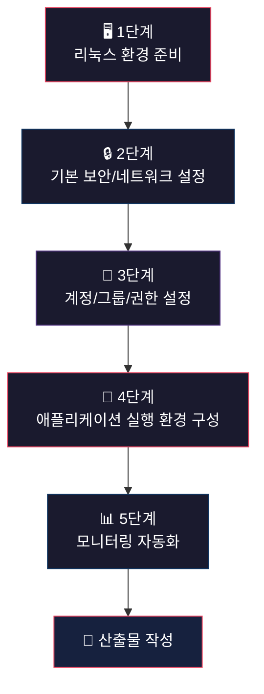

# 🚀 리눅스 서버 운영 미션 — 전체 로드맵

## 미션 요약

리눅스(Ubuntu 22.04) 환경에서 **서버 보안 설정 → 계정/권한 관리 → 앱 배포 → 모니터링 자동화**까지 직접 구축하는 과제입니다.

> [!IMPORTANT]
> 이 미션은 **리눅스 환경(Ubuntu 22.04)**에서 수행해야 합니다. 현재 macOS를 사용하고 계시므로, 먼저 리눅스 실습 환경을 준비해야 합니다.

---

## 사전 확인 필요 사항

### Q1. 리눅스 실습 환경이 준비되어 있나요?

미션 문서에 "이전 미션에서 구성한 Linux 실습 환경(컨테이너/VM)을 그대로 사용 권장"이라고 되어 있습니다.

- **A) 이전에 만든 VM/컨테이너가 있다** → 그 환경에서 바로 진행
- **B) 아직 없다** → 아래 중 하나를 선택해서 새로 만들어야 합니다:
  - **Docker** (가장 간편, Mac에서 바로 가능): `docker run -it ubuntu:22.04 bash`
  - **UTM / VirtualBox** (완전한 VM, SSH 등 네트워크 실습에 유리)
  - **Multipass** (Ubuntu 공식 경량 VM): `brew install multipass && multipass launch 22.04`

> [!TIP]
> SSH 포트 변경, 방화벽 설정 등 **네트워크 관련 실습**을 온전히 하려면 **VM(UTM/VirtualBox/Multipass)**을 추천합니다. Docker 컨테이너는 `systemd`, `ufw`, `sshd` 등이 기본적으로 제한되어 추가 설정이 필요합니다.

### Q2. `agent-app` 바이너리 실행 관련

제공된 `agent-app`은 **x86-64 Linux ELF 바이너리**입니다.
- Mac(ARM)에서는 직접 실행이 불가능합니다
- 반드시 **Linux x86-64 환경**에서 실행해야 합니다
- VM을 사용한다면 x86-64 에뮬레이션 또는 x86-64 VM이 필요합니다

---

## 전체 로드맵 (5단계)



---

## 1단계: 리눅스 환경 준비 ⏱️ ~30분

| 할 일 | 설명 |
|------|------|
| 리눅스 환경 생성 | Ubuntu 22.04 VM 또는 컨테이너 실행 |
| 기본 패키지 설치 | `openssh-server`, `ufw`, `python3`, `acl` 등 |
| `agent-app` 파일 전송 | Mac → Linux로 바이너리 복사 |

### 내가 해줄 수 있는 것
- ✅ 환경 설정용 초기 스크립트 작성 (패키지 설치 자동화)
- ✅ 파일 전송 명령어 안내

### 사용자가 해야 할 것
- ❓ **리눅스 환경을 어떤 방식으로 만들지 결정** (Docker / VM / Multipass)
- ❓ 환경을 실제로 생성하고 접속

---

## 2단계: 기본 보안 및 네트워크 설정 ⏱️ ~30분

### 2-1. SSH 설정
```bash
# SSH 포트를 20022로 변경
sudo sed -i 's/^#Port 22/Port 20022/' /etc/ssh/sshd_config

# Root 원격 로그인 차단
sudo sed -i 's/^#PermitRootLogin.*/PermitRootLogin no/' /etc/ssh/sshd_config

# SSH 서비스 재시작
sudo systemctl restart sshd

# 확인
ss -tulnp | grep sshd
```

**배경 지식:**
- **SSH 포트 변경**: 기본 22번 포트는 자동화 공격(봇)의 주요 타겟. 비표준 포트로 변경하면 무차별 대입 공격을 크게 줄일 수 있음
- **Root 로그인 차단**: root는 모든 권한을 가지므로, 원격에서 직접 접근을 막고 일반 계정 → `sudo` 경로로 관리하는 것이 보안 원칙

### 2-2. 방화벽 설정 (UFW 추천)
```bash
# UFW 설치 및 활성화
sudo apt install ufw -y

# 기본 정책: 인바운드 차단, 아웃바운드 허용
sudo ufw default deny incoming
sudo ufw default allow outgoing

# 필요 포트만 허용
sudo ufw allow 20022/tcp    # SSH
sudo ufw allow 15034/tcp    # APP

# 방화벽 활성화
sudo ufw enable

# 확인
sudo ufw status verbose
```

**배경 지식:**
- **방화벽의 원칙**: "기본 거부, 필요한 것만 허용" (Deny by default, allow by exception)
- **UFW**: Uncomplicated Firewall의 약자. iptables를 쉽게 관리하는 프론트엔드

### 내가 해줄 수 있는 것
- ✅ 위 명령어를 그대로 실행하면 됩니다
- ✅ 각 명령어의 의미를 상세히 설명

### 사용자가 해야 할 것
- ⚡ 리눅스 환경에서 위 명령어를 직접 실행
- 📸 결과 캡처 (수행 내역서용)

---

## 3단계: 계정/그룹/권한 설정 ⏱️ ~40분

### 3-1. 그룹 및 계정 생성
```bash
# 그룹 생성
sudo groupadd agent-common
sudo groupadd agent-core

# 계정 생성 (-m: 홈 디렉토리 생성, -s: 기본 쉘)
sudo useradd -m -s /bin/bash agent-admin
sudo useradd -m -s /bin/bash agent-dev
sudo useradd -m -s /bin/bash agent-test

# 그룹 할당
# agent-common: 전원
sudo usermod -aG agent-common agent-admin
sudo usermod -aG agent-common agent-dev
sudo usermod -aG agent-common agent-test

# agent-core: admin, dev만
sudo usermod -aG agent-core agent-admin
sudo usermod -aG agent-core agent-dev

# 확인
id agent-admin
id agent-dev
id agent-test
```

### 3-2. 디렉토리 구조 및 권한 설정
```bash
# AGENT_HOME 디렉토리 생성
AGENT_HOME=/home/agent-admin/agent-app
sudo mkdir -p $AGENT_HOME/upload_files
sudo mkdir -p $AGENT_HOME/api_keys
sudo mkdir -p $AGENT_HOME/bin
sudo mkdir -p /var/log/agent-app

# upload_files: agent-common 그룹 R/W
sudo chown agent-admin:agent-common $AGENT_HOME/upload_files
sudo chmod 770 $AGENT_HOME/upload_files

# api_keys: agent-core ONLY
sudo chown agent-admin:agent-core $AGENT_HOME/api_keys
sudo chmod 770 $AGENT_HOME/api_keys

# /var/log/agent-app: agent-core ONLY
sudo chown agent-admin:agent-core /var/log/agent-app
sudo chmod 770 /var/log/agent-app

# AGENT_HOME 자체
sudo chown agent-admin:agent-core $AGENT_HOME
sudo chmod 750 $AGENT_HOME

# ACL로 더 세밀한 제어 (선택사항이지만 과제에서 언급)
sudo apt install acl -y
sudo setfacl -m g:agent-common:rwx $AGENT_HOME/upload_files
sudo setfacl -m g:agent-core:rwx $AGENT_HOME/api_keys
sudo setfacl -m g:agent-core:rwx /var/log/agent-app

# 확인
ls -la $AGENT_HOME/
getfacl $AGENT_HOME/upload_files
getfacl $AGENT_HOME/api_keys
```

**배경 지식:**
- **최소 권한 원칙**: 각 사용자에게 업무에 필요한 최소한의 권한만 부여
- **그룹 기반 접근 제어**: 개별 사용자 대신 그룹 단위로 관리하면 확장성 있음
- **ACL (Access Control List)**: 기본 유닉스 권한(owner/group/other)을 넘어 더 세밀한 접근 제어 가능

### 내가 해줄 수 있는 것
- ✅ 위 명령어 세트를 그대로 제공
- ✅ ACL 개념 추가 설명

### 사용자가 해야 할 것
- ⚡ 리눅스 환경에서 명령어 실행
- 📸 `id` 명령어와 `ls -la`, `getfacl` 결과 캡처

---

## 4단계: 애플리케이션 실행 환경 구성 ⏱️ ~30분

### 4-1. 환경 변수 설정
```bash
# agent-admin의 .bashrc에 환경 변수 추가
sudo -u agent-admin bash -c 'cat >> /home/agent-admin/.bashrc << "EOF"

# Agent App Environment Variables
export AGENT_HOME=/home/agent-admin/agent-app
export AGENT_PORT=15034
export AGENT_UPLOAD_DIR=$AGENT_HOME/upload_files
export AGENT_KEY_PATH=$AGENT_HOME/api_keys/t_secret.key
export AGENT_LOG_DIR=/var/log/agent-app
EOF'
```

### 4-2. 키 파일 생성
```bash
# 키 파일 생성
sudo -u agent-admin bash -c 'echo "agent_api_key_test" > /home/agent-admin/agent-app/api_keys/t_secret.key'
```

### 4-3. 앱 파일 배치 및 실행
```bash
# agent-app 바이너리를 AGENT_HOME으로 복사 (Mac에서 scp 또는 직접 복사)
sudo cp /path/to/agent-app $AGENT_HOME/agent_app.py   # 또는 적절한 이름으로
sudo chown agent-admin:agent-core $AGENT_HOME/agent_app.py
sudo chmod 750 $AGENT_HOME/agent_app.py

# agent-admin으로 앱 실행
sudo -u agent-admin bash -l -c 'cd $AGENT_HOME && ./agent_app.py'
# 또는 python3로 실행하는 경우:
# sudo -u agent-admin bash -l -c 'cd $AGENT_HOME && python3 agent_app.py'
```

> [!WARNING]
> `agent-app`은 ELF 바이너리(컴파일된 실행 파일)입니다. Python 스크립트가 아니라 직접 실행하는 바이너리입니다. 실행 방법은 바이너리를 적절한 위치에 복사하고 `./agent-app`으로 실행하면 됩니다. 파일명이 `agent_app.py`인지 `agent-app`인지 확인이 필요합니다.

### 내가 해줄 수 있는 것
- ✅ 환경 변수 설정 스크립트 작성
- ✅ 키 파일 생성 명령어 제공

### 사용자가 해야 할 것
- ⚡ `agent-app` 파일을 리눅스로 전송
- ⚡ 앱 실행 후 Boot Sequence 5단계 [OK] 및 "Agent READY" 확인
- 📸 Boot Sequence 결과 캡처

---

## 5단계: 시스템 관제 자동화 ⏱️ ~1시간

### 5-1. monitor.sh 작성

이 부분은 **내가 직접 스크립트를 작성해 드릴 수 있습니다.** 과제의 핵심 산출물이므로, 코드를 만들어 드리고 각 부분을 설명해 드리겠습니다.

주요 기능:
- Health Check (프로세스/포트 확인, 실패 시 exit 1)
- 방화벽 상태 점검 (비활성 시 WARNING)
- 리소스 수집 (CPU/MEM/DISK)
- 임계값 경고 (CPU>20%, MEM>10%, DISK>80%)
- 로그 기록 (`/var/log/agent-app/monitor.log`)
- 로그 용량 관리 (10MB/10파일)

### 5-2. cron 등록
```bash
# agent-admin의 crontab에 매분 실행 등록
sudo -u agent-admin crontab -e
# 아래 라인 추가:
# * * * * * /home/agent-admin/agent-app/bin/monitor.sh
```

### 내가 해줄 수 있는 것
- ✅ **`monitor.sh` 전체 코드 작성** (핵심 산출물)
- ✅ **`report.sh` 보너스 코드 작성** (선택)
- ✅ cron 등록 명령어 안내

### 사용자가 해야 할 것
- ⚡ 스크립트를 리눅스에 배치
- ⚡ cron 등록 후 1~2분 후 monitor.log 확인
- 📸 실행 결과 캡처

---

## 산출물 작성

| 산출물 | 설명 | 도움 가능 여부 |
|--------|------|---------------|
| 수행 내역서 | 각 단계별 설정/명령어 기록 + 증거 캡처 | ✅ 템플릿 작성 가능 |
| monitor.sh | 시스템 상태 수집 스크립트 | ✅ **전체 코드 작성 가능** |

---

## 다음 단계

위 계획을 확인하시고, 아래 질문에 답변해 주시면 바로 진행하겠습니다:

1. **리눅스 환경**: 이미 준비된 VM/컨테이너가 있나요? 없다면 어떤 방식을 선호하시나요?
2. **진행 방식**: 제가 먼저 `monitor.sh` 스크립트를 작성해 드릴까요, 아니면 1단계(환경 준비)부터 순서대로 같이 진행할까요?
3. **보너스 과제**: `report.sh`(보너스 1)와 로그 보존 정책(보너스 2)도 수행할 계획인가요?
