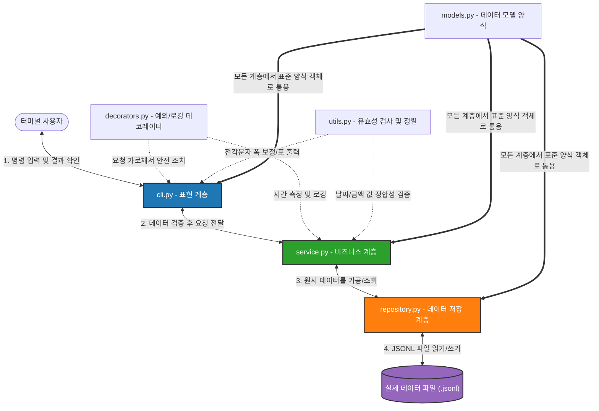

# 💰 초심자를 위한 스마트 가계부 (budget_app) 종합 학습 가이드 & 사용 매뉴얼

안녕하세요! 이 가이드는 파이썬 언어가 낯설고 가계부 프로그램의 전체적인 원리가 궁금한 입문자분들을 위해 작성되었습니다. 

본 문서를 완독하고 나면, **"이 가계부 프로그램이 어떤 파일들로 나뉘어 있고, 내부적으로 파이썬의 핵심 문법들이 어떻게 유기적으로 동작하는지"**를 다른 초심자에게 직접 칠판에 그려가며 명쾌하게 설명할 수 있게 됩니다.

또한, 프로그램에 탑재된 수많은 명령어(옵션)의 실제 작동법과 예상 터미널 실행 화면까지 아주 상세하게 수록했으니, 가계부를 직접 다루는 훌륭한 나침반으로 활용해 보세요!

---

## 🗺️ 목차
1. [**1장: 가계부의 전체 그림판 (아키텍처와 디렉토리 구조)**](#1장-가계부의-전체-그림판-아키텍처와-디렉토리-구조)
   - 디렉토리 파일 지도
   - 레이어드 아키텍처(Layered Architecture)와 데이터 흐름
2. [**2장: 핵심 기술 심층 탐구 (초심자를 위한 개념 해설)**](#2장-핵심-기술-심층-탐구-초심자를-위한-개념-해설)
   - `classmethod` (클래스 메서드)의 모든 것
   - `argparse`로 구현하는 명령행 인터페이스(CLI)의 뇌
   - `unicodedata`로 해결하는 동아시아 한글 터미널 정렬의 마법
   - 보너스 고급 기술 해설 (Generator, Decorator, Atomic Write)
3. [**3장: 프로그램 종합 사용 설명서 (명령어 백과사전)**](#3장-프로그램-종합-사용-설명서-명령어-백과사전)
   - 명령어 전체 트리 구조
   - 12가지 서브커맨드별 매뉴얼 & 실제 실행/예상 출력 화면 시각화
4. [**4장: 자가진단(FAQ) 및 초심자 성장 튜토리얼 과제**](#4장-자가진단faq-및-초심자-성장-튜토리얼-과제)

---

## 1장: 가계부의 전체 그림판 (아키텍처와 디렉토리 구조)

프로그램이 커지면 한 파일에 모든 코드를 넣지 않고, **"관심사 분리(Separation of Concerns)"** 원칙에 따라 역할별로 파일을 쪼개게 됩니다. 우리 가계부는 매우 모범적인 **레이어드 아키텍처(Layered Architecture)** 구조를 띠고 있습니다.

### 📁 디렉토리 파일 지도

`budget_app` 디렉토리 아래에는 총 8개의 파이썬 파일이 존재합니다. 각각의 고유한 직무는 다음과 같습니다.

| 파일명 | 역할 | 비유하자면? |
| :--- | :--- | :--- |
| [__init__.py](file:///Users/f22losophysics1091/Desktop/glad/budget_app/__init__.py) | 패키지 초기화 파일. 이 폴더가 파이썬 패키지임을 나타내고 버전 정보를 담음 | "가계부 지점의 명패와 허가증" |
| [__main__.py](file:///Users/f22losophysics1091/Desktop/glad/budget_app/__main__.py) | 프로그램 실행 진입점. 터미널 명령을 받으면 가장 먼저 실행됨 | "가계부 지점의 메인 출입문" |
| [cli.py](file:///Users/f22losophysics1091/Desktop/glad/budget_app/cli.py) | **표현 계층 (Presentation)**. 사용자의 입력을 유도하고 결과를 화면에 예쁘게 그려줌 | "고객을 직접 응대하고 안내해주는 창구 직원" |
| [service.py](file:///Users/f22losophysics1091/Desktop/glad/budget_app/service.py) | **비즈니스 로직 계층 (Service)**. 계산, 백업, 무결성 검증, 파일 내보내기/가져오기 규칙 집행 | "금고 안에서 실질적인 재정 연산을 처리하는 지점장" |
| [repository.py](file:///Users/f22losophysics1091/Desktop/glad/budget_app/repository.py) | **데이터 영구 저장 계층 (Persistence)**. 파일을 안전하게 읽고 쓰는 역할 | "실제 거래 장부와 파일 보관 캐비닛을 관리하는 창고지기" |
| [models.py](file:///Users/f22losophysics1091/Desktop/glad/budget_app/models.py) | **도메인 모델 계층 (Model)**. 거래 내역, 예산, 반복 규칙 등의 표준 양식 정의 | "가계부에서 공통으로 사용하는 표준 계약서/신청서 양식" |
| [decorators.py](file:///Users/f22losophysics1091/Desktop/glad/budget_app/decorators.py) | **횡단 관심사 헬퍼 (Decorator)**. 로깅, 예외 처리, 시간 측정 등 공통 기능 래핑 | "가계부 내부의 안전요원 및 감사관 (CCTV 기록 등)" |
| [utils.py](file:///Users/f22losophysics1091/Desktop/glad/budget_app/utils.py) | **유틸리티 계층 (Utility)**. 날짜/금액 유효성 검증 및 한글 폭 계산 기반 예쁜 표 그리기 기능 | "장부 서류 규격 검사기 및 자로 잰 듯 반듯한 포스터 눈금자" |

---

### 🔄 레이어드 아키텍처와 데이터 흐름

가계부 데이터가 터미널 화면에서 출발하여 텍스트 파일까지 흘러가고 되돌아오는 구조를 그림으로 나타내면 다음과 같습니다.



> [!NOTE]
> **왜 레이어드 아키텍처를 쓸까요?**
> 만약 나중에 데이터 저장소를 텍스트 파일에서 SQL 데이터베이스로 바꾸고 싶다면, `cli.py`나 `service.py`를 전혀 손대지 않고 오직 **`repository.py`** 파일 하나만 수정하면 됩니다. 이렇게 각 계층이 독립적으로 분리되어 있어 유지보수와 기능 확장이 획기적으로 편해집니다!

---

## 2장: 핵심 기술 심층 탐구 (초심자를 위한 개념 해설)

가계부의 내부 구조를 뜯어보면 파이썬의 흥미로운 핵심 기술 3가지가 사용되었습니다. 이 기술들을 쉽고 완벽하게 마스터해 봅시다.

---

### 1️⃣ `classmethod` (클래스 메서드)의 모든 것

우리는 `models.py`에서 다음과 같은 코드를 만날 수 있습니다.
```python
@dataclass
class Transaction:
    id: str
    type: str
    date: str
    amount: int
    category: str
    memo: str = ""
    tags: List[str] = field(default_factory=list)

    def to_dict(self) -> dict:  # 일반 메서드
        return {"id": self.id, "type": self.type, "amount": self.amount, ...}

    @classmethod
    def from_dict(cls, data: dict) -> "Transaction":  # 클래스 메서드
        return cls(
            id=data["id"],
            type=data["type"],
            date=data["date"],
            amount=int(data["amount"]),
            category=data["category"],
            memo=data.get("memo", ""),
            tags=data.get("tags", [])
        )
```

#### 💡 일반 메서드(`self`)와 클래스 메서드(`classmethod`)의 근본적 차이

* **일반 인스턴스 메서드 (`to_dict`)**:
  * 매개변수로 **`self`**를 받습니다. `self`는 이미 탄생한 **'특정 붕어빵(인스턴스)'** 자체를 가리킵니다.
  * 이미 존재하는 거래 내역 객체의 필드(id, amount 등)를 읽어서 딕셔너리로 바꿀 때처럼, **객체가 이미 생성되어 있어야만** 호출할 수 있습니다.
  * 예: `my_tx.to_dict()` (이미 탄생한 `my_tx`를 활용)

* **클래스 메서드 (`from_dict`)**:
  * 위에 `@classmethod`라는 장식자(Decorator)가 붙으며, 첫 번째 매개변수로 `self` 대신 **`cls`**를 받습니다.
  * `cls`는 특정 붕어빵이 아니라 **'붕어빵 틀(클래스 자체)'**을 가리킵니다.
  * 즉, 아직 객체가 태어나기 전이라도 클래스 이름 자체로 직접 호출할 수 있으며, 메서드 안에서 새로운 객체를 찍어내어 반환할 수 있습니다!
  * 예: `Transaction.from_dict(raw_data)` (클래스 틀에서 직접 호출하여 새로운 붕어빵을 반환받음)

#### ❓ 왜 데이터 복원에 `classmethod`를 썼을까요? (역직렬화의 팩토리 패턴)

저장 장부(JSONL 파일)에서 한 줄을 읽어오면 그것은 파이썬 객체가 아닌 단순한 **딕셔너리(`{"id": "TX-001", "amount": 10000}`)** 형태입니다.
우리는 이 날것의 딕셔너리를 완벽한 `Transaction` 객체로 부활시켜야 합니다.

만약 `classmethod`가 없다면 매번 외부에서 수동으로 조립해야 합니다:
```python
# classmethod가 없을 때의 불편한 조립 방식
raw_data = {"id": "TX-001", "type": "expense", ...}
tx = Transaction(
    id=raw_data["id"],
    type=raw_data["type"],
    amount=int(raw_data["amount"]), # 매번 수동으로 형변환!
    ...
)
```
하지만 클래스 메서드(`from_dict`)를 정의해 두면, 클래스 틀 내부에 조립 레시피를 캡슐화할 수 있습니다:
```python
# classmethod를 활용한 깔끔한 생성 (팩토리 패턴)
tx = Transaction.from_dict(raw_data)
```
이렇게 하면 데이터 가공 처리가 `models.py` 내부 한곳으로 모이게 되므로, 코드가 훨씬 정돈되고 객체 지향적으로 변모합니다.

#### ⚖️ `classmethod` vs `staticmethod`
* `staticmethod`는 `self`도 `cls`도 받지 않는 순수한 외톨이 함수입니다. 단순히 클래스 네임스페이스 아래에 묶어둔 기능에 가깝습니다.
* 반면, `classmethod`는 부모 클래스를 상속받은 자식 클래스가 부모의 `from_dict`를 호출할 때, `cls` 자리에 부모 클래스가 아닌 **'자식 클래스'가 자동으로 주입**됩니다. 따라서 유연한 상속 구조 설계가 가능해집니다.

---

### 2️⃣ `argparse`로 구현하는 명령행 인터페이스(CLI)의 뇌

가계부 프로그램을 실행할 때 우리는 터미널에 `python3 -m budget_app list --limit 5`와 같은 타이핑을 입력합니다. 이 복잡한 영문 명령어들과 옵션을 한 글자씩 쪼개어 분석하고 처리해 주는 사령탑이 바로 파이썬 표준 라이브러리인 **`argparse`**입니다.

#### 🧠 `subparsers`와 서브커맨드 설계
`argparse`는 명령을 계층 구조로 처리할 수 있는 **Subparser(하위 파서)** 기능을 지원합니다. 
```python
parser = argparse.ArgumentParser(prog="python -m budget_app")
subparsers = parser.add_subparsers(dest="command") # 여기에 하위 명령어들이 등록됨
```
위 코드를 기반으로 우리는 `add`, `list`, `search`, `summary` 등 각 역할에 맞는 전용 주머니(Subparser)를 이어 붙입니다.
* `python3 -m budget_app list`를 입력하면 `dest="command"`에 의해 `args.command` 변수에 `"list"` 문자열이 담깁니다.
* `python3 -m budget_app summary`를 입력하면 `args.command`에 `"summary"`가 담겨, 대형 `if-elif` 분기문을 돌며 올바른 함수로 안내합니다.

#### 🔗 파라미터가 바인딩되는 흐름 추적

`search` 명령어의 돋보기 옵션들이 바인딩되는 여정을 따라가 봅시다.
```python
search_parser = subparsers.add_parser("search")
search_parser.add_argument("--from", dest="from_date", help="시작 날짜")
search_parser.add_argument("--limit", type=int, default=None, help="최대 출력 건수")
```
1. **분석**: 사용자가 터미널에 `python3 -m budget_app search --from 2026-05-01 --limit 5`를 입력합니다.
2. **파싱**: `argparse`가 옵션 플래그(`--from`) 뒤에 오는 문자열(`"2026-05-01"`)을 읽어들입니다.
3. **타입 변환**: `--limit` 뒤의 문자열 `"5"`는 `type=int` 설정에 의해 즉시 정수 숫자 `5`로 변환됩니다.
4. **네임스페이스 바인딩**: `dest="from_date"` 옵션에 의해, 원래 파이썬에서 예약어인 `from` 대신 안전하게 `args.from_date` 변수명에 `"2026-05-01"`을 매핑해 줍니다.
5. **결과**: `args = parser.parse_args()`가 실행되고 나면 `args.from_date`는 `"2026-05-01"`, `args.limit`는 `5`라는 값을 가지게 되며, 이 변수들을 `service.py`로 고스란히 전달해 검색 필터링을 집행합니다.

---

### 3️⃣ `unicodedata`로 해결하는 동아시아 한글 터미널 정렬의 마법

콘솔 화면에 데이터를 출력할 때 가장 기분 좋은 경험 중 하나는 **컴퓨터가 표를 자로 잰 듯이 반듯하게 그렸을 때**입니다. 하지만 동아시아 언어(한글, 한자)가 포함되면 표의 줄이 삐뚤빼뚤 엉망이 되는 치명적인 문제가 발생합니다.

```
[잘못 정렬된 예시]
|   거래 ID  |   날짜   |   카테고리   |    금액    |
| TX-000001 | 2026-05-29 | 식비 |  15,000원 |
| TX-000002 | 2026-05-29 | 대중교통비 |   1,250원 |
(한글 단어 폭이 안 맞아 우측 수직선 | 위치가 뒤죽박죽 어긋남)
```

#### 📏 왜 한글이 들어가면 줄 정렬이 깨질까요?
컴퓨터 모니터의 터미널(콘솔) 화면은 바둑판 모양의 고정 폭 그리드 시스템입니다.
* 영어 알파벳, 숫자, 기호: 가로 1칸을 차지합니다 (Half-width, 반각 문자).
* **한글, 한자, 일본어 가나**: 영문 글자보다 가로 크기가 **정확히 2배 넓어 가로 2칸**을 차지합니다 (Full-width, 전각 문자).

하지만 파이썬의 표준 함수인 `len("식비")`를 호출하면 동아시아 문자의 시각적 크기는 고려하지 않고 단순히 **글자 수인 `2`**를 돌려줍니다.
만약 너비 10칸에 맞추기 위해 10에서 `len("식비")`인 2를 빼서 공백 8개를 패딩하면:
* "식비"(시각적 4칸) + 공백 8개(8칸) = **총 12칸**을 차지하게 되어 표 전체 라인이 오른쪽으로 2칸 밀려 어긋납니다!

#### 🛠️ `unicodedata`를 활용한 전각 문자 판별 공식

[utils.py](file:///Users/f22losophysics1091/Desktop/glad/budget_app/utils.py)에서는 이 문제를 표준 라이브러리인 `unicodedata`로 완벽하게 타파했습니다.
```python
import unicodedata

def get_display_width(text: str) -> int:
    width = 0
    for char in text:
        # 문자의 동아시아 너비 분류값 획득
        status = unicodedata.east_asian_width(char)
        if status in ('W', 'F', 'A'): # 'Wide'(전각), 'Full-width', 'Ambiguous'
            width += 2
        else:
            width += 1
    return width
```

* **`unicodedata.east_asian_width(char)`**는 유니코드 표준 규격에 따라 해당 문자가 화면에서 차지하는 너비 카테고리를 리턴합니다.
  * `'W'` (Wide), `'F'` (Full-width): 한글, 한자, 전각 기호 등 ➡️ **시각적 폭 2칸 인정!**
  * `'Na'` (Narrow), `'H'` (Half-width): 일반 알파벳, 숫자 등 ➡️ **시각적 폭 1칸 인정!**

이 폭 계산기를 기반으로, 목표 너비(`target_width`)와 시각적 너비(`get_display_width`)의 차이만큼 공백을 덧붙이는 `pad_string` 함수를 구현하여, 외부 오픈소스 라이브러리 설치 없이도 칼로 자른 듯 정교한 표(`print_table`)를 렌더링하는 데 성공했습니다.

---

### 4️⃣ 보너스 고급 기술 3가지 맛보기

우리 가계부는 초심자 학습용임에도 불구하고 업계에서 실제로 널리 사용되는 고급 프로그래밍 설계 기법들이 충실히 구현되어 있습니다.

#### ① 제너레이터(Generator)와 `yield` (메모리 효율 극대화)
`repository.py`의 조회 기능은 데이터를 대괄호 리스트(`[...]`)에 전부 쓸어 담아 한 번에 리턴하지 않고, **`yield`** 문법을 활용합니다.
```python
def find_all_stream(self) -> Generator[Transaction, None, None]:
    with open(self.file_path, "r") as f:
        for line in f:
            yield Transaction.from_dict(json.loads(line))
```
* **일반 리스트 반환**: 100만 개의 거래 내역이 있다면, 100만 개 객체를 전부 메모리에 올려 리스트를 만든 후 반환하므로 메모리가 터질 수 있습니다.
* **제너레이터 (`yield`) 반환**: 호출한 쪽에서 "다음 거래 내역 하나 줘!"라고 요청할 때마다 장부 파일에서 **딱 한 줄만 읽어서 가공한 뒤 건네줍니다 (스트리밍)**. 사용이 끝나면 버리므로, 대용량 거래 데이터 파일이 들어와도 메모리를 아주 쥐꼬리만큼만 사용하여 쾌적하게 구동됩니다.

#### ② 데코레이터(Decorator)와 `@` (횡단 관심사의 분리)
로깅, 실행 소요 시간 측정, 복잡한 한글 안내 예외 처리 등은 가계부의 핵심 계산과는 상관없지만 곳곳에서 반복되는 **공통 업무**입니다. 이를 비즈니스 코드와 섞지 않고 함수 밖에 예쁘게 두르는 기법이 데코레이터입니다.
* `@handle_errors_gracefully`: `cli.py` 최상단에 붙여서, 아래에서 날아오는 모든 기괴한 시스템 에러를 가로채 친절한 한글 오류 안내문으로 번역해 줍니다.
* `@log_execution_time`: 무거운 작업을 처리하는 함수(백업, 가져오기 등)에 붙여, 작업이 시작하고 끝날 때까지 걸린 시간을 마이크로초 단위로 타이머를 가동해 표시합니다.
* `@log_activity()`: 가계부 데이터를 영구 수정하는 핵심 행동에 달아주면, `data/activity.log` 파일에 호출 흔적을 자동으로 빽빽하게 기록해 둡니다.

#### ③ 원자적 쓰기 (Atomic Write)
데이터 장부 파일에 쓰기(Write) 작업을 수행하던 중, 갑자기 정전이 나거나 배터리가 방전되어 컴퓨터가 꺼지면 파일이 반만 쓰여 영구적으로 깨지는 참사가 일어납니다. 이를 완벽하게 보호하기 위해 원자적 쓰기(Atomic Write) 기법이 도입되었습니다.
1. 기존 장부(`transactions.jsonl`)를 바로 덮어쓰지 않습니다.
2. 장부 폴더에 임시 파일인 `transactions.jsonl.tmp`를 새로 만듭니다.
3. 임시 파일에 수정된 데이터를 안전하게 끝까지 다 씁니다.
4. 쓰기가 무사히 끝나 파일이 정상적으로 닫히면, OS 커널 수준의 함수인 `os.replace()`를 호출해 기존 원본 장부를 임시 파일로 **눈 깜짝할 사이에 단 한 번(Atomic)의 동작으로 교체**합니다.
5. 중간에 오류가 나면 임시 파일만 휴지통에 버리므로, 기존 장부는 털끝 하나 상하지 않고 안전하게 보존됩니다.

---

## 3장: 프로그램 종합 사용 설명서 (명령어 백과사전)

이 가계부 프로그램은 터미널에서 작동하는 완전한 도구입니다. 모든 서브커맨드의 구체적인 옵션 설명과 실제 예제, 그리고 예상되는 터미널 스크린샷 화면을 알기 쉽게 매핑했습니다.

### 🌳 명령어 전체 트리 구조

우리가 타이핑할 수 있는 명령어의 전체 지형도는 다음과 같습니다.
```
python -m budget_app
 ├── add (대화형 거래 등록)
 ├── list [--limit N] (거래 전체 목록 최신순 조회)
 ├── search [--from YYYY-MM-DD] [--to YYYY-MM-DD] [--category CAT] [--type TYPE] [--q KEYWORD] [--tag TAG] (상세 다중 검색)
 ├── summary --month YYYY-MM [--top N] (재정 분석 리포트 및 예산 대조)
 ├── budget
 │    └── set --month YYYY-MM --amount WON (한도 예산 등록)
 ├── category
 │    ├── add (신규 카테고리 사전 등록)
 │    ├── list (등록된 모든 카테고리 조회)
 │    └── remove [--fallback CAT] (카테고리 무결성 삭제 및 이관)
 ├── update (대화형 데이터 변경)
 ├── delete --id TX-XXXXXX (데이터 영구 삭제)
 ├── backup (가계부 ZIP 압축 생성)
 ├── recurring
 │    ├── add (반복 규칙 정의)
 │    ├── list (반복 규칙 조회)
 │    ├── remove --id REC-XXXXXX (규칙 영구 삭제)
 │    └── generate --month YYYY-MM (반복 규칙 데이터 월별 일괄 생성)
 ├── import --from CSV_PATH (CSV 파일 일괄 검증 및 불러오기)
 └── export --out CSV_PATH {--month YYYY-MM | --from YYYY-MM-DD --to YYYY-MM-DD} (데이터 백업 내보내기)
```

---

### 1️⃣ add (대화형 거래 등록)
* **설명**: 사용자의 입력을 실시간 대화 흐름으로 안내받아 새로운 수입이나 지출 거래를 안전하게 장부에 적습니다.

| 매개변수 | 타입 | 필수 여부 | 설명 |
| :--- | :--- | :--- | :--- |
| 없음 (대화형 실행) | - | - | 실행 후 순차적으로 6단계의 안내에 따라 값을 입력합니다. |

* **실제 실행 명령어**:
  ```bash
  python3 -m budget_app add
  ```
* **🖥️ 예상 터미널 화면**:
  ```
  === [거래 추가 진행] 대화형 가이드를 시작합니다 ===
  1. 날짜(YYYY-MM-DD): 2026-05-29
  2. 타입(income/expense): expense
    * 현재 선택 가능 카테고리: ['식비', '교통', '주거', '수입', '기타']
  3. 카테고리: 식비
  4. 금액(양수): 12500
  5. 메모(선택 - 없을 시 그냥 엔터): 맛있는 점심 돈까스 식사
  6. 태그(쉼표 구분 선택 - 없을 시 그냥 엔터): 외식, 금요일

  [저장 완료] 성공적으로 추가되었습니다. 고유 발급 ID = TX-000001
  ```

---

### 2️⃣ list (전체 거래 목록 최신순 조회)
* **설명**: 장부에 등록된 모든 거래 내역을 날짜가 가장 최근인 순서(최신순)로 예쁜 ASCII 표로 그려 보여줍니다.

| 매개변수 | 타입 | 필수 여부 | 설명 / 기본값 |
| :--- | :--- | :--- | :--- |
| `--limit` | 정수(int) | 선택 | 화면에 출력할 거래 내역의 최대 줄 개수를 제한합니다. (기본값: 전체 출력) |

* **실제 실행 명령어 (5건만 보기)**:
  ```bash
  python3 -m budget_app list --limit 3
  ```
* **🖥️ 예상 터미널 화면**:
  ```
  [성능 로그] 'list_transactions' 작업 소요 시간: 0.0012초

  === [거래 목록 전체 보기] (출력 제한: 3) ===
  +-----------+------------+------+----------+-----------+----------------------+--------------+
  |  거래 ID  |    날짜    | 종류 | 카테고리 |    금액   |         메모         |   해시태그   |
  +-----------+------------+------+----------+-----------+----------------------+--------------+
  | TX-000003 | 2026-05-29 | 지출 |   교통   |   1,250원 | 지하철 퇴근          | 퇴근길       |
  | TX-000002 | 2026-05-29 | 수입 |   수입   | 500,000원 | 프리랜서 용역비 입금 | 부업         |
  | TX-000001 | 2026-05-29 | 지출 |   식비   |  12,500원 | 맛있는 점심 돈까스   | 외식, 금요일 |
  +-----------+------------+------+----------+-----------+----------------------+--------------+
  ```

---

### 3️⃣ search (상세 다중 검색)
* **설명**: 시작/종료일, 카테고리, 수입/지출 유형, 키워드, 태그 등 여러 상세 조건을 조합하여 원하는 거래를 사막에서 바늘 찾듯 정밀 검색합니다.

| 매개변수 | 타입 | 필수 여부 | 설명 |
| :--- | :--- | :--- | :--- |
| `--from` | 문자열 (YYYY-MM-DD) | 선택 | 검색을 시작할 기준 일자 |
| `--to` | 문자열 (YYYY-MM-DD) | 선택 | 검색을 마칠 기준 일자 |
| `--category` | 문자열 | 선택 | 특정 카테고리만 필터링 |
| `--type` | 문자열 | 선택 | `income`(수입) 또는 `expense`(지출) 필터링 |
| `--q` | 문자열 | 선택 | 메모 필드에 포함된 텍스트 검색 키워드 (대소문자 구분 없음) |
| `--tag` | 문자열 | 선택 | 특정 해시태그가 포함된 거래 필터링 |

* **실제 실행 명령어 (5월 한 달간 지출된 식비 중 '돈까스' 키워드 검색)**:
  ```bash
  python3 -m budget_app search --from 2026-05-01 --to 2026-05-31 --category 식비 --type expense --q 돈까스
  ```
* **🖥️ 예상 터미널 화면**:
  ```
  === [거래 검색 결과] ===
  +-----------+------------+------+----------+----------+--------------------+--------------+
  |  거래 ID  |    날짜    | 종류 | 카테고리 |   금액   |        메모        |   해시태그   |
  +-----------+------------+------+----------+----------+--------------------+--------------+
  | TX-000001 | 2026-05-29 | 지출 |   식비   | 12,500원 | 맛있는 점심 돈까스 | 외식, 금요일 |
  +-----------+------------+------+----------+----------+--------------------+--------------+
  ```

---

### 4️⃣ summary (재정 분석 리포트 및 예산 대조)
* **설명**: 특정 월의 총수입, 총지출, 순잔액을 계산하고, 설정된 한도 예산 대비 사용 비율과 ⚠️초과 경고 알림, 그리고 가장 많은 지출이 일어난 카테고리 랭킹(TOP N)을 분석 보고서 형태로 뽑아냅니다.

| 매개변수 | 타입 | 필수 여부 | 설명 / 기본값 |
| :--- | :--- | :--- | :--- |
| `--month` | 문자열 (YYYY-MM) | **필수** | 통계 및 리포트를 뽑아낼 대상 년월 (예: `2026-05`) |
| `--top` | 정수(int) | 선택 | 최다 지출 카테고리 순위 출력 개수 (기본값: `3`) |

* **실제 실행 명령어**:
  ```bash
  python3 -m budget_app summary --month 2026-05 --top 3
  ```
* **🖥️ 예상 터미널 화면 (예산이 초과되었을 때)**:
  ```
  ==========================================
         💰  2026-05 재정 분석 리포트        
  ==========================================
   · 총 수입:  500,000원
   · 총 지출:  620,000원
   · 순 잔액:  -120,000원
  ------------------------------------------
   · 설정 예산: 500,000원
   · 사용률:    124.0%
   ⚠️  [경고] 이번 달 설정한 총 예산을 초과하셨습니다!
  ==========================================
         🔥 지출 TOP 3 카테고리 랭킹      
  ==========================================
    1위) 주거 : 350,000원
    2위) 식비 : 180,000원
    3위) 교통 : 90,000원
  ==========================================
  ```

---

### 5️⃣ budget set (월별 한도 예산 설정)
* **설명**: 특정 월에 사용할 총 지출 한도 예산을 데이터베이스(장부)에 기록합니다. 이 금액은 `summary` 명령어에서 사용률을 산출할 때 활용됩니다.

| 매개변수 | 타입 | 필수 여부 | 설명 |
| :--- | :--- | :--- | :--- |
| `--month` | 문자열 (YYYY-MM) | **필수** | 예산을 책정할 해당 년월 |
| `--amount` | 정수(int) | **필수** | 한도 예산액 (0보다 큰 양의 정수) |

* **실제 실행 명령어**:
  ```bash
  python3 -m budget_app budget set --month 2026-05 --amount 500000
  ```
* **🖥️ 예상 터미널 화면**:
  ```
  [저장 완료] 2026-05 예산 한도가 500,000원으로 책정되어 저장되었습니다.
  ```

---

### 6️⃣ category (카테고리 사전 정의 관리)
* **설명**: 가계부 거래에 배정할 수 있는 분류명(카테고리 사전)을 추가하거나, 목록을 보거나, 삭제합니다.
* **무결성 보안 정책 (Cascading/Restrict)**: 만약 기존 장부에 `"식비"`라는 거래 내역이 존재하는데 `"식비"` 카테고리를 그냥 삭제하면 가계부의 데이터 무결성이 깨지게 됩니다. 우리 프로그램은 이를 방지하고자 삭제하려는 카테고리에 묶여 있는 거래 내역이 있으면 **대체할 카테고리(`--fallback`)** 지정을 의무화하여 데이터를 안전하게 이관한 뒤 기존 카테고리를 지웁니다.

#### ① 카테고리 추가
* **실제 실행**: `python3 -m budget_app category add`
* **🖥️ 터미널 화면**:
  ```
  === [신규 카테고리 추가] ===
  새 카테고리명: 통신비
  [저장 완료] 카테고리 '통신비'이(가) 신규 등록되었습니다.
  ```

#### ② 카테고리 목록 보기
* **실제 실행**: `python3 -m budget_app category list`
* **🖥️ 터미널 화면**:
  ```
  === [사용 가능 카테고리 일람] ===
   - 식비
   - 교통
   - 주거
   - 수입
   - 기타
   - 통신비
  ```

#### ③ 카테고리 제거 (안전 이관 정책 포함)
* **실제 실행 (대체 카테고리를 미리 알려주지 않았을 때 대화형 자동 복구 작동)**:
  ```bash
  python3 -m budget_app category remove
  ```
* **🖥️ 터미널 화면**:
  ```
  === [카테고리 삭제 진행] ===
  삭제할 카테고리명: 식비
  
  [실패] '식비' 카테고리를 사용하는 거래가 4건 존재합니다. 안전을 위해 대체할 카테고리를 함께 지정해 주세요.
  
  [대화형 구조 복구]
  거래를 이관해 줄 대체 카테고리명: 기타
  [성공] '식비' 카테고리를 삭제했습니다. (연관된 거래 4건의 분류를 '기타'(으)로 이관했습니다.)
  ```

---

### 7️⃣ update (대화형 거래 정보 수정)
* **설명**: 기존 거래 내역의 정보를 안전하고 영리하게 수정하는 모듈입니다.
* **영리한 수정 기능 (Smart Input)**: 
  * 기존 값을 유지하고 싶다면 아무것도 적지 않고 그냥 **[엔터]**만 치면 됩니다.
  * 기존 메모나 해시태그를 공백이나 빈 리스트로 초기화(삭제)하고 싶다면 대시 기호(**`-`**)를 입력하면 됩니다.

| 매개변수 | 타입 | 필수 여부 | 설명 |
| :--- | :--- | :--- | :--- |
| 없음 (대화형 실행) | - | - | 수정할 대상 ID를 입력한 뒤 각 필드 수정을 순차적으로 선택합니다. |

* **실제 실행 명령어**:
  ```bash
  python3 -m budget_app update
  ```
* **🖥️ 예상 터미널 화면**:
  ```
  === [거래 내역 대화형 수정] (안 B 방식 작동) ===
  수정할 거래 고유 ID를 입력해 주세요: TX-000001
  
  거래 검색 성공! 내용을 수정하려면 값을 새로 적으시고, 그대로 유지하려면 [엔터]를 치세요.
  
  날짜 [현재값: 2026-05-29] 수정할 값 입력 (형식: YYYY-MM-DD): [엔터]
  타입 [현재값: expense] 수정할 값 입력 (income / expense): [엔터]
    * 현재 선택 가능 카테고리: ['교통', '주거', '수입', '기타']
  카테고리 [현재값: 기타] 수정할 값 입력: 교통
  금액 [현재값: 12,500원] 수정할 값 입력 (양수 숫자): 13000
  메모 [현재값: '맛있는 점심 돈까스'] 수정할 값 입력 (없애려면 '-' 입력): 점심 돈까스 금액 인상 반영
  태그 [현재값: 외식, 금요일] 수정할 값 입력 (쉼표로 구분, 없애려면 '-' 입력): -
  
  [성능 로그] 'update_transaction' 작업 소요 시간: 0.0025초
  [수정 완료] 거래 'TX-000001' 정보가 무결하게 변경되어 안전하게 기록되었습니다!
  ```

---

### 8️⃣ delete (거래 내역 단건 삭제)
* **설명**: 고유 거래 ID를 지정하여 해당하는 단일 거래 데이터를 영구 장부 파일에서 깨끗이 도려내고 저장합니다. (원자적 쓰기가 뒤에서 조용히 보호합니다)

| 매개변수 | 타입 | 필수 여부 | 설명 |
| :--- | :--- | :--- | :--- |
| `--id` | 문자열 | **필수** | 지우고자 하는 거래의 고유 식별자 (예: `TX-000001`) |

* **실제 실행 명령어**:
  ```bash
  python3 -m budget_app delete --id TX-000001
  ```
* **🖥️ 예상 터미널 화면**:
  ```
  [성능 로그] 'delete_transaction' 작업 소요 시간: 0.0019초
  
  [삭제 완료] 요청하신 거래 ID 'TX-000001' 가 안전하게 제거되었습니다.
  ```

---

### 9️⃣ backup (데이터 ZIP 압축 보존)
* **설명**: 현재 등록된 가계부 파일 데이터들(`transactions.jsonl`, `budgets.jsonl` 등)의 원본을 고스란히 모아서 타임스탬프 이름의 단일 ZIP 파일로 백업 보관합니다.

| 매개변수 | 타입 | 필수 여부 | 설명 |
| :--- | :--- | :--- | :--- |
| 없음 | - | - | 백업 결과 파일의 저장 경로를 반환합니다. |

* **실제 실행 명령어**:
  ```bash
  python3 -m budget_app backup
  ```
* **🖥️ 예상 터미널 화면**:
  ```
  === [가계부 백업 데이터 압축 파일 생성 시작] ===
  [성능 로그] 'backup_data' 작업 소요 시간: 0.0042초
  [완료] 데이터가 완벽히 압축 저장되었습니다: backups/backup_20260529_104413.zip
  ```

---

### 🔟 recurring (정기 반복 거래 자동화 모듈)
* **설명**: 매달 고정적으로 통장에서 빠져나가는 적금, 보험료, 월세, 통신비 또는 월급 같은 거래를 매번 손으로 입력하지 않고 규칙을 정의해 둔 뒤, 월 초에 일괄 자동 생성시키는 강력한 자동화 엔진입니다.
* **이중 중복 생성 차단 장치 (Double-Spend Protection)**: 
  * 반복 거래가 등록될 때 태그 리스트에 자동으로 해당 반복 규칙 고유 ID(예: `REC-000001`)를 단단히 심어 둡니다.
  * 추후 실수로 동일한 월에 `generate` 명령을 또 실행하더라도, 시스템은 거래 내역에 심어진 `REC-` 태그의 유무를 먼저 검사하여 이미 생성된 이력이 있으면 똑똑하게 실행을 스킵(중복 방어)합니다.

#### ① 반복 거래 규칙 추가 (add)
* **실제 실행**: `python3 -m budget_app recurring add`
* **🖥️ 터미널 화면**:
  ```
  === [매달 고정 반복 규칙 등록] ===
  1. 매달 발생할 일자 (1~31일): 25
  2. 타입 (income / expense): income
    * 현재 선택 가능 카테고리: ['교통', '주거', '수입', '기타']
  3. 카테고리: 수입
  4. 금액: 3000000
  5. 메모(선택): 매달 꿀맛 같은 월급날!
  6. 태그(쉼표 구분 선택): 회사, 월급
  
  [저장 완료] 정기 반복 거래 규칙이 생성되었습니다. 규칙 ID = REC-000001
  ```

#### ② 반복 거래 규칙 조회 (list)
* **실제 실행**: `python3 -m budget_app recurring list`
* **🖥️ 터미널 화면**:
  ```
  === [등록된 정기 반복 거래 규칙 일람] ===
  +------------+----------+------+----------+-------------+----------------------+
  |  규칙 ID   |  발생일  | 종류 | 카테고리 |     금액    |         메모         |
  +------------+----------+------+----------+-------------+----------------------+
  | REC-000001 | 매달 25일| 수입 |   수입   | 3,000,000원 | 매달 꿀맛 같은 월급날|
  +------------+----------+------+----------+-------------+----------------------+
  ```

#### ③ 특정 규칙 삭제 (remove)
* **실제 실행**: `python3 -m budget_app recurring remove --id REC-000001`
* **🖥️ 터미널 화면**:
  ```
  [삭제 완료] 정기 반복 규칙 'REC-000001' 가 제거되었습니다.
  ```

#### ④ 월별 반복 규칙 데이터 대조 및 자동 일괄 생성 (generate)
* **실제 실행 (처음 실행 시 1건 성공, 두 번째 실행 시 중복 차단되어 1건 건너뜀 시각화)**:
  ```bash
  python3 -m budget_app recurring generate --month 2026-05
  ```
* **🖥️ 터미널 화면 (1차 실행 시)**:
  ```
  === [2026-05 정기 반복 거래 자동 일괄 대조 및 생성 작동] ===
  [성능 로그] 'generate_recurring_transactions' 작업 소요 시간: 0.0035초
  [완료] 자동 생성 완료 = 1건, 기 생성 건너뜀(중복 방어) = 0건
  ```
* **🖥️ 터미널 화면 (직후 똑같은 명령으로 2차 재실행 시)**:
  ```
  === [2026-05 정기 반복 거래 자동 일괄 대조 및 생성 작동] ===
  [성능 로그] 'generate_recurring_transactions' 작업 소요 시간: 0.0029초
  [완료] 자동 생성 완료 = 0건, 기 생성 건너뜀(중복 방어) = 1건
  ```

---

### 1️⃣1️⃣ import (CSV 일괄 가져오기)
* **설명**: 가계부 장부를 엑셀이나 외부 기기에서 추출한 CSV 파일 양식으로부터 일괄 등록합니다.
* **부분 검증 및 무결성 수집 장치 (Fault-Tolerant Import)**:
  * CSV의 수많은 줄 중 날짜가 깨졌거나, 음수 금액이 적혔거나, 사전에 등록 안 된 정체불명의 카테고리가 섞여 있는 불량 데이터가 있을 때 프로그램 실행을 멈추고 에러를 뿜는 것은 가혹합니다.
  * 우리 시스템은 올바른 데이터를 가진 정상 줄(Row)은 장부에 안전하게 추가하고, **문제가 있는 불량 줄만 선택적으로 골라내어 스킵**한 뒤, 몇 번째 줄에서 어떤 이유로 탈락했는지 아래 화면처럼 친절한 보고서로 보여줍니다.

| 매개변수 | 타입 | 필수 여부 | 설명 |
| :--- | :--- | :--- | :--- |
| `--from` | 파일 경로 (string) | **필수** | 불러올 대상 외부 CSV 파일 경로 |

* **실제 실행 명령어**:
  ```bash
  python3 -m budget_app import --from external_data.csv
  ```
* **🖥️ 예상 터미널 화면 (일부 데이터 통과 실패 스킵 리포트 포함)**:
  ```
  === [외부 CSV 가계부 일괄 불러오기 시작] ===
   분석 파일: external_data.csv
  
  [성능 로그] 'import_from_csv' 작업 소요 시간: 0.0124초
  
  [가져오기 종료]
   · 성공적으로 저장 완료된 데이터: 12건
   · 스킵(데이터 정밀 검사 탈락)된 데이터: 2건
  
  🚨 [스킵 데이터 상세 리포트]
    [4번 행 스킵 이유] 금액 '-5000'은(는) 0보다 큰 양의 정수(숫자)여야 합니다. (예: 15000)
    [8번 행 스킵 이유] '해외여행' 카테고리는 현재 가계부에 존재하지 않는 카테고리입니다.
  
  [힌트] 스킵된 줄의 데이터를 확인하신 후 올바르게 교정하여 CSV를 다시 불러오시길 권장합니다.
  ```

---

### 1️⃣2️⃣ export (조건부 CSV 백업 내보내기)
* **설명**: 장부에 기록된 거래 내역을 외부에서 분석할 수 있도록 대중적인 UTF-8 엑셀용 CSV 파일로 내보냅니다.
* **보안 필터 정책**: 전체 백업이 무분별하게 추출되는 것을 방지하기 위해, 반드시 `--month` 또는 `--from/--to` 기간 지정 옵션 중 **최소 하나 이상**을 명시해야만 동작하도록 통제하고 있습니다.

| 매개변수 | 타입 | 필수 여부 | 설명 |
| :--- | :--- | :--- | :--- |
| `--out` | 파일명 (string) | **필수** | 생성할 CSV 파일의 저장 파일명 |
| `--month` | 문자열 (YYYY-MM) | 선택 | 내보낼 특정 년월 한정 |
| `--from` | 문자열 (YYYY-MM-DD) | 선택 | 내보낼 기간 시작일 |
| `--to` | 문자열 (YYYY-MM-DD) | 선택 | 내보낼 기간 종료일 |

* **실제 실행 명령어**:
  ```bash
  python3 -m budget_app export --out my_backup_may.csv --month 2026-05
  ```
* **🖥️ 예상 터미널 화면**:
  ```
  === [조건별 가계부 CSV 내보내기 시작] ===
  [성능 로그] 'export_to_csv' 작업 소요 시간: 0.0039초
  [완료] 'my_backup_may.csv' 경로에 안전하게 저장되었습니다. (추출 건수: 13건)
  ```

---

## 4장: 자가진단(FAQ) 및 초심자 성장 튜토리얼 과제

프로그램 작동 중 어려움이 발생했거나, 여기서 배운 지식을 기초로 파이썬 실력을 한 단계 도약시키고 싶은 분들을 위한 장입니다.

### 🔍 Q1. 에러가 났을 때 영어 문장이 잔뜩 나오면서 프로그램이 깨지지 않고 친절하게 종료되는데 왜 그런가요?
* **A**: 이것은 [decorators.py](file:///Users/f22losophysics1091/Desktop/glad/budget_app/decorators.py) 파일에 구현된 **`@handle_errors_gracefully`** 데코레이터의 고마운 덕분입니다. 
  * 파이썬 엔진에서 치명적인 에러가 터지면 원래는 해독하기 어려운 영문 추적 로그(Traceback)가 뿜어집니다.
  * 이 데코레이터가 실행 함수 전체를 꽉 감싸고 있다가, 예외(ValueError 등)가 발생하면 이를 낚아채어 친절한 한글 에러 문구와 어떻게 입력해야 오류를 피할 수 있는지 **[힌트]** 가이드까지 가공하여 화면에 띄우고 시스템을 안전하게 종료(`sys.exit(1)`)시킵니다.
  * 따라서 터미널에 에러 문구가 뜨면, 당황하지 말고 가장 아래에 적힌 **`[힌트]`** 부분을 정독하시면 해결책을 금방 찾을 수 있습니다!

---

### 🎓 초심자 파이썬 성장 튜토리얼 과제 (직접 도전해 보세요!)

이 가계부 앱에 나만의 기능을 직접 코딩해 넣어보고 싶지 않으신가요? 다음 두 가지만 직접 수정해 보셔도 파이썬 중급자로 껑충 올라서게 됩니다.

#### 🎯 미션 1: 신규 기본 카테고리 추가해 보기
* **목표**: 가계부를 처음 실행하면 카테고리 장부에 자동으로 ["식비", "교통", "주거", "수입", "기타"]가 등록됩니다. 여기에 나만의 취미 생활을 위한 `"문화생활"`이라는 기본 카테고리가 자동으로 추가되게 수정해 봅시다.
* **힌트 파일**: [repository.py](file:///Users/f22losophysics1091/Desktop/glad/budget_app/repository.py) 파일의 155번째 줄 부근 `_ensure_initial_categories` 함수 내부 리스트를 찾아보세요!

#### 🎯 미션 2: summary 명령어의 지출 랭킹(TOP N) 개수 마음대로 늘려보기
* **목표**: 현재 지출이 가장 심했던 카테고리를 순위별로 기본 3위(`--top 3`)까지만 보여줍니다. 사용자가 옵션을 적지 않았을 때 기본적으로 5위까지 보여주도록 디폴트 옵션을 고쳐봅시다.
* **힌트 파일**: [cli.py](file:///Users/f22losophysics1091/Desktop/glad/budget_app/cli.py) 파일의 103번째 줄 부근 `summary_parser.add_argument` 함수의 `default` 매개변수 숫자를 수정해 보세요!

---

이 가이드를 통해 스마트 가계부(`budget_app`)의 원리를 완전하게 이해하셨기를 바랍니다. 이제 마음껏 명령어를 터미널에 입력하고 테스트해 보며 꼼꼼한 자산 관리 파트너로 삼아보세요! 🚀
