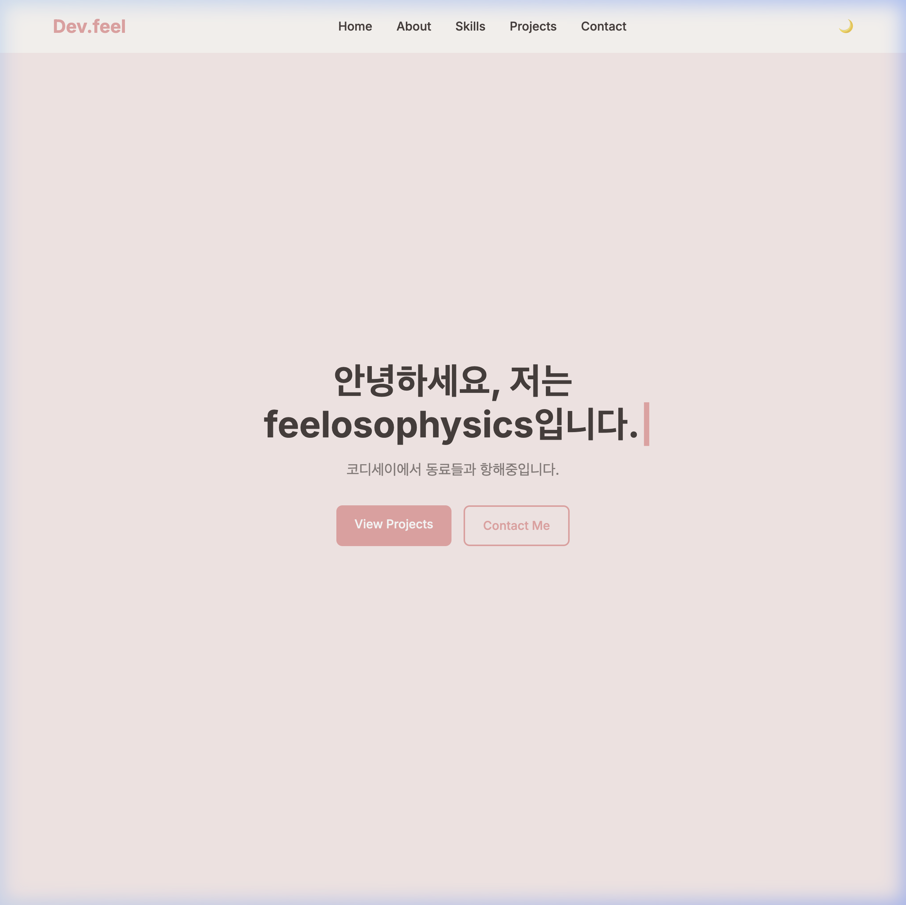
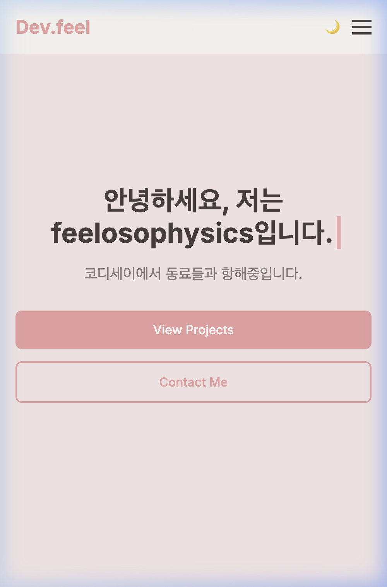
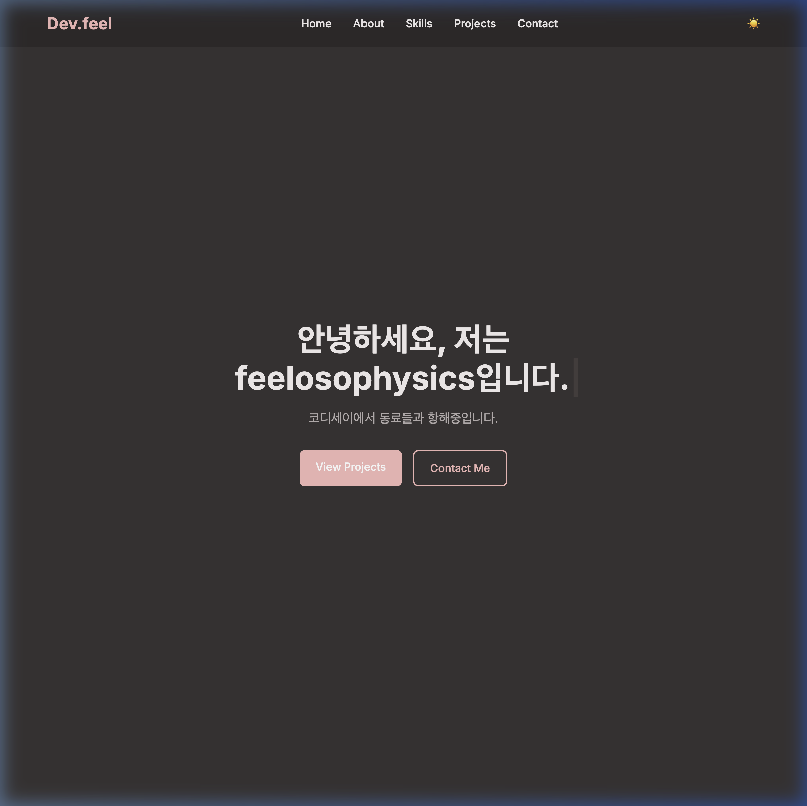

# Frontend Portfolio Project (Vanilla HTML/CSS/JS)

순수 HTML, CSS, JavaScript만을 사용하여 제작한 반응형 포트폴리오 웹사이트입니다. 외부 라이브러리(React, Bootstrap, Tailwind 등)를 일절 사용하지 않고, DOM 조작과 이벤트 처리, 비동기 통신 등 웹의 동작 원리를 체득하기 위해 만들어졌습니다.

## 🚀 배포 링크

- 배포 URL: [https://feelosophysics.github.io/glad/portfolio/](https://feelosophysics.github.io/glad/portfolio/)

## ✨ 주요 기능

| 기능 | 설명 |
|------|------|
| **시맨틱 마크업** | `header`, `nav`, `main`, `section`, `article`, `footer` 등 시맨틱 태그를 활용한 구조적 마크업 |
| **반응형 레이아웃** | CSS Flexbox와 Grid를 적극 활용, **모바일 퍼스트**(`min-width`) 미디어 쿼리 적용 |
| **다크 모드** | CSS 변수(`:root`)와 시스템 설정 감지(`prefers-color-scheme`)를 조합한 다크 모드 지원 및 상태 유지(`localStorage`) |
| **외부 API 연동** | GitHub API 비동기 호출(`fetch`, `async/await`)을 통한 프로젝트 카드 렌더링 |
| **언어별 필터링** | 가져온 저장소 목록을 언어별로 필터링 (`Array.prototype.filter`) |
| **폼 유효성 검사** | 실시간(`input` 이벤트) + 제출 시(`submit` 이벤트) 유효성 검사. Formspree 연동 |
| **스크롤 인터랙션** | Intersection Observer를 활용한 스크롤 등장 애니메이션 및 부드러운 스크롤 이동 |

## 🛠️ 기술 스택

- **HTML5** — 시맨틱 태그, 접근성(`alt`, `label`-`for` 매칭)
- **CSS3** — Variables, Flexbox, Grid, `transition`, `@keyframes`, 모바일 퍼스트 미디어 쿼리
- **JavaScript (ES6+)** — `const`/`let`, 화살표 함수, 템플릿 리터럴, 구조분해 할당, `map`/`filter`/`forEach`, `async`/`await`, Intersection Observer

## 📁 프로젝트 구조 및 파일 분리 이유

본 프로젝트는 유지보수성과 웹 성능 최적화를 위해 HTML(구조), CSS(스타일), JavaScript(동작) 코드를 독립적인 파일로 철저히 분리하여 관리합니다.

```text
glad/portfolio/
├── index.html        # 웹페이지의 뼈대 (구조 정의, 시맨틱 마크업)
├── css/
│   └── style.css     # 웹페이지의 의상 (스타일링, 레이아웃, 테마 정의)
└── js/
    └── main.js       # 웹페이지의 행동 및 두뇌 (상태 관리, 이벤트 처리, API 연동)
```

### 💡 웹 테크놀로지 파일 분리(Separation of Concerns)의 의의
- **관심사 분리(Separation of Concerns):** 웹 문서의 내용(HTML), 외형(CSS), 상호작용(JS)의 역할을 명확히 분리함으로써 코드의 가독성을 극대화하고, 특정 요소를 수정할 때 다른 기술 스택 코드에 미치는 영향을 최소화합니다.
- **유지보수성 향상:** 협업 시 마크업 개발자, 디자이너, 프론트엔드 개발자가 각자의 영역(파일)만 전담하여 수정할 수 있어 충돌 위험을 줄이고 생산성을 높입니다.
- **캐싱 및 웹 성능 최적화:** 브라우저는 한 번 다운로드한 CSS와 JS 파일을 캐싱(Caching)합니다. 페이지 이동 시 HTML 뼈대만 새로 받고 스타일과 스크립트는 로컬 캐시에서 불러오므로 트래픽을 아끼고 초기 로딩 속도를 대폭 단축시킵니다.

## ⚙️ 인터랙션 기준값

미션 요구사항에 따라, 본 프로젝트에서 사용하는 인터랙션 기준값은 다음과 같습니다.

| 인터랙션 | 기준값 | 설명 |
|----------|--------|------|
| **스크롤 탑 버튼** | `300px` | 스크롤이 300px 이상일 때 버튼이 나타남 |
| **네비게이션 스타일 변경** | `60px` | 스크롤이 60px 이상일 때 네비게이션 배경에 `box-shadow` 추가 |
| **스크롤 애니메이션** | `threshold: 0.5` | Intersection Observer의 임계값. 요소가 50% 이상 화면에 보일 때 애니메이션 발동 |

## 🔄 상태 → 렌더링 흐름 (중앙 집중식 STATE 패턴)

본 프로젝트는 난잡하게 흩어지기 쉬운 상태 값들을 하나의 객체(`STATE`)로 묶어 관리하고, **"이벤트 발생 → 상태 업데이트 → 화면 업데이트(Render)"**로 흐르는 단방향 데이터 바인딩 패턴을 수동으로 구현했습니다. 이는 모던 프론트엔드 라이브러리(React, Vue 등)의 동작 철학과 완벽히 궤를 같이 합니다.

### 💡 중앙 집중식 STATE 객체 관리 이유
- **일반 개별 변수 관리의 문제점:** 테마 상태 변수(`theme`), 프로젝트 데이터 변수(`projects`), 필터 상태 변수(`currentFilter`) 등을 제각각 전역 변수로 관리하면, 규모가 커질 때 어떤 이벤트가 어떤 변수를 언제 바꾸었는지 파악(스파게티 코드)하기 힘들며, 변수가 변경되었는데 화면을 갱신하지 않는 싱크 불일치 버그가 흔히 발생합니다.
- **STATE 패턴의 이점:** 앱 전체의 핵심 데이터가 `STATE`라는 단 하나의 객체 안에 묶여 있어 "현재 애플리케이션의 상태"를 스냅샷처럼 한눈에 파악할 수 있으며, 상태 변화가 일어날 때마다 지정된 `render()` 함수를 연쇄 호출함으로써 항상 최신의 상태와 화면이 한 몸처럼 동기화됩니다.

```javascript
// js/main.js 에 정의된 중앙 상태 관리 객체
const STATE = {
  theme: localStorage.getItem('theme') || (window.matchMedia('(prefers-color-scheme: dark)').matches ? 'dark' : 'light'),
  portfolio: {
    allData: [],      // API 원본 데이터
    filter: 'all',    // 언어 필터 ('all', 'JavaScript', 'Python' 등)
    status: 'idle',   // 통신 상태 ('idle', 'loading', 'success', 'error', 'empty')
    errorMsg: ''
  }
};
```

### 🔍 대표적인 "상태 → 렌더링" 4가지 흐름 및 코드 트레이스

| # | 이벤트 (Event) | 상태 변경 (State Update) | 화면 갱신 (DOM Render) |
|---|--------|-----------|-------------|
| 1 | **다크 모드 토글 클릭**<br>`themeToggleBtn` 클릭 이벤트 발생 | `STATE.theme`을 `'dark'` ↔ `'light'`로 전환 후 `localStorage` 저장 | `renderTheme()` 실행: `<html>` 태그에 `data-theme` 속성 부여 + 토글 아이콘 텍스트 변경 (`☀️`/`🌙`) |
| 2 | **GitHub API 호출**<br>페이지 진입 또는 에러창 재시도 버튼 클릭 | `STATE.portfolio.status`를 `'loading'`으로 변경 후 호출 성공/실패에 따라 `'success'` 또는 `'error'`로 전환 | `renderProjectsUI()` 실행:<br>1. `'loading'`: 로딩 중 텍스트 노출<br>2. `'success'`: 프로젝트 리스트 카드 또는 '데이터 없음' 노출<br>3. `'error'`: 에러 메시지 + 다시 시도 버튼 노출 |
| 3 | **필터 버튼 클릭**<br>`filterBtns` 중 하나를 클릭 | `STATE.portfolio.filter` 값을 선택한 언어로 변경 | `renderProjectsUI()` 실행: 가공 필터링 함수가 실시간 동작하여 일치하는 언어 카드만 재렌더링 |
| 4 | **폼 입력 및 제출**<br>`contactForm` submit 이벤트 발생 | 각 필드 유효성 통과 여부(`isValid`) 검증 및 상태 갱신 | 검증 실패 시 입력 박스 테두리에 `.invalid` 클래스 부여 및 에러 경고 라벨(`display: block`) 노출 |

#### 🔬 다크 모드 흐름 코드 추적 (Code Trace)
1. **[이벤트 리스너 등록]** 토글 버튼에 클릭 이벤트를 등록합니다.
   ```javascript
   themeToggleBtn.addEventListener('click', () => { ... });
   ```
2. **[상태 변경]** 클릭 시 상태값인 `STATE.theme`를 뒤집고, 브라우저가 테마 상태를 영구적으로 기억하도록 `localStorage`에 저장합니다.
   ```javascript
   STATE.theme = STATE.theme === 'dark' ? 'light' : 'dark';
   localStorage.setItem('theme', STATE.theme);
   ```
3. **[화면 갱신 호출]** 상태 변경이 완료되면 화면 갱신 함수인 `renderTheme()`를 명시적으로 호출합니다.
   ```javascript
   renderTheme();
   ```
4. **[DOM 조작]** `renderTheme()` 함수는 오직 `STATE.theme`의 값만 바라보고 `<html>` 엘리먼트 속성과 버튼 아이콘 모양을 갱신합니다.
   ```javascript
   const renderTheme = () => {
     if (STATE.theme === 'dark') {
       htmlElement.setAttribute('data-theme', 'dark');
       themeIcon.textContent = '☀️';
     } else {
       htmlElement.setAttribute('data-theme', 'light');
       themeIcon.textContent = '🌙';
     }
   };
   ```

## 📸 스크린샷

| 뷰 | 스크린샷 |
|-----|----------|
| 데스크톱 (Light) |  |
| 모바일 (Light) |  |
| 다크 모드 |  |

## 🧠 학습 목표 및 성과

- HTML 시맨틱 태그의 접근성 및 SEO 이점 체득.
- CSS 변수를 이용한 글로벌 상태(테마) 관리 방법 이해.
- `addEventListener`를 통한 이벤트 처리와 DOM 렌더링 사이클 이해.
- 외부 API 통신 시 발생하는 4가지 상태(Loading, Success, Error, Empty)에 대한 UI 처리 완수.
- 모바일 퍼스트 반응형 디자인 접근법 실습.

---

## ✅ 미션 요구사항 체크리스트

### 4-1. 프로젝트 기본 구성
- [x] `index.html`, `css/`, `js/`, `images/` 폴더 구조 분리
- [x] 외부 스타일시트(`css/style.css`)와 JavaScript(`js/main.js`)를 HTML에 올바르게 연결
- [x] VS Code + Live Server로 실시간 개발 환경 구성

### 4-2. HTML 구조 (시맨틱 마크업)
- [x] `<header>`, `<nav>`, `<main>`, `<section>`, `<article>`, `<footer>` 시맨틱 태그 사용
  <details>
  <summary><b>💡 시맨틱 태그 선택 기준 및 SEO/웹 접근성 이점 (자세히 보기)</b></summary>

  #### 1) 사용한 주요 시맨틱 태그와 설계 기준
  - `<header>`: 문서나 섹션의 머리말을 정의하며, 본 사이트에서는 최상단 로고와 네비게이션을 감싸는 내비게이션 바 영역에 사용했습니다.
  - `<nav>`: 다른 페이지나 페이지 내의 다른 부분으로 연결되는 네비게이션 링크들의 집합을 정의합니다. GNB(Global Navigation Bar)의 역할을 명시하기 위해 header 내부에 배치했습니다.
  - `<main>`: 문서에서 독자적이고 중심적인 핵심 콘텐츠를 담는 영역입니다. 사이트 내에 단 하나만 존재해야 하며, Hero, About, Skills, Projects, Contact 섹션을 묶는 최상위 컨테이너로 사용했습니다.
  - `<section>`: 문서의 테마별 그룹을 묶어 연관된 콘텐츠를 구획화합니다. `#home`, `#about`, `#skills`, `#projects`, `#contact` 각각을 독립된 주제 영역으로 표현하기 위해 사용했습니다.
  - `<article>`: 그 자체로 독립적으로 배포되거나 재사용될 수 있는 완성된 콘텐츠 영역을 정의합니다. Skills 섹션의 스택 카드(`.skills__card`)와 Projects 섹션의 개별 프로젝트 카드(`.project-card`)는 그 자체로 독립적인 정보 단위를 이루므로 article로 마크업했습니다.
  - `<footer>`: 문서나 구획의 하단 정보를 정의하며, 카피라이트와 소셜 링크를 담는 최하단 영역에 사용했습니다.

  #### 2) 시맨틱 마크업의 가치와 이점
  - **SEO (검색 엔진 최적화):** 구글 등 검색 엔진의 웹 크롤러가 웹페이지를 분석할 때 일반 `<div>` 대신 시맨틱 태그를 통해 사이트의 구조와 콘텐츠의 중요도를 명확히 파악할 수 있어 검색 노출 순위에 긍정적인 영향을 줍니다.
  - **웹 접근성 (Accessibility):** 시각장애인이 스크린 리더(화면 낭독기)를 이용해 사이트를 탐색할 때, 시맨틱 태그를 이정표(Landmark) 삼아 원하는 영역(예: 메인 본문, 내비게이션 등)으로 즉시 건너뛰거나 효율적으로 내용을 들을 수 있습니다.
  - **개발자 간 소통 및 가독성:** 코드의 구조가 직관적으로 보여 다른 개발자가 코드를 분석할 때 어느 부분이 헤더인지, 어느 부분이 주요 콘텐츠 영역인지 한눈에 알 수 있습니다.
  </details>
- [x] Hero 섹션: 인사말(`타이핑 효과`), CTA 버튼(`View Projects`, `Contact Me`)
- [x] About 섹션: 자기소개, 프로필 이미지
- [x] Skills 섹션: 기술 스택 목록 (Frontend / Backend / Database & Tools)
- [x] Projects 섹션: GitHub API 연동 카드
- [x] Contact 섹션: 문의 폼 (이름, 이메일, 메시지)
- [x] Footer: 저작권, 소셜 링크 (GitHub)
- [x] 네비게이션에 각 섹션으로 이동하는 앵커 링크 존재
- [x] 모든 이미지에 의미있는 `alt` 속성 존재
- [x] 폼 요소에 `<label>`이 `for`-`id` 매칭으로 올바르게 연결

### 4-3. CSS 스타일링 (레이아웃 & 반응형)
- [x] 외부 스타일시트(`css/style.css`) 사용
- [x] CSS 변수(`:root`)로 색상, 폰트, 간격 정의
  <details>
  <summary><b>💡 CSS 변수 사용 이유 및 유지보수 이점 (자세히 보기)</b></summary>

  #### 1) CSS 변수 도입 이유
  웹사이트 전체에서 사용되는 테마 색상(파스텔 코랄, 연한 베이지 등), 전역 글꼴 속성, 고정된 레이아웃 높이 등을 중앙에서 관리하기 위해 사용했습니다.
  ```css
  /* css/style.css */
  :root {
    --color-bg: #fffbf7;
    --color-text: #4a403d;
    --color-primary: #f2a6a6;
    --font-main: 'Inter', sans-serif;
  }
  ```
  #### 2) CSS 변수 도입의 구체적 이점
  - **유지보수성 극대화:** 포인트 컬러나 브랜드 테마가 변경될 때 수십, 수백 개의 CSS 규칙을 일일이 찾아 바꿀 필요 없이 `:root`의 변수 정의 하나만 수정하면 사이트 전체에 실시간 적용됩니다. (일명 'Magic Number' 배제)
  - **동적 테마(다크 모드) 전환의 극대화:** JavaScript에서 HTML 최상단 노드에 속성(`data-theme="dark"`)을 부여하는 것만으로 변수 값을 덮어써서 페이지 전체 색상을 한순간에 바꿀 수 있습니다.
  ```css
  [data-theme="dark"] {
    --color-bg: #2d2a2a;
    --color-text: #f5f0f0;
    --color-primary: #f5baba;
  }
  ```
  </details>
- [x] 다크 모드용 CSS 변수 별도 정의 (`[data-theme="dark"]`)
- [x] 네비게이션: Flexbox 사용 (로고 왼쪽, 메뉴 오른쪽)
- [x] Projects 카드: Grid 사용 (`auto-fit`, `minmax`로 반응형)
  <details>
  <summary><b>💡 Flexbox와 Grid 사용처 및 선택 이유 비교 (자세히 보기)</b></summary>

  #### 1) Flexbox와 Grid의 핵심 차이점
  - **Flexbox (1차원 레이아웃):** 콘텐츠를 가로(행) 또는 세로(열)의 **단일 축(1-Dimension)**을 기준으로 배치하는 데 최적화되어 있습니다. 아이템의 유연한 크기 조절과 정렬이 핵심 목적입니다.
  - **Grid (2차원 레이아웃):** 가로줄(Row)과 세로줄(Column)을 모두 활용하는 **2차원 Grid 형태(2-Dimension)**의 정밀한 구조 설계에 최적화되어 있습니다.

  #### 2) 본 프로젝트의 적용 기준 및 선택 이유
  - **Flexbox 적용처 - 네비게이션 바 (`.nav`):**
    - 좌측 로고, 우측 링크/토글 버튼을 1차원 가로축으로 단순 정렬합니다. 로고와 메뉴 그룹 사이의 유연한 정렬을 위해 `justify-content: space-between;` 속성을 사용하여 양 끝으로 쉽게 밀어냈습니다.
  - **Grid 적용처 - Skills 카드 목록 (`.skills__container`) 및 Projects 카드 목록 (`.projects__container`):**
    - 다수의 카드를 바둑판 모양의 행과 열 형태로 빈틈없이 정렬해야 합니다.
    - 반응형 디자인 시 화면 너비에 따라 열의 개수를 자동으로 조절하고자 `grid-template-columns: repeat(auto-fit, minmax(300px, 1fr));`를 사용했습니다. 이는 미디어 쿼리 없이도 화면 폭에 따라 1열, 2열, 3열로 카드를 자동 배치하는 유연성을 제공합니다.
  </details>
- [x] **모바일 퍼스트**(`min-width`) 미디어 쿼리 적용
- [x] 브레이크포인트: `768px` (태블릿), `1024px` (데스크톱)
  <details>
  <summary><b>💡 모바일 퍼스트 반응형 레이아웃 설계 이유 (자세히 보기)</b></summary>

  #### 1) 모바일 퍼스트(Mobile-First)란?
  미디어 쿼리가 없는 기본 CSS 상태에서 모바일 뷰(가장 좁은 화면)의 스타일을 정의하고, 화면이 넓어짐에 따라 `@media screen and (min-width: 768px)` 등을 추가하여 레이아웃을 단계별로 확장하는 방식입니다.

  #### 2) 데스크톱 퍼스트와의 비교 및 선택 이유
  - **데스크톱 퍼스트 (Desktop-First):** 데스크톱 중심 CSS를 작성한 후 `max-width: 767px` 등을 이용해 화면이 작아질 때 불필요한 스타일을 지우거나 레이아웃을 숨기는 방식입니다. 모바일 기기에서 불필요한 데스크톱용 무거운 스타일 리소스를 우선 로딩하므로 비효율적입니다.
  - **모바일 퍼스트 선택 이유:**
    1. **모바일 성능 최적화:** 모바일 기기는 데스크톱에 비해 CPU 성능 및 네트워크 대역폭이 제한적입니다. 미디어 쿼리가 없는 기본 CSS만 파싱하여 즉시 모바일 뷰를 그리므로 로딩 속도와 모바일 사용자 경험(UX)이 극대화됩니다.
    2. **더 깨끗한 코드 흐름:** 좁은 화면의 1열 레이아웃(단순한 구조)에서 넓은 화면의 다열 레이아웃(복잡한 구조)으로 점진적으로 확장하는 방식이 스타일을 깎아내거나 취소하는 방식보다 코드가 훨씬 간결하고 정돈됩니다.
  </details>
- [x] 모바일에서 네비게이션 숨겨짐 + 햄버거 버튼 노출
- [x] 버튼, 카드에 `hover` 효과 + `transition` 적용
- [x] 카드에 `box-shadow` 적용

### 4-4. JavaScript 기초 (DOM & 이벤트)
- [x] JavaScript 파일을 `defer` 속성으로 연결
- [x] `var` 대신 `const`, `let`만 사용
- [x] HTML에 `onclick` 속성 미사용, `addEventListener`로 이벤트 연결
  <details>
  <summary><b>💡 인라인 onclick 속성 대신 addEventListener를 사용한 이유 (자세히 보기)</b></summary>

  #### 1) 두 방식의 비교
  - **인라인 `onclick` 방식:** HTML 태그 내부에 JavaScript 코드를 문자열로 직접 주입합니다.
    ```html
    <!-- 권장되지 않는 인라인 방식 -->
    <button onclick="fetchProjects()">다시 시도</button>
    ```
  - **`addEventListener` 방식:** HTML은 구조(뼈대)만 남겨두고, JS 파일에서 DOM 요소를 선택해 동적으로 이벤트를 바인딩합니다.
    ```javascript
    // 권장되는 main.js 이벤트 리스너 방식
    const retryBtn = projectsContainer.querySelector('#retry-btn');
    retryBtn.addEventListener('click', fetchProjects);
    ```

  #### 2) addEventListener의 핵심적 이점
  1. **관심사의 분리:** 마크업(HTML)과 로직(JS)이 완전히 격리되어 코드가 깨끗해지고 유지보수가 수월해집니다.
  2. **다중 이벤트 핸들러 등록:** 인라인 `onclick`은 하나의 요소에 하나의 함수만 할당할 수 있지만, `addEventListener`는 동일한 요소의 동일한 이벤트에 대해 여러 개의 독립적인 리스너를 추가로 등록할 수 있습니다.
  3. **동적 이벤트 제어:** 런타임에 이벤트를 동적으로 등록하거나 해제(`removeEventListener`)하는 등 강력한 이벤트 제어가 가능합니다.
  4. **전역 네임스페이스 오염 방지:** 인라인 방식은 함수가 반드시 글로벌 스코프에 노출되어 있어야 하지만, `addEventListener`는 모듈화된 독립 스코프 내에서도 안전하게 동작합니다.
  </details>
- [x] `querySelector`, `querySelectorAll`로 요소 선택
- [x] `textContent`, `innerHTML`로 내용 변경
- [x] `classList.add`, `remove`, `toggle`로 클래스 조작
- [x] `click`, `submit`, `scroll`, `input` 이벤트 처리
- [x] `event.preventDefault()`로 기본 동작 방지

### 4-5. 인터랙션 구현
- [x] **a. 햄버거 메뉴 토글**: `classList.toggle('active')` 활용
- [x] **b. 부드러운 스크롤**: `scroll-behavior: smooth` + 메뉴 클릭 시 해당 섹션 이동
- [x] **c. 스크롤 탑 버튼**: 스크롤 `300px` 이상에서 나타남, 클릭 시 페이지 최상단 이동
- [x] **d. 네비게이션 스타일 변경**: 스크롤 `60px` 이상에서 배경에 `box-shadow` 추가
- [x] **e. 다크 모드**: 토글 전환 + `localStorage` 저장으로 새로고침 후에도 유지
- [x] **f. 스크롤 애니메이션**: Intersection Observer `threshold: 0.5` 사용
  <details>
  <summary><b>💡 주요 인터랙션 기술 분석 및 임계값 설정 기준 (자세히 보기)</b></summary>

  #### 1) 햄버거 메뉴 토글 로직 (`main.js`)
  모바일 해상도에서 햄버거 버튼 클릭 시 메뉴가 부드럽게 옆에서 미끄러져 들어오며 삼선(三) 버튼이 X 모양으로 변형됩니다.
  ```javascript
  navToggle.addEventListener('click', () => {
    navToggle.classList.toggle('active'); // 삼선 -> X 변환
    navMenu.classList.toggle('active');   // 메뉴 컨테이너의 right: -100% -> 0
  });
  ```

  #### 2) 스크롤 탑 버튼 & 네비게이션 스타일링 임계값 기준
  - **네비게이션 배경 변화 (`scrollY >= 60`):** 헤더 영역의 기본 높이가 `70px`이므로, 사용자가 페이지를 약 `60px` 정도 스크롤하여 콘텐츠 영역이 헤더 밑으로 들어가기 시작하는 순간을 임계값으로 설정했습니다. 이때 헤더에 그림자(`.scrolled`)를 추가하여 스크롤 중임을 시각적으로 분리합니다.
  - **스크롤 탑 버튼 표시 (`scrollY >= 300`):** 사용자가 약 1~2 스크롤을 내려 헤로(Hero) 섹션을 벗어나는 지점(300px)에 도달했을 때만 탑 버튼(`.scroll-top.show`)이 유용하다고 판단하여 임계값을 설정했습니다.
  ```javascript
  window.addEventListener('scroll', () => {
    // 네비 스타일 변경 (60px)
    if (window.scrollY >= 60) { header.classList.add('scrolled'); } 
    else { header.classList.remove('scrolled'); }

    // 탑 버튼 표시 (300px)
    if (window.scrollY >= 300) { scrollTopBtn.classList.add('show'); } 
    else { scrollTopBtn.classList.remove('show'); }
  });
  ```

  #### 3) 스크롤 등장 애니메이션 (`Intersection Observer`)
  스크롤할 때 각 요소가 부드럽게 위로 솟아오르며 나타나는 효과입니다.
  - **`threshold: 0.5`로 설정한 이유:** 대상 요소의 면적이 브라우저 뷰포트에 **최소 50% 이상 노출되었을 때**를 이벤트 트리거 타이밍으로 삼았습니다. 요소의 절반 가량이 확실하게 화면에 진입한 뒤 애니메이션이 발동하여, 사용자가 콘텐츠의 형태를 충분히 인지한 상태에서 등장하도록 유도하여 시각적 안정감을 줍니다.
  ```javascript
  const observerOptions = { root: null, threshold: 0.5 };
  const observer = new IntersectionObserver((entries, observer) => {
    entries.forEach(entry => {
      if (entry.isIntersecting) {
        entry.target.classList.add('appear'); // opacity: 1, translateY: 0
        observer.unobserve(entry.target);     // 한 번 등장 후 관찰 해제(성능 확보)
      }
    });
  }, observerOptions);
  ```
  </details>

### 4-6. 폼 UX
- [x] Contact 섹션에 문의 폼 존재 (이름, 이메일, 메시지)
- [x] 필수값 검증 (빈 필드 제출 불가)
- [x] 이메일 형식 검증 (정규식)
- [x] 에러 메시지가 입력 필드 근처에 표시
- [x] `event.preventDefault()`로 기본 동작 방지 + 성공 메시지 표시
  <details>
  <summary><b>💡 실시간 유효성 검사 및 사용자 피드백 메커니즘 (자세히 보기)</b></summary>

  #### 1) 실시간 + 최종 제출 2중 검증 흐름
  - 사용자가 입력을 완료하기 전에 무턱대고 에러 메시지를 띄우는 나쁜 UX를 방지하기 위해, 최초 폼 제출(`submit` 이벤트) 전까지는 에러를 표시하지 않습니다.
  - 폼 제출 시 유효하지 않은 입력 항목이 있다면 `event.preventDefault()`로 폼 전송을 즉시 차단하고, 해당 입력 필드 아래에 에러 텍스트를 노출하며 테두리를 붉은색(`.invalid`)으로 변경합니다.
  - 한 번 에러가 발생한 필드는 사용자가 수정을 시작하는 즉시 피드백을 주기 위해 `input` 실시간 이벤트를 감지하여 입력 값이 유효해지는 순간 즉각 붉은 테두리와 에러 메시지를 소거합니다.

  #### 2) 실시간 피드백 JavaScript 코드 조각
  ```javascript
  // 이메일 정규식 검사 함수
  const validateEmail = (email) => {
    return /^[^\s@]+@[^\s@]+\.[^\s@]+$/.test(String(email).toLowerCase());
  };

  // 실시간 입력(input) 감지하여 에러 제거
  emailInput.addEventListener('input', () => {
    if (emailInput.value.trim() && validateEmail(emailInput.value)) {
      clearError(emailInput, 'email-error');
    }
  });
  ```
  </details>

### 4-7. ES6+ 문법 & 배열 메서드
- [x] 화살표 함수 활용
- [x] 템플릿 리터럴로 HTML 동적 생성
- [x] 구조분해 할당 (`const { status, allData, filter, errorMsg } = STATE.portfolio`)
- [x] `map`: GitHub 데이터 → HTML 카드 변환
- [x] `filter`: 언어별 프로젝트 필터링
- [x] `forEach`: 배열 순회 (navLinks, filterBtns 등)
  <details>
  <summary><b>💡 map과 filter를 활용한 GitHub API 카드 변환 파이프라인 분석 (자세히 보기)</b></summary>

  GitHub API로부터 프로젝트 목록을 비동기식으로 받아온 뒤, 사용자가 클릭한 필터에 부합하도록 데이터를 정제하고 브라우저에 렌더링하는 과정에서 **선언형 배열 메서드**를 연쇄적으로 적용합니다.

  #### 1) 1단계: 언어별 데이터 필터링 (`filter`)
  `STATE.portfolio.filter`가 `'all'`이 아니라면, 원본 데이터 배열인 `allData`에서 사용자가 선택한 언어(예: `'JavaScript'`)와 저장소의 언어(`repo.language`)가 일치하는 아이템만 골라내어 새로운 배열인 `filteredData`를 동적 생성합니다.
  ```javascript
  const filteredData = filter === 'all'
    ? allData
    : allData.filter(repo => repo.language === filter);
  ```

  #### 2) 2단계: 가공된 데이터를 HTML 카드 문자열로 변환 (`map` & `join`)
  필터링이 완료된 `filteredData` 배열의 각 객체를 `map` 메서드로 순회하면서 템플릿 리터럴을 통해 동적인 HTML 카드 마크업 문자열로 치환합니다. 이후 반환된 마크업 배열을 `.join('')`을 이용하여 하나의 거대한 문자열로 합쳐 DOM에 한 번에 주입합니다.
  ```javascript
  const projectsHTML = filteredData.map(repo => {
    const description = repo.description || '프로젝트에 대한 설명이 없습니다.';
    const language = repo.language || 'Others';

    return `
      <article class="project-card fade-in appear">
        <h3><a href="${repo.html_url}" target="_blank" rel="noopener noreferrer">${repo.name}</a></h3>
        <p>${description}</p>
        <div class="project-meta">
          <span>${language}</span>
          <span>⭐ ${repo.stargazers_count}</span>
        </div>
      </article>
    `;
  }).join('');

  projectsContainer.innerHTML = projectsHTML;
  ```
  </details>

### 4-8. 비동기 처리 & API 연동
- [x] `fetch` + `async/await`로 GitHub API 호출
- [x] 로딩 상태: "프로젝트를 불러오는 중입니다..." 텍스트
- [x] 성공 상태: 카드 리스트 렌더링
- [x] 에러 상태: 에러 메시지 + "다시 시도" 버튼
- [x] 빈 상태: "표시할 프로젝트가 없습니다" 메시지
- [x] `try/catch`로 에러 처리
- [x] 레이트 리밋(403) 에러 시 에러 상태 UI 표시
  <details>
  <summary><b>💡 async/await & try/catch를 통한 비동기 흐름 및 4대 UI 상태 설계 (자세히 보기)</b></summary>

  #### 1) async/await와 try/catch 기반 에러 핸들링 구조
  비동기 함수 `fetchProjects`는 동기식 코드처럼 읽기 쉽도록 `async/await` 패턴을 채용했으며, 통신 과정에서 발생할 수 있는 네트워크 장애 및 HTTP 예외 상황을 안전하게 격리하고자 `try/catch`문으로 감쌌습니다.
  - `response.ok`를 체크하여 실패 시(`!response.ok`) 의도적으로 `Error`를 throw하여 catch 블록으로 흐름을 넘깁니다. 특히 GitHub API의 대표적인 에러인 '시간당 API 요청 횟수 초과(403)'를 감지하여 적절한 경고 메시지를 바인딩합니다.

  #### 2) GitHub API 연동 실제 코드 조각
  ```javascript
  const fetchProjects = async () => {
    // 1. 상태 변경: 로딩 중
    STATE.portfolio.status = 'loading';
    renderProjectsUI();

    try {
      const response = await fetch(`https://api.github.com/users/${GITHUB_USERNAME}/repos?sort=updated`);
      if (!response.ok) {
        // 403 레이트 리밋 감지 또는 404 등 예외 분기
        throw new Error(response.status === 403 ? 'API 호출 제한 초과' : '데이터를 불러올 수 없습니다.');
      }
      const data = await response.json();

      // 2. 상태 변경: 성공 (Fork된 레포 제외)
      STATE.portfolio.allData = data.filter(repo => !repo.fork);
      STATE.portfolio.status = 'success';
      renderProjectsUI();

    } catch (error) {
      // 3. 상태 변경: 에러
      STATE.portfolio.status = 'error';
      STATE.portfolio.errorMsg = error.message;
      renderProjectsUI();
    }
  };
  ```

  #### 3) 비동기 통신의 4가지 상태(State) 설계 및 렌더링 매핑
  화면이 깜빡이거나 멈춘 느낌을 주지 않고, 사용자에게 명확한 진행 상황을 공유하기 위해 4가지 상태를 정의하여 UI를 갱신합니다.
  - **Loading 상태 (`status === 'loading'`):** API 데이터가 응답하기 전까지 스피너나 플레이스홀더 텍스트("프로젝트를 불러오는 중입니다...")를 렌더링합니다.
  - **Success 상태 (`status === 'success'`):** 응답이 완료된 정상 데이터를 받아 배열을 카드로 맵핑하여 그리드 화면에 출력합니다.
  - **Error 상태 (`status === 'error'`):** 네트워크 차단, 403 API 만료, 서버 오류 발생 시 붉은 텍스트 에러 메시지와 함께 직관적으로 다시 시도할 수 있는 `[다시 시도]` 재시도 버튼을 렌더링합니다.
  - **Empty 상태 (`status === 'success' && filteredData.length === 0`):** 성공했으나 결과 데이터가 없거나, 필터 조건(예: Python)에 해당하는 프로젝트가 없을 때 "표시할 프로젝트가 없습니다."를 표시해 오동작이 아님을 확인시킵니다.
  </details>

### 4-9. 상태 관리 패턴
- [x] "이벤트 → 상태 변경 → 화면 업데이트" 흐름 명확 (중앙 집중식 `STATE` 객체)
- [x] 상태 → 렌더링 흐름 4가지 구현 (다크 모드, API 상태, 폼 유효성, 필터)

### 4-10. 배포
- [x] GitHub Pages 배포
- [x] 배포 URL에서 모든 기능 정상 동작 확인
- [x] README에 프로젝트 설명, 사용 기술, 배포 URL 섹션 포함
- [x] README에 스크린샷 포함

---

### 보너스 과제

- [x] **5-1. 프로젝트 필터링**: 언어별 필터링 버튼 구현 (`array.filter()` 활용)
- [x] **5-2. 타이핑 효과**: Hero 섹션에 타자기처럼 한 글자씩 나타나는 효과 구현
- [x] **5-3. 폼 실제 전송**: Formspree 연동 (⚠️ action URL을 실제 Formspree ID로 교체 필요: `https://formspree.io/f/my_form_id_here`)
- [x] **5-4. 시스템 다크 모드 감지**: `prefers-color-scheme` 미디어 쿼리로 초기 테마 자동 감지
