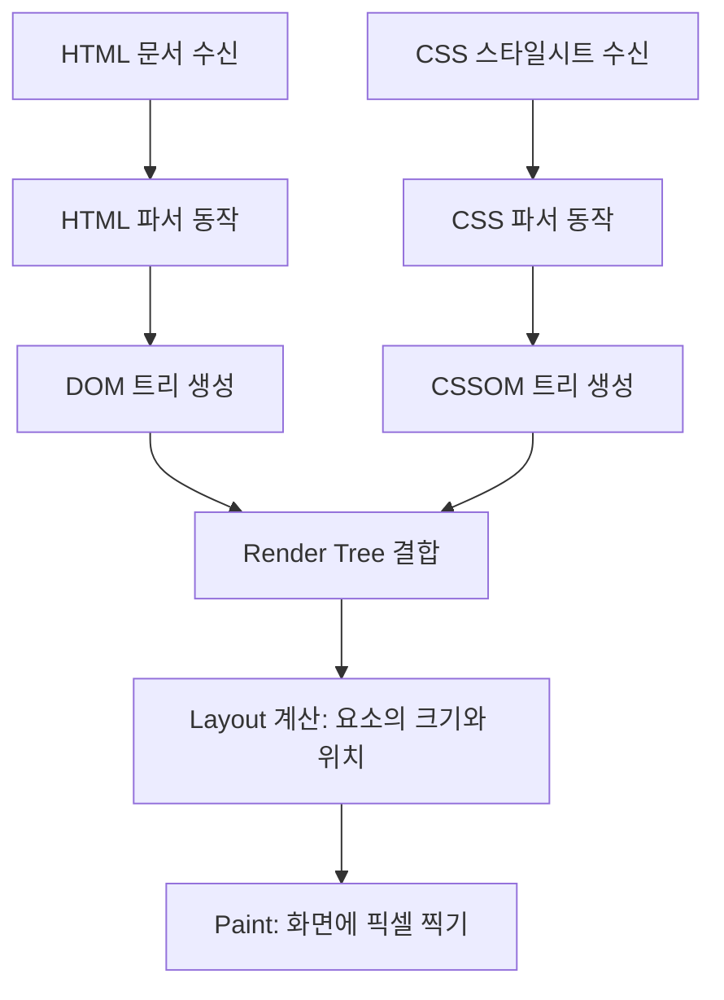
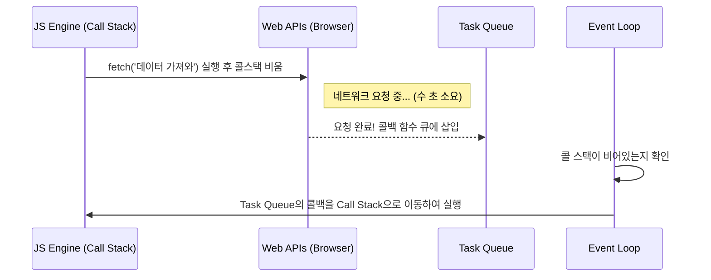
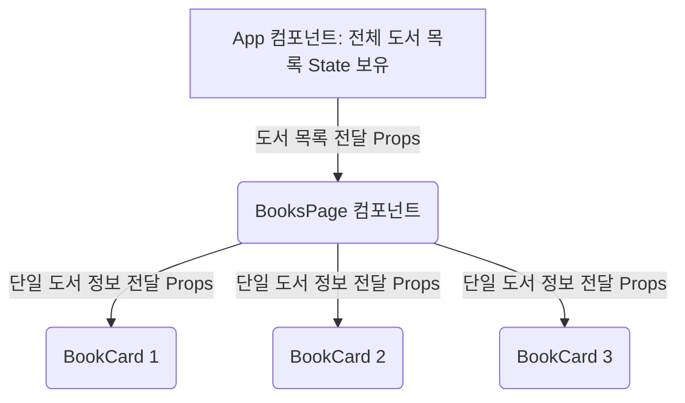
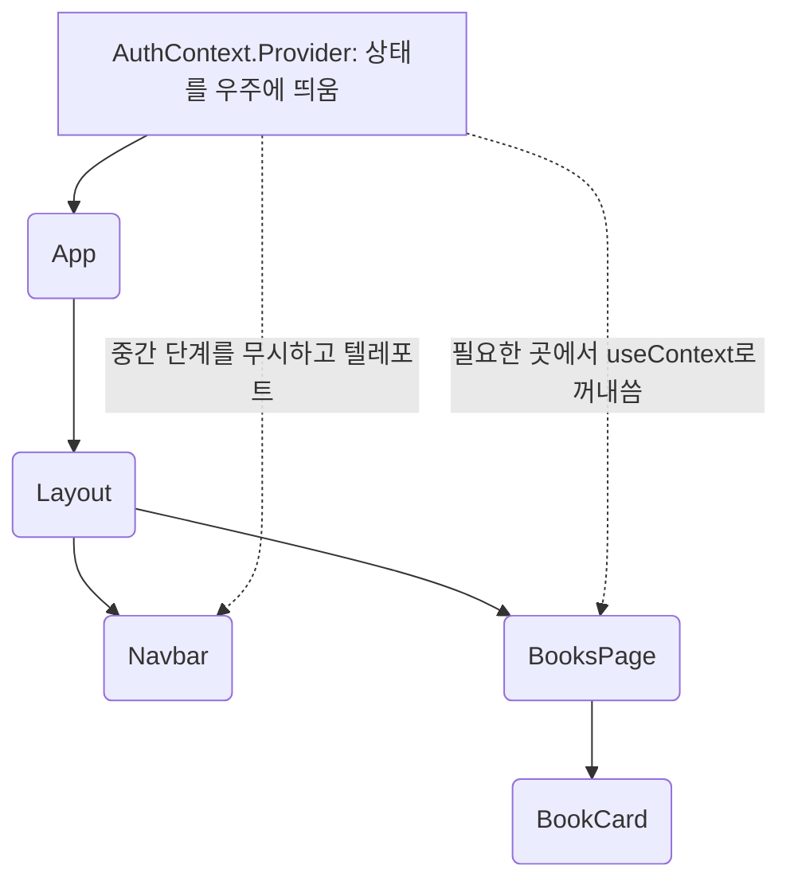

# 🧠 React SPA 마스터 클래스: 밑바닥부터 완벽히 이해하는 BookLog의 모든 것

> *"우리는 왜 이렇게 코드를 작성해야만 하는가?"*
> 단순한 How-to를 넘어, 브라우저의 심연부터 React의 엔진, 그리고 BookLog 애플리케이션의 구조까지 이어지는 인지과학적 여정.

---

## Chapter 1: 왜 우리는 React를 배우는가? (웹의 진화와 기초)

React라는 거대한 도구를 진정으로 이해하기 위해서는, React가 없던 시절 우리가 겪었던 "고통"을 알아야 합니다. 이 장에서는 여러분이 작성한 React 코드가 실행되기 이전에, 브라우저라는 무대 위에서 어떤 일이 벌어지는지 바닥부터 탐구합니다.

### 1.1 브라우저의 렌더링 파이프라인 (Rendering Pipeline)

여러분이 브라우저 주소창에 `https://booklog.app`을 입력하고 엔터를 누르면, 서버로부터 HTML 문서를 전달받습니다. 브라우저는 이 텍스트 덩어리를 화면에 시각적인 요소로 변환하기 위해 다음과 같은 복잡한 과정을 거칩니다.



#### DOM (Document Object Model) 트리
HTML은 컴퓨터가 이해하기 어려운 단순한 텍스트입니다. 브라우저 엔진은 이를 파싱(Parsing)하여 JavaScript가 접근하고 조작할 수 있는 객체(Object)의 나무(Tree) 구조로 만듭니다. 이것이 바로 DOM입니다.
예를 들어 `<div><p>Hello</p></div>`는 `div` 객체 아래에 `p` 객체가 자식으로 달린 트리 구조로 메모리에 적재됩니다.

#### CSSOM (CSS Object Model) 트리
마찬가지로 CSS 파일이나 `<style>` 태그의 내용도 파싱되어, 각 요소가 어떤 스타일(색상, 폰트 크기 등)을 가져야 하는지 정의하는 CSSOM 트리를 구성합니다.

#### Render Tree와 Layout (Reflow)
DOM과 CSSOM이 결합하여 화면에 실제로 보여야 할 요소들만 추려낸 'Render Tree'가 완성됩니다. (예: `display: none`인 요소는 Render Tree에서 제외됩니다.)
이후 브라우저는 화면의 뷰포트 크기를 기준으로 각 요소가 정확히 어디에, 얼만큼의 크기로 배치되어야 하는지 수학적으로 계산합니다. 이 과정을 **Layout**(또는 Reflow)이라고 합니다.

#### Paint (Repaint)
위치가 결정되면 브라우저는 실제 픽셀 단위로 색을 채워 넣습니다. 이것이 Paint 과정입니다. 

> [!IMPORTANT]
> **왜 이 과정을 알아야 하는가?**
> JavaScript를 통해 DOM을 조작하여 화면을 변경할 때마다, 브라우저는 Layout과 Paint 과정을 다시 수행해야 할 수 있습니다. Layout 계산은 브라우저에게 매우 무거운 작업(Expensive Operation)입니다. DOM을 무분별하게 조작하면 화면이 끊기고 성능이 급격히 저하됩니다.

### 1.2 순수 JavaScript (Vanilla JS)와 명령형 UI의 고통

React가 없던 시절, 우리는 순수 JavaScript로 DOM을 직접 조작해야 했습니다. 이를 **명령형(Imperative) 프로그래밍**이라고 부릅니다. 
명령형 방식은 브라우저에게 "이 요소를 찾아라", "이벤트를 붙여라", "텍스트를 이렇게 바꿔라"라고 한 단계씩 지시하는 방식입니다.

BookLog 앱에서 책 제목을 입력받아 화면에 보여주는 아주 간단한 기능을 순수 JS로 구현해 보겠습니다.

```javascript
// [Vanilla JS의 예시: 명령형 UI 조작]

// 1. 요소 찾기
const inputElement = document.getElementById('title-input');
const displayElement = document.getElementById('title-display');

// 2. 이벤트 리스너 부착
inputElement.addEventListener('input', function(event) {
  // 3. 상태 업데이트 및 수동 DOM 조작
  const newTitle = event.target.value;
  
  // 에러 방어 로직
  if (newTitle === '') {
    displayElement.textContent = '제목을 입력해주세요.';
    displayElement.style.color = 'red';
  } else {
    displayElement.textContent = newTitle;
    displayElement.style.color = 'black';
  }
});
```

언뜻 보면 간단해 보입니다. 하지만 애플리케이션이 거대해지고, 데이터(상태)가 여러 곳에서 동시에 변경된다고 상상해 봅시다.

1. **상태 관리의 파편화**: 데이터가 DOM 자체(`textContent`, `value` 등)에 저장되어 있습니다. 어떤 데이터가 최신인지, 이 데이터가 바뀌면 화면의 '어느 부분'을 업데이트해야 하는지 개발자가 일일이 추적해야 합니다.
2. **스파게티 코드**: 코드가 조금만 복잡해져도 DOM 조작 로직과 비즈니스 로직이 무섭게 뒤섞입니다.
3. **불필요한 Reflow 유발**: 개발자의 실수로 10번의 DOM 업데이트가 필요할 때마다 10번의 Layout 재계산이 발생하면 성능은 곤두박질칩니다.

개발자는 비즈니스 로직의 구현보다 **"DOM을 언제, 어떻게, 얼마나 효율적으로 바꿀 것인가?"**에 에너지의 90%를 쏟아야만 했습니다.

### 1.3 JavaScript의 비동기(Asynchronous) 처리와 Event Loop

BookLog 앱을 보면 Supabase(데이터베이스)에서 책 목록을 가져옵니다. 네트워크 요청은 언제 완료될지 모릅니다. 만약 JS가 서버로부터 데이터를 받아올 때까지 화면을 멈추고 기다린다면(동기식 처리), 사용자는 브라우저가 완전히 다운된 것처럼 느낄 것입니다.

JavaScript는 **싱글 스레드(Single Thread)** 언어입니다. 즉, 한 번에 하나의 작업밖에 처리하지 못합니다. 그렇다면 어떻게 네트워크 요청을 기다리는 동안 화면을 렌더링하고 사용자의 클릭 이벤트를 받을 수 있을까요? 

그 비밀은 브라우저의 **Event Loop(이벤트 루프)**와 **비동기 처리**에 있습니다.

#### 콜 스택(Call Stack)과 Web APIs
JS 엔진에는 실행 중인 함수들을 차곡차곡 쌓아두는 '콜 스택'이 딱 하나 있습니다. 하지만 `fetch` 같은 네트워크 요청이나 `setTimeout` 같은 타이머 함수를 만나면, JS 엔진은 이 무거운 작업을 브라우저의 'Web APIs'에게 넘겨버립니다. 그리고 콜 스택은 바로 다음 코드를 실행합니다. (이것이 Non-blocking입니다.)

#### 태스크 큐(Task Queue)와 이벤트 루프(Event Loop)
Web APIs에서 작업(예: 서버 응답 대기)이 끝나면, 그 결과를 처리할 콜백(Callback) 함수를 '태스크 큐'라는 대기열에 밀어 넣습니다.
'이벤트 루프'는 끊임없이 돌아가며 콜 스택이 텅 비어있는지 감시합니다. 콜 스택이 비어있는 순간, 태스크 큐에 대기 중인 콜백 함수를 콜 스택으로 끌어올려 실행합니다.



이러한 비동기 흐름을 코드로 우아하게 다루기 위해 과거에는 콜백 지옥(Callback Hell)을 겪었고, 이후 `Promise` 객체가 등장했으며, 현재는 우리가 BookLog 앱에서 흔히 사용하는 `async` / `await` 문법으로 발전했습니다.

```javascript
// 최신 비동기 처리 문법: async / await (동기 코드처럼 읽힘)
async function fetchBooks() {
  // await는 백그라운드(Web APIs)에서 작업이 끝날 때까지 기다리되, 콜스택을 막지 않음
  const response = await fetch('https://api.supabase.com/books');
  const data = await response.json();
  console.log(data);
}
```

### 1.4 요약: 인지적 한계에 부딪히다

순수 JavaScript와 브라우저 API만을 이용한 개발은 인간의 인지적 한계에 부딪혔습니다.
데이터의 흐름을 통제할 수 없고, 수동적인 DOM 조작은 성능 병목을 일으켰으며, 비동기 처리는 상태를 더욱 예측 불가능하게 만들었습니다.

이 때, Facebook(현 Meta)의 엔지니어들은 완전히 새로운 발상을 제안합니다.

> *"상태(데이터)가 바뀔 때마다, DOM을 섬세하게 조작하려 애쓰지 말고... 그냥 **화면 전체를 처음부터 새로 그려버리면** 어떨까? 그러면 '어디를 업데이트해야 하지?'라는 고민 자체가 사라질 텐데!"*

하지만 화면을 매번 새로 그리면 브라우저의 Layout과 Paint 연산 때문에 엄청난 성능 문제가 발생합니다. 이 모순을 어떻게 해결했을까요? 
바로 다음 장에서 다룰 **Virtual DOM(가상 DOM)**의 탄생입니다.

---


## Chapter 2: React 엔진의 심장

1장에서 우리는 브라우저의 무거운 렌더링 과정과, 순수 JavaScript가 가진 명령형 제어의 고통을 뼈저리게 확인했습니다. React는 이 고통을 해결하기 위해 개발자들에게 새로운 **'멘탈 모델(Mental Model)'**을 제시합니다. 

이 장에서는 React가 내부적으로 어떻게 브라우저를 속이며(?) 놀라운 퍼포먼스를 내는지, 그리고 우리가 어떤 마음가짐으로 React 코드를 대해야 하는지 알아봅니다.

### 2.1 가상 DOM (Virtual DOM): 혁명적인 아이디어

*"상태가 바뀔 때마다 화면을 아예 통째로 새로 그려버리자!"*

이 무식해 보이는 아이디어를 현실로 만든 기술이 바로 **Virtual DOM(가상 DOM)**입니다. Virtual DOM은 실제 화면에 렌더링되는 진짜 DOM이 아닙니다. 단지 진짜 DOM의 구조를 흉내 낸 **가벼운 JavaScript 객체(Object) 덩어리**일 뿐입니다.

가상 DOM은 화면을 그리는 능력(Paint)이 없기 때문에, 메모리 상에서 수천 번을 새로 만들고 부숴도 브라우저에는 아무런 부하를 주지 않습니다.

#### 재조정(Reconciliation)과 Diffing 알고리즘

React 엔진은 데이터가 변경되면 다음과 같은 일련의 과정을 1초에도 수십 번씩 조용히 처리합니다.

```mermaid
graph TD
    A[상태(State) 업데이트 발생] --> B[새로운 Virtual DOM 트리 생성]
    B --> C{Diffing 알고리즘 가동}
    C -->|이전 Virtual DOM과| D[새로운 Virtual DOM 비교]
    D --> E[정확히 무엇이 바뀌었는지 1차원적인 차이 계산]
    E --> F[Patch: 변경된 '그 부분만' 실제 브라우저 DOM에 반영]
    F --> G[단 한 번의 Layout / Paint 발생]
```

1. 사용자가 폼에 글자를 하나 타이핑합니다 (상태 변경).
2. React는 변경된 상태를 바탕으로 메모리 상에 **새로운 Virtual DOM 트리 전체**를 순식간에 찍어냅니다.
3. React 내부의 **Diffing 알고리즘**이 방금 만든 '새 Virtual DOM'과 직전에 가지고 있던 '옛날 Virtual DOM'을 비교합니다.
4. "아, 다른 곳은 다 똑같은데 저기 `input` 태그의 `value` 속성만 'A'에서 'AB'로 바뀌었구나!" 라고 알아냅니다.
5. React는 실제 브라우저 DOM에 접근하여, **오직 변경이 확인된 그 속성 딱 하나만** 업데이트합니다.

이러한 비교와 패치 과정을 React에서는 **재조정(Reconciliation)**이라고 부릅니다. 이 엔진 덕분에 개발자는 "이전 화면과 지금 화면이 어떻게 다른지"를 추적할 필요가 사라졌습니다. 그저 "지금 데이터가 이러니까, 화면은 이렇게 생겨야 해"라고 선언하기만 하면 됩니다.

### 2.2 패러다임의 전환: 명령형(Imperative)에서 선언적(Declarative)으로

Virtual DOM 엔진을 장착한 순간, 프론트엔드 개발의 패러다임은 완전히 뒤바뀌었습니다.

- **명령형(Vanilla JS)**: "저기 빈 `div`를 가져와서, 빨간색으로 칠하고, 텍스트는 '에러'라고 적어 넣어라." (How에 집중)
- **선언적(React)**: "에러 상태(`isError`)가 true면 빨간색 '에러' 텍스트를 보여주고, 아니면 아무것도 보여주지 마라." (What에 집중)

React에서 UI(화면)는 그저 **상태(State)를 인자로 받아 화면을 반환하는 거대한 수학 함수**일 뿐입니다.
공식으로 표현하자면 **`UI = f(State)`** 입니다.

우리가 만든 `BookLog` 앱을 떠올려보세요. 책 목록(데이터)이 비어있으면 `<EmptyState />`를 그리고, 책 데이터가 있으면 `<BookCard />`들을 그립니다. 우리는 DOM을 찢어내고 다시 붙이는 '과정'을 코딩한 적이 단 한 번도 없습니다. 그저 각 상태에 따른 '결과(모습)'만 선언했을 뿐입니다.

### 2.3 단방향 데이터 흐름 (One-way Data Flow)

React 컴포넌트 트리는 거대한 폭포수와 같습니다. 데이터(물)는 언제나 높은 곳(부모 컴포넌트)에서 낮은 곳(자식 컴포넌트)으로만 흐릅니다. 
이 아래로 흐르는 데이터를 React에서는 **Props**라고 부릅니다.



**[인지적 질문]** 그렇다면 자식 컴포넌트에서 무언가 입력이 발생해서 부모의 상태를 바꿔야 할 때는 물을 거꾸로 올려보내야 하지 않나요?
**[해답]** 아닙니다. 데이터 자체는 거꾸로 올라갈 수 없습니다. 대신, 부모는 자식에게 **"내 상태를 바꿀 수 있는 함수(스위치)"**를 Props로 묶어서 밑으로 던져줍니다. 자식은 그저 전달받은 함수(스위치)를 누를 뿐이고, 실제 상태 변경과 리렌더링은 부모 컴포넌트에서 폭포수처럼 다시 아래로 쏟아져 내립니다.

이러한 단방향 데이터 흐름은 초기에는 번거로워 보일 수 있으나, 앱이 거대해질수록 **"버그가 발생했을 때 데이터가 어디서 어떻게 변했는지 추적하기가 압도적으로 쉽다"**는 엄청난 이점을 제공합니다.

### 2.4 컴포넌트와 순수성 (Purity)

React가 재조정 엔진을 안전하게 돌리기 위해 개발자에게 요구하는 단 하나의 엄격한 규칙이 있습니다. 바로 **"컴포넌트는 순수 함수(Pure Function)여야 한다"**는 것입니다.

수학에서 `f(x) = x * 2`라는 함수는 언제 어디서 10을 넣든 항상 20을 반환합니다. 실행할 때마다 결과가 달라지거나, 함수 외부의 파일 시스템을 건드리는 일(부수 효과, Side Effect)이 없습니다.

React 컴포넌트도 마찬가지입니다.
1. 동일한 State와 Props를 주면, 항상 동일한 Virtual DOM 구조(UI)를 반환해야 합니다.
2. 컴포넌트가 화면을 그리는(렌더링) 도중에 외부 세계(API 서버 요청, DOM 직접 수정, `localStorage` 조작 등)를 건드리면 절대 안 됩니다.

만약 외부 세계와 상호작용해야 한다면? 그것은 컴포넌트 렌더링이 완전히 다 끝난 직후, 격리된 안전지대에서 실행되어야 합니다. 이것이 바로 뒤에서 다루게 될 **`useEffect`**의 탄생 배경입니다.

이제 React의 심장이 어떻게 뛰는지 완벽히 이해하셨습니다. 다음 장부터는 이 멘탈 모델을 바탕으로, 여러분의 워크스페이스에 잠들어있는 `BookLog` 프로젝트의 심부를 하나씩 해부해 보겠습니다.

---


## Chapter 3: BookLog 해부학 1 - 거시적 구조와 전역 상태

이제 여러분이 작성한 실제 코드를 뜯어볼 차례입니다. 가장 먼저 살펴볼 곳은 애플리케이션의 진입점(Entry Point)이자 전체적인 뼈대를 잡고 있는 `App.jsx`와, 앱 전반에 걸쳐 흐르는 피와 같은 '전역 상태'를 관리하는 `Context` 부분입니다.

### 3.1 SPA(Single Page Application)와 라우팅의 마법

과거의 웹사이트는 링크를 클릭할 때마다 브라우저가 화면을 백지상태로 만들고 서버로부터 새로운 HTML을 통째로 받아와 화면을 "깜빡"이며 새로 그렸습니다. 이를 멀티 페이지 애플리케이션(MPA)이라고 합니다.

하지만 우리가 만든 BookLog는 **SPA(단일 페이지 애플리케이션)**입니다. 

#### [Why] 왜 SPA인가?
최초 접속 시 단 한 번만 뼈대 HTML(우리가 본 `index.html`)과 JavaScript 묶음을 받아옵니다. 그 이후 사용자가 메뉴를 클릭하면? 서버에 새 HTML을 달라고 요청하지 않습니다. React가 내부적으로 주소창(URL)만 슬쩍 바꾸고, 화면의 필요한 컴포넌트만 **교체(Mount/Unmount)**해버립니다. 깜빡임이 전혀 없는 모바일 앱 같은 부드러운 UX가 탄생하는 순간입니다.

#### [How] 코드로 보는 라우팅 (`App.jsx`)

```javascript
// src/App.jsx 핵심 블록 분석
import { BrowserRouter, Routes, Route } from 'react-router-dom';
import Layout from './components/Layout';
import ProtectedRoute from './components/ProtectedRoute';

function App() {
  return (
    <BrowserRouter>
      <Routes>
        <Route element={<Layout />}>
          {/* 퍼블릭 라우트: 누구나 접근 가능 */}
          <Route path="/" element={<HomePage />} />
          <Route path="/login" element={<LoginPage />} />

          {/* 프라이빗 라우트: 로그인한 사용자만 접근 가능 */}
          <Route path="/books" element={
            <ProtectedRoute>
              <BooksPage />
            </ProtectedRoute>
          } />
        </Route>
      </Routes>
    </BrowserRouter>
  );
}
```

이 코드가 동작하는 원리는 다음과 같습니다.
1. `<BrowserRouter>`: 브라우저의 주소창 상태를 모니터링하는 눈(Eye) 역할을 합니다.
2. `<Routes>`: 현재 URL에 맞는 단 하나의 경로(Route)를 찾아내는 스위치입니다.
3. **중첩 라우팅 (Nested Routing)**: `<Route element={<Layout />}>` 안에 자식 라우트들이 들어있습니다. 이렇게 하면 페이지가 `/login`에서 `/books`로 바뀌더라도, 겉을 감싸고 있는 `<Layout />`(예: 상단 네비게이션 바) 컴포넌트는 파괴되지 않고 그대로 유지됩니다.

#### [How] 화면을 그리기 전의 검문소: `ProtectedRoute.jsx`

이 앱은 로그인을 해야만 내 서재(`/books`)를 볼 수 있습니다. 이 권한 검사는 어디서 할까요? 컴포넌트가 화면에 렌더링되는 과정 중간에 가로채어 검문소 역할을 하는 것이 바로 `ProtectedRoute`입니다.

```javascript
// src/components/ProtectedRoute.jsx 분석
export default function ProtectedRoute({ children }) {
  // Context에서 현재 사용자 정보 가져오기
  const { user, loading } = useAuth(); 

  // 1. 아직 로그인 상태를 서버에 물어보고 있는 중이라면 로딩 화면 표시
  if (loading) return <Loading />;
  
  // 2. 응답이 왔는데 user가 없다면(미로그인), 그리기 중단하고 강제 이동!
  if (!user) return <Navigate to="/login" replace />; 
  
  // 3. 무사 통과했다면 원래 그리려던 화면(children) 렌더링
  return children; 
}
```
여기서 `children`은 `ProtectedRoute` 태그 사이에 들어있는 `<BooksPage />`를 의미합니다. React의 선언적 라우팅이 얼마나 강력하고 직관적인지 보여주는 대표적인 패턴입니다.

### 3.2 상태의 지옥, "Prop Drilling"과 Context API

앞서 데이터는 무조건 부모에서 자식으로만 위에서 아래로 흐른다고 했습니다.
그런데 '로그인한 사용자 정보(User)'나 '다크 모드 상태(Theme)' 같은 데이터는 앱의 **모든 곳**에서 필요합니다. 네비게이션 바에서도 프로필 사진을 띄워야 하고, 책 작성 폼에서도 내 ID가 필요합니다.

최상단인 `App` 컴포넌트에서 이 상태를 가지고 있다가 자식에게, 그 자식의 자식에게, 또 그 자식의 자식에게 계속 Props로 넘겨줘야 할까요? 이 끔찍한 릴레이를 **Prop Drilling**이라고 부릅니다.

#### [Why & How] Context API의 구원

이 문제를 해결하기 위해 React는 `Context`라는 비밀 통로(웜홀)를 제공합니다.



우리가 작성한 `src/contexts/AuthContext.jsx`를 뜯어봅시다.

```javascript
// src/contexts/AuthContext.jsx 핵심 구조
import { createContext, useContext, useState, useEffect } from 'react';
import { supabase } from '../lib/supabase';

// 1. 컨텍스트(우주 공간) 생성
const AuthContext = createContext();

// 2. 우주 공간에 데이터를 공급해줄 Provider 컴포넌트
export function AuthProvider({ children }) {
  const [user, setUser] = useState(null);
  const [loading, setLoading] = useState(true);

  useEffect(() => {
    // --- (1) 현재 세션(로그인 상태) 확인 ---
    supabase.auth.getSession().then(({ data: { session } }) => {
      setUser(session?.user ?? null);
      setLoading(false);
    });

    // --- (2) 인증 상태 변경 리스너 등록 ---
    const { data: { subscription } } = supabase.auth.onAuthStateChange(
      (_event, session) => {
        setUser(session?.user ?? null);
        setLoading(false);
      }
    );

    // --- (3) 클린업 함수 ---
    return () => subscription.unsubscribe();
  }, []);

  // 회원가입 함수
  const signUp = async (email, password) => {
    const { data, error } = await supabase.auth.signUp({ email, password });
    if (error) throw error;
    return data;
  };

  // 로그인 함수
  const signIn = async (email, password) => {
    const { data, error } = await supabase.auth.signInWithPassword({ email, password });
    if (error) throw error;
    return data;
  };

  // 로그아웃 함수
  const signOut = async () => {
    const { error } = await supabase.auth.signOut();
    if (error) throw error;
  };

  // 우주 공간에 띄울 데이터를 value에 담음
  return (
    <AuthContext.Provider value={{ user, loading, signUp, signIn, signOut }}>
      {children}
    </AuthContext.Provider>
  );
}

// 3. 누구나 쉽게 텔레포트로 데이터를 꺼내 쓸 수 있게 하는 Custom Hook
export function useAuth() {
  const context = useContext(AuthContext);
  if (!context) {
    throw new Error('useAuth는 AuthProvider 안에서만 사용할 수 있습니다.');
  }
  return context;
}
```

이 `AuthProvider`로 `main.jsx`에서 `<App />` 전체를 감싸주기만 하면, 앱 안의 어떤 컴포넌트든 Prop을 거치지 않고 `const { user } = useAuth();` 한 줄로 사용자 정보에 접근할 수 있습니다. 

**테마(ThemeContext)** 또한 정확히 동일한 원리로 동작하며, 현재 다크모드인지 라이트모드인지를 전역적으로 관리합니다.

### 3.3 Supabase: 외부 세계와의 연결 (BaaS)

이 프로젝트는 백엔드 서버를 우리가 직접 코딩하지 않았습니다. 대신 **Supabase**라는 Backend-as-a-Service(BaaS)를 사용했습니다.

우리의 `src/lib/supabase.js`는 브라우저(프론트엔드)에서 Supabase 서버의 데이터베이스와 인증 시스템에 직통으로 연결되는 "마법의 전화기"를 생성하는 코드입니다. 이 전화기를 통해 우리는 SQL 문법과 유사한 직관적인 JavaScript 함수 체이닝으로 데이터를 제어할 수 있습니다.

```javascript
// Supabase를 활용한 직관적인 데이터 선언
const { data, error } = await supabase
  .from('books')
  .select('*')
  .eq('user_id', user.id); // SQL의 WHERE user_id = '...' 와 동일
```

React가 화면(UI)의 렌더링 고통을 없애주었듯이, Supabase는 백엔드 인프라 구축의 고통을 없애주었습니다. 
프론트엔드 개발자는 오직 **"사용자와 상호작용하는 UI와 상태 모델링"**이라는 본질적인 가치에만 집중할 수 있게 된 것입니다.

이제 전체적인 숲(구조)을 파악했으니, 4장에서는 가장 중요한 핵심 부품인 UI 컴포넌트들, 그중에서도 고도의 기술이 집약된 `BookForm.jsx`의 내부로 현미경을 들이대 보겠습니다.

---


## Chapter 4: BookLog 해부학 2 - 핵심 비즈니스 로직과 UI

이 장에서는 애플리케이션의 핵심 상호작용이 일어나는 폼(Form) 컴포넌트와 그 내부의 레고 블록들을 블록 단위로 쪼개어 분석합니다. 특히 사용자의 입력을 받아들이는 과정을 통해 React의 가장 중요한 개념인 **제어 컴포넌트(Controlled Component)**를 완벽하게 마스터합니다.

### 4.1 제어 컴포넌트: HTML 요소를 React의 노예로 만들다

과거 순수 HTML 폼 요소(`<input>`, `<textarea>`)는 자신이 입력받은 값을 스스로 관리했습니다. (이를 비제어 컴포넌트라고 합니다.)
하지만 React 세계에서는 **"UI는 상태의 스냅샷"**이라는 철학에 따라, 입력 필드가 스스로 상태를 가지는 것을 용납하지 않습니다. 입력 필드의 값(Value)은 오직 React의 State에 의해서만 결정되어야 합니다.

`src/components/BookForm.jsx`의 핵심 구조를 뜯어봅시다.

#### [Block 1] 상태(State) 선언

```javascript
import { useState } from 'react';

export default function BookForm() {
  // 1. React가 관리하는 상태 공간 선언
  const [title, setTitle] = useState('');
  const [author, setAuthor] = useState('');
  
  // (중략)
```
- **[Why]** 사용자가 입력할 '제목'과 '저자'를 저장할 메모리 공간을 만듭니다. `useState('')`는 초기값을 빈 문자열로 설정한다는 뜻입니다.
- **[How]** `title`은 현재 상태 값이고, `setTitle`은 이 값을 변경하면서 **동시에 컴포넌트를 다시 그리라고 React 엔진에 명령하는 방아쇠(Trigger)**입니다.

#### [Block 2] 상태와 UI의 동기화 (단방향 데이터 흐름의 극치)

```javascript
  return (
    <form>
      <Input
        label="책 제목"
        value={title}  // 2. 입력 필드의 값을 React State에 강제 고정!
        onChange={(e) => setTitle(e.target.value)} // 3. 타이핑할 때마다 State를 변경!
      />
    </form>
  );
}
```

이 짧은 코드는 React의 본질 그 자체입니다.

```mermaid
graph TD
    A[사용자가 'A' 키보드 누름] --> B[onChange 이벤트 발생]
    B --> C[setTitle('A') 호출]
    C --> D[React 엔진: State가 바뀌었네? 리렌더링 시작!]
    D --> E[새로운 UI 계산: value='A' 인 Input 컴포넌트 반환]
    E --> F[실제 브라우저 DOM 업데이트 (화면에 'A' 표시)]
```

**[인지적 분석]**
만약 사용자가 'A'를 입력했는데, 내부 로직에서 `setTitle('A')`를 호출하지 않는다면 어떻게 될까요?
정답은 **"화면의 입력창에 'A'가 찍히지 않는다"** 입니다. `<Input value={title} />` 로 인해 입력창의 화면 표시값은 영원히 `title` 상태에 묶여 있기 때문입니다.
사용자가 글자를 치면 브라우저가 화면을 바꾸는 것이 아니라, **"타이핑 이벤트 발생 -> React 상태 변경 -> 상태에 맞는 새 화면 렌더링 -> 결과적으로 글자가 보임"** 이라는 완벽한 통제 흐름이 만들어집니다.

### 4.2 UI 레고 블록: 재사용 가능한 컴포넌트의 위력

위의 `BookForm.jsx` 코드를 자세히 보면 기본 HTML `<input>` 태그 대신 우리가 직접 만든 `<Input />` 컴포넌트를 사용하고 있습니다. 

#### [Why] 왜 굳이 감싸서 만드나요?
애플리케이션 전체에서 입력 필드는 로그인, 회원가입, 책 등록 등 수십 번 재사용됩니다. 그때마다 매번 라벨(Label), 에러 메시지(Error), 테두리 스타일(CSS)을 새로 작성하는 것은 엄청난 낭비입니다.
따라서, 우리는 이 반복되는 패턴을 **'레고 블록'**처럼 하나로 묶어(`src/components/Input.jsx`) 어디서든 똑같은 디자인과 기능을 불러다 쓸 수 있게 만들었습니다.

#### [How] `Input.jsx` 뜯어보기

```javascript
// src/components/Input.jsx 블록 분석
export default function Input({ 
  label,      // 상단에 표시될 라벨 텍스트
  error,      // 유효성 검사 실패 시 보여줄 빨간 에러 메시지
  multiline,  // 여러 줄 입력이 필요한가? (textarea 여부)
  ...props    // value, onChange 등 나머지 모든 속성들을 쓸어담기
}) {
  return (
    <div className="input-group">
      {/* 1. 라벨이 전달되었다면 렌더링 */}
      {label && <label className="input-label">{label}</label>}
      
      {/* 2. multiline 여부에 따라 input 또는 textarea를 조건부 렌더링 */}
      {multiline ? (
        <textarea className={`input-field ${error ? 'error' : ''}`} {...props} />
      ) : (
        <input className={`input-field ${error ? 'error' : ''}`} {...props} />
      )}
      
      {/* 3. 에러 메시지가 있다면 하단에 빨간색으로 렌더링 */}
      {error && <span className="input-error">{error}</span>}
    </div>
  );
}
```

이 구조 덕분에 우리는 폼을 조립할 때 HTML 떡칠을 하지 않고, 매우 선언적이고 깔끔하게 코드를 짤 수 있습니다. `<Button />`, `<Card />` 컴포넌트 모두 이와 완벽하게 동일한 철학(재사용성과 캡슐화)으로 설계되었습니다.

### 4.3 렌더링 외부 세계와의 동기화: Custom Hook과 `useEffect`

`BookForm`에서 버튼을 눌러 데이터를 Supabase(서버)로 보내거나, 서버에서 책 목록을 가져올 때는 어떻게 해야 할까요?
앞서 강조했듯, 렌더링 도중에는 절대 외부 네트워크 요청을 해서는 안 됩니다. 순수 함수 규칙이 깨지기 때문입니다.

우리는 이 비즈니스 로직(데이터 패칭)을 화면을 그리는 UI 로직과 완전히 분리하기 위해 **Custom Hook**을 만들었습니다. (`src/hooks/useBooks.js`)

```javascript
// src/hooks/useBooks.js 핵심 분석
import { useState, useEffect, useCallback } from 'react';
import { supabase } from '../lib/supabase';

export default function useBooks() {
  const [books, setBooks] = useState([]);
  const [loading, setLoading] = useState(true);
  const [error, setError] = useState(null);

  // 1. 데이터를 가져오는 함수 정의
  const fetchBooks = useCallback(async () => {
    try {
      setLoading(true);
      setError(null);

      // 최신 순 정렬하여 books 테이블에서 데이터 조회
      const { data, error: fetchError } = await supabase
        .from('books')
        .select('*')
        .order('created_at', { ascending: false });

      if (fetchError) throw fetchError;
      setBooks(data || []);
    } catch (err) {
      setError(err.message || '데이터를 불러오는데 실패했습니다.');
    } finally {
      setLoading(false);
    }
  }, []);

  // 2. 특정 독서 기록을 삭제하는 함수
  const deleteBook = useCallback(async (id) => {
    try {
      const { error: deleteError } = await supabase
        .from('books')
        .delete()
        .eq('id', id);

      if (deleteError) throw deleteError;

      // 성공 시 상태 업데이트
      setBooks(prev => prev.filter(book => book.id !== id));
      return true;
    } catch (err) {
      setError(err.message || '삭제에 실패했습니다.');
      return false;
    }
  }, []);

  // 3. 렌더링 이후 외부 세계와 '동기화'
  useEffect(() => {
    fetchBooks();
  }, [fetchBooks]);

  return { books, loading, error, fetchBooks, deleteBook };
}
```

#### [Why] `useEffect`의 진정한 의미
많은 초보자들이 `useEffect`를 "컴포넌트가 마운트될 때 무언가를 실행하는 함수"로 오해합니다.
하지만 `useEffect`의 진짜 의미는 **"현재의 React State와 화면 렌더링을 모두 끝마친 후, 외부 세계(서버, DOM, 타이머 등)의 상태를 이 React State에 맞춰 동기화하라"**는 뜻입니다.

1. **최초 렌더링**: `loading=true`, `books=[]`, `error=null` 상태로 로딩 스피너 UI가 화면에 먼저 그려집니다. (이때 사용자는 흰 화면 대신 반응형 UI를 즉시 보게 됩니다.)
2. **Effect 실행**: 렌더링 직후 `useEffect`가 실행되어 `fetchBooks`가 호출되고, 백그라운드(Event Loop)에서 서버 요청이 진행됩니다.
3. **상태 변경 및 리렌더링**: 서버에서 성공적으로 데이터를 가져오면 `setBooks(data)`, `setLoading(false)`가 실행되어 상태가 바뀝니다. 에러가 발생한 경우에는 `setError(errorMessage)`와 `setLoading(false)`가 작동합니다. React 엔진은 즉시 재조정(Reconciliation)을 가동하여 로딩 스피너를 없애고 책 목록 UI 또는 에러 화면을 동적으로 그려냅니다.

이렇게 UI 계층(`BooksPage.jsx`)과 로직 계층(`useBooks.js`)을 분리함으로써, 우리는 컴포넌트 코드를 읽을 때 복잡한 네트워크 통신 코드를 신경 쓰지 않고 오로지 "어떤 데이터를 받아서 어떻게 그릴 것인가"에만 집중할 수 있게 되었습니다.

---


## Chapter 5: 최적화와 결론 (메모이제이션과 렌더링 방어선)

지금까지 우리는 React의 렌더링 엔진과 상태 관리, 그리고 UI 컴포넌트의 구성 원리를 깊게 파고들었습니다. 마지막으로 다룰 주제는, 이 거대한 폭포수(단방향 데이터 흐름) 속에서 어떻게 불필요한 연산을 막아내고 성능을 끌어올릴 것인가 하는 **최적화(Optimization)**입니다.

### 5.1 연쇄 리렌더링의 함정

React의 기본 렌더링 규칙은 아주 무식하고(?) 단순합니다.
**"부모 컴포넌트의 상태가 바뀌어 리렌더링되면, 그 안의 모든 자식 컴포넌트도 무조건 리렌더링된다."**

`BooksPage`에 1,000권의 책 카드가 렌더링되어 있다고 가정해 봅시다. 
사용자가 상단의 검색창(`<input>`)에 '안녕'이라는 글자를 하나 타이핑합니다. 
그러면 `BooksPage`의 `searchQuery` 상태가 변경됩니다. 부모(`BooksPage`)가 리렌더링되므로, 그 아래에 있는 1,000개의 `<BookCard />` 컴포넌트도 **자신의 내용이 전혀 바뀌지 않았음에도 불구하고** 모두 1,000번의 Virtual DOM 재생성 과정을 거치게 됩니다.

이것은 엄청난 CPU 낭비입니다. 우리는 React 엔진에게 "이 카드는 내용이 안 바뀌었으니까 렌더링 건너뛰어!"라고 알려줄 방어선이 필요합니다.

### 5.2 렌더링 방어선 구축: `React.memo`와 메모이제이션

`src/components/BookCard.jsx` 코드를 다시 살펴봅시다.

```javascript
// src/components/BookCard.jsx 핵심 분석
import { memo } from 'react';

// 1. 컴포넌트를 memo 함수로 감싼다
const BookCard = memo(function BookCard({ book, onClick }) {
  console.log(`${book.title} 카드 렌더링!`); // 언제 렌더링되는지 확인용
  
  return (
    <Card onClick={onClick}>
      <h3>{book.title}</h3>
      {/* ...기타 내용... */}
    </Card>
  );
});

export default BookCard;
```

#### [Why & How] `memo`의 원리
`memo`는 컴포넌트 주변에 방어막을 칩니다. 부모 컴포넌트가 리렌더링을 시도할 때, 이 방어막은 부모가 내려준 이전 Props(`book`, `onClick`)와 방금 새로 내려준 Props를 **얕은 비교(Shallow Compare)** 합니다.
- "어? `book` 객체의 내용도 똑같고, `onClick` 함수도 똑같네?"
- 방어막은 React 엔진에게 **"Stop!"**을 외치고 리렌더링을 완전히 취소해 버립니다. 대신 직전에 만들어두었던 Virtual DOM 결과를 그대로 재사용합니다. 이것이 바로 **메모이제이션(Memoization)**입니다.

#### [주의] `useCallback`이 필수적인 이유
하지만 `memo`만으로는 완벽하지 않습니다. JavaScript에서 함수(Function)는 객체(Object)입니다.
부모(`BooksPage`)가 리렌더링되면, 부모 안에 선언된 `const handleCardClick = () => { ... }` 같은 함수들도 메모리상에서 **완전히 새로운 주소값을 가진 새로운 함수 객체**로 다시 태어납니다.

그러면 자식인 `BookCard`의 방어막(`memo`)은 이렇게 생각합니다.
- "어? `book`은 똑같은데, `onClick` 함수 메모리 주소가 아까랑 다르네? Props가 변경되었으니 리렌더링 해야겠다!"

결국 방어막이 뚫려 1,000개의 카드가 리렌더링됩니다. 이를 막기 위해 우리는 부모 컴포넌트에서 **`useCallback`** 훅을 사용합니다.
`useCallback`은 함수의 메모리 주소를 꽉 붙잡아 고정시킵니다. 덕분에 자식 컴포넌트의 `memo` 방어막이 정상적으로 작동하게 됩니다.

---

## 결론: "인지적 도약 (Cognitive Leap)"

우리는 이 방대한 학습 가이드를 통해 단순한 API 사용법이 아닌, 현대 웹 개발의 **'철학'**을 배웠습니다.

1. **DOM 조작의 늪에서 벗어나다**: 화면의 요소를 어떻게 잡고 수정할지(How) 고민하지 않습니다. 오직 "이러한 데이터(State)일 때 화면은 이렇게 생겼다(What)"만 선언합니다.
2. **독립적인 UI 레고 블록**: `<Input />`, `<Button />`, `<Card />` 같은 순수하고 재사용 가능한 부품을 만들고, 이를 조립하여 거대한 페이지를 만들어냅니다.
3. **외부 세계와의 우아한 격리**: 렌더링 엔진(UI)과 외부 세계(API 서버, 브라우저 스토리지)를 `useEffect`라는 완충 지대를 통해 안전하게 동기화합니다.

순수 JavaScript로 이 9개의 페이지와 수백 가지의 상호작용(테마 변경, 로그인, 라우팅 보호, 실시간 검색, 모달 창, 데이터 삭제 등)을 명령형으로 구현했다면, DOM 선택자와 콜백 함수가 스파게티처럼 얽혀 며칠 만에 유지보수를 포기했을 것입니다.

**React는 개발자의 두뇌를 "화면을 그리는 과정"에서 "비즈니스 로직과 데이터의 흐름"으로 완벽히 해방시켜 주었습니다.**

이 가이드에 담긴 '멘탈 모델'을 체화하셨다면, 여러분은 이제 단순한 코더를 넘어, 상태와 UI의 아키텍처를 그릴 수 있는 진정한 프론트엔드 엔지니어로의 첫발을 내디딘 것입니다. 

긴 여정, 고생 많으셨습니다! 이 `BookLog` 프로젝트의 모든 코드를 여러분의 것으로 만드십시오.


