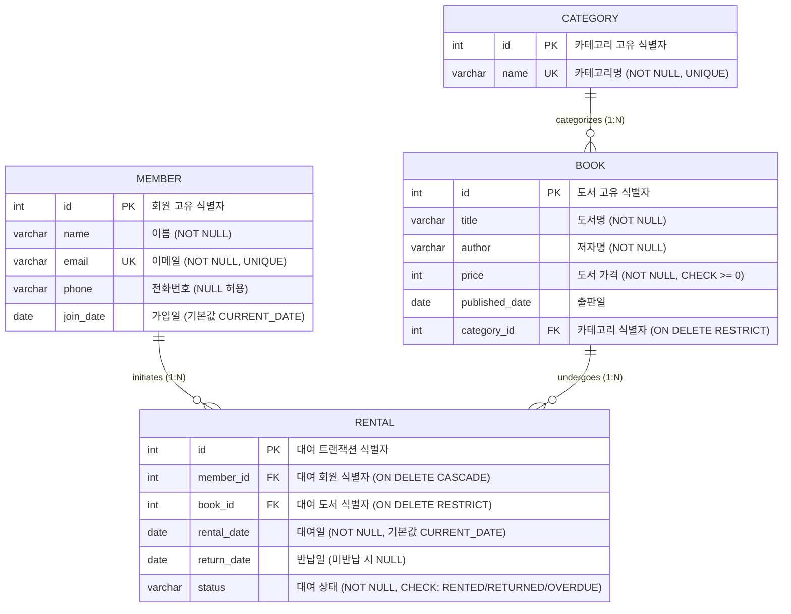
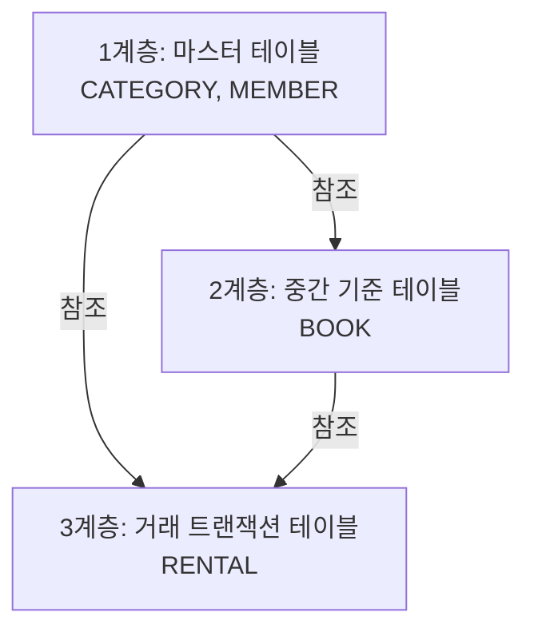

# 📚 SQL로 만드는 나만의 도서 대여 데이터베이스

이 프로젝트는 백엔드 프레임워크나 외부 라이브러리 없이, 순수 SQL 스크립트만으로 도서 대여 시스템을 위한 관계형 데이터베이스(RDBMS)를 설계하고 데이터 구축, 핵심 비즈니스 쿼리 작성, 성능 최적화(인덱싱) 및 비즈니스 의사결정을 위한 리포트 쿼리까지 수행한 종합 포트폴리오입니다.

> **💡 핵심 학습 정리 문서 안내:**  
> RDBMS 이론, 정규화, SQL 실행 순서, B-Tree 인덱스 아키텍처 및 AI 피처 스토어 접점 기술 등 심층적인 컴퓨터 과학(CS) 이론은 [study_guide.md](file:///Users/f22losophysics1091/Desktop/glad/study/study_guide.md) 가이드에 별도로 정리되어 있습니다.

---

## 📂 프로젝트 구조 및 결과물

프로젝트의 디렉토리 구조 및 각 파일의 역할은 다음과 같습니다:

```text
glad/
├── query/
│   ├── schema.sql         # 데이터베이스 스키마 정의서 (DDL)
│   ├── data.sql           # 샘플 시나리오 데이터 적재 (DML)
│   ├── queries.sql        # 핵심 쿼리 16선 & 인덱스 & 보너스 과제 분석 (DQL/DML)
│   └── query_results.txt  # SQLite 구동을 통한 전체 쿼리 실행 결과 보고서
└── study/
    └── study_guide.md     # 데이터베이스 엔진 이론 학습서 (CS & AI 연계)
```

| 파일명 (File Link) | 유형 (Type) | 용도 및 핵심 역할 (Purpose & Key Role) | 주요 포함 내용 (Key Contents) |
| :--- | :---: | :--- | :--- |
| [schema.sql](file:///Users/f22losophysics1091/Desktop/glad/query/schema.sql) | DDL (스키마) | 데이터베이스 물리/논리 설계 정의 | 테이블 생성, PK/FK 제약 조건, CASCADE 처리, CHECK 제약조건 |
| [data.sql](file:///Users/f22losophysics1091/Desktop/glad/query/data.sql) | DML (데이터) | 시나리오 기반 실무 데이터 구축 | 10행 이상의 테스트 데이터, 외래키 참조 무결성을 고려한 순차 적재 |
| [queries.sql](file:///Users/f22losophysics1091/Desktop/glad/query/queries.sql) | SQL (통합) | 핵심 비즈니스 로직 구현 및 성능 튜닝 | 기본 조회/조인/집계/서브쿼리 16선, SQLite 설정, 보너스 분석 및 미니 리포트 3선 |
| [query_results.txt](file:///Users/f22losophysics1091/Desktop/glad/query/query_results.txt) | TXT (결과) | 쿼리 일괄 실행에 따른 최종 터미널 출력본 | `.headers on`, `.mode column` 이 적용된 실제 쿼리 수행 이력 데이터 |
| [study_guide.md](file:///Users/f22losophysics1091/Desktop/glad/study/study_guide.md) | MD (가이드) | RDBMS 심층 기술 이론 및 AI 피처 스토어 접점 가이드 | 트랜잭션(WAL/MVCC), B+Tree 인덱싱 아키텍처, 쿼리 처리 순서 |

---

## 🧪 로컬 실행 및 검증 프로세스

프로젝트 루트 디렉토리에서 제공되는 자동화 스크립트를 사용하거나, 수동으로 쿼리를 실행하여 데이터베이스 구축 및 검증을 진행할 수 있습니다.

### 1. 자동화 스크립트 실행 (권장)
제공된 `setup.sh` 스크립트를 실행하면 기존 데이터베이스 초기화부터 스키마 생성, 샘플 데이터 적재, 핵심 쿼리 결과 보고서 갱신까지 모든 단계가 일괄 처리됩니다.

```bash
# 프로젝트 루트 디렉토리에서 실행
./setup.sh
```

### 2. 수동 실행 프로세스 (참고)
각 단계를 수동으로 직접 수행하여 검증하고 싶다면, `query` 디렉토리로 이동하여 다음 명령어들을 순차적으로 실행할 수 있습니다.

```bash
# 1. 터미널에서 query 디렉토리로 이동하여 기존 데이터베이스 파일 초기화
rm -f library.db

# 2. DDL 스크립트 실행 (외래키 제약조건 활성화 및 스키마 생성)
sqlite3 library.db < schema.sql

# 3. 샘플 데이터(DML) 삽입
sqlite3 library.db < data.sql

# 4. 핵심 및 보너스 쿼리 일괄 실행 및 파일 추출 (.headers on, .mode column 자동 적용됨)
sqlite3 library.db < queries.sql > query_results.txt
```
---

## 🗺️ 데이터베이스 모델링 및 ERD

본 도서 대여 데이터베이스는 **분류(Category), 회원(Member), 도서(Book), 대여(Rental)**의 4대 핵심 엔티티를 도출하여 구축되었습니다.

### Entity Relationship Diagram (ERD)



### 테이블 간 1:N 관계 설명

1. **CATEGORY (1) : BOOK (N)**  
   * 한 카테고리(예: 컴퓨터과학) 아래에는 여러 권의 책이 귀속될 수 있습니다. 
   * `BOOK` 테이블의 `category_id` 컬럼이 `CATEGORY` 테이블의 `id`를 가리켜 소속 관계를 표현합니다.
2. **MEMBER (1) : RENTAL (N)**  
   * 한 명의 회원은 가입 기간 동안 여러 차례 도서를 대여할 수 있습니다.
   * `RENTAL` 테이블의 `member_id` 컬럼이 `MEMBER` 테이블의 `id`를 참조하여 대여 기록의 주체를 특정합니다.
3. **BOOK (1) : RENTAL (N)**  
   * 한 권의 책은 시간이 흐르며 대여와 반납을 반복하여 여러 번의 대여 트랜잭션에 기여할 수 있습니다.
   * `RENTAL` 테이블의 `book_id` 컬럼이 `BOOK` 테이블의 `id`를 참조합니다.

---

## 📥 샘플 데이터 적재 아키텍처

외래키 제약조건이 걸려 있는 시스템에서는 아무 테이블이나 먼저 데이터를 넣을 수 없습니다. 데이터 간의 **참조 종속성 계층(Referential Dependency Hierarchy)**을 고려해 데이터를 삽입해야 에러가 발생하지 않습니다.



1. **1계층 (독립 데이터)**: `CATEGORY`(10행), `MEMBER`(11행)  
   * 다른 테이블을 참조하지 않으므로 가장 먼저 생성하고 데이터를 삽입합니다.
2. **2계층 (1차 종속 데이터)**: `BOOK`(11행)  
   * 생성된 `CATEGORY.id` 중 하나를 반드시 가지고 있어야 하므로, `CATEGORY` 적재 후에 삽입합니다.
3. **3계층 (2차 종속 데이터)**: `RENTAL`(15행)  
   * 빌리는 회원(`MEMBER`)과 빌려주는 책(`BOOK`)이 모두 실재해야 하므로 가장 마지막에 적재합니다.

---

## 🔍 핵심 SQL 쿼리 및 분석 요약

과제 수행에 필요한 15+1개 쿼리는 [queries.sql](file:///Users/f22losophysics1091/Desktop/glad/query/queries.sql) 파일에 가장 단순하고 직관적인 형태로 작성되어 있습니다.

### 쿼리 및 분석 범위 요약
- **기본 조회 (Query 1 ~ 4)**: 전체 회원 목록 조회(가입일 순), 고가 도서 필터링, 이메일 패턴 매칭 및 페이징, 카테고리 목록 조회.
- **테이블 조인 (Query 5 ~ 8)**: 대여 기록과 회원 정보 결합(Inner Join), 도서와 카테고리 결합(Inner Join), 도서별 대여일 조회(Left Join), 회원별 대여 상태 조회(Left Join).
- **집계 및 그룹화 (Query 9 ~ 11)**: 카테고리별 도서 평균 가격, 회원별 누적 대여 횟수, 카테고리별 도서 총 가격 합산.
- **서브쿼리 (Query 12 ~ 13)**: 평균 도서 가격 상위 도서 필터링, 대여 이력이 없는 회원 추출.
- **데이터 조작 (Query 14 ~ 15)**: 특정 대여 기록을 반납 완료로 업데이트, 특정 회원 삭제를 통한 외래키 CASCADE 검증.
- **성능 최적화 (Query 16)**: 회원별 대여 기록 조회 최적화를 위한 인덱스 생성 (`CREATE INDEX idx_rental_member ON RENTAL(member_id)`).

---

## 🏆 보너스 과제 분석 요약

상세 쿼리와 작동 설명은 [queries.sql](file:///Users/f22losophysics1091/Desktop/glad/query/queries.sql) 파일의 최하단(`PART G: 보너스 과제`)에서 확인할 수 있습니다.

1. **JOIN vs Subquery 비교**: '이영희' 회원의 대여 기록 조회 시 JOIN 방식과 Subquery 방식의 문법 구조 및 결과 비교.
2. **참조 무결성 파괴 실험**: 존재하지 않는 카테고리 ID(999)로 도서 등록 시도 시 외래키 제약조건 위배 에러(`FOREIGN KEY constraint failed`) 유도.
3. **비즈니스 의사결정 미니 리포트**: 
   - 지표 1: 가장 대여가 많이 된 도서 TOP 3 (도서 ID 및 횟수)
   - 지표 2: 카테고리별 등록된 도서 개수
   - 지표 3: 현재 대여 중인 도서 건수

---

## 🏛️ 아키텍처 개선 제안: Soft Delete 패턴 도입

우리 설계에서는 회원 탈퇴 시 `ON DELETE CASCADE`를 사용해 회원의 대여 이력을 함께 지워버립니다. 하지만 실무에서는 큰 문제를 낳습니다.

* **CASCADE의 문제점**: 대여 이력은 도서관의 자산 통계, 도서 마모도 분석, 매출 결산에 쓰이는 귀중한 지표입니다. 회원이 떠났다고 거래 이력까지 지우면 연말 결산 시 수치가 불일치하는 **정합성 붕괴**가 일어납니다.
* **해결 대안 (Soft Delete)**: 
  - `MEMBER` 테이블에 물리적인 `DELETE` 명령을 내리지 않고, `is_active` (1/0) 혹은 `member_status` ('ACTIVE', 'WITHDRAWN') 필드를 둡니다.
  - 회원이 탈퇴할 때 `UPDATE MEMBER SET member_status = 'WITHDRAWN' WHERE id = 11;` 형태로 상태만 변경(논리적 삭제)합니다.
  - 이 방식은 회원의 시스템 로그인은 막으면서도, 외래키로 연결된 대여 이력(`RENTAL`)은 훼손 없이 보존하므로 통계 정합성을 완벽하게 지킬 수 있습니다.
