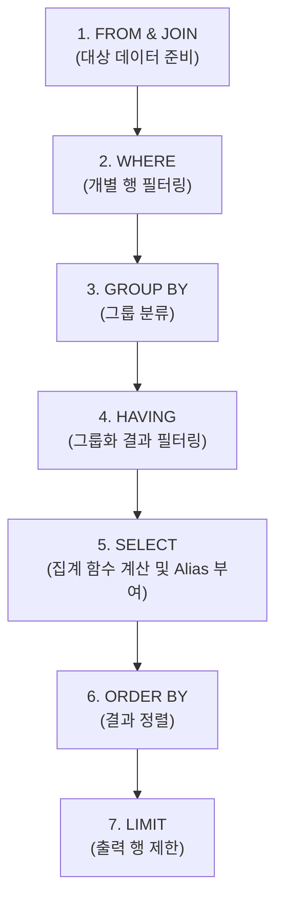

# SQL 및 데이터베이스 학습 메모 (Study Memo)

본 문서는 도서 대여 데이터베이스 프로젝트를 진행하며 학습한 RDBMS의 기본 개념, SQLite의 아키텍처 특성, 그리고 면접 및 기술 리뷰에 대비하기 위해 실제 프로젝트 쿼리와 데이터를 기반으로 작성된 Q&A 학습 자료입니다.

---

## Ⅰ. 기초 핵심 정리

### 1. 엑셀(Excel) vs 데이터베이스(RDBMS)의 근본적 차이
* **관계(Relation)의 표현**: 엑셀은 데이터를 단순 표 형태로 늘어놓아 중복이 다량 발생하지만, RDBMS는 외래키(FK)를 통해 테이블 간의 유기적인 관계를 정의합니다.
* **무결성 규칙(Integrity Constraint)**: 엑셀은 잘못된 값이 수동으로 입력되는 것을 막기 어렵지만, RDBMS는 기본키(PK), 외래키(FK), CHECK 제약조건 등을 통해 엔진 레벨에서 잘못된 데이터 입력을 원천 차단합니다.
* **중복 제거(정규화)**: 예를 들어 '컴퓨터과학' 카테고리가 백만 번 쓰일 때, 엑셀은 매 행에 글자를 직접 쓰지만 RDBMS는 `CATEGORY` 테이블에 1번만 저장하고 숫자 ID만 참조하여 저장 공간을 절약하고 수정 이상을 방지합니다.

### 2. SQLite 환경설정 및 유용한 툴 명령어
SQLite 터미널 환경에서 결과를 보기 좋게 출력하고 상태를 점검하는 명령어 목록입니다.

```sql
-- 1. 출력 포맷 설정 (헤더 출력 활성화 및 컬럼 모드 지정)
.headers on
.mode column

-- 2. 외래키(Foreign Key) 활성화 (★매 세션 시작 시 반드시 실행!)
PRAGMA foreign_keys = ON;

-- 3. 생성된 테이블 및 인덱스 목록 확인
.tables
.indices rental  -- rental 테이블에 생성된 인덱스 목록 확인

-- 4. 인덱스 메타데이터 직접 조회
SELECT name, sql FROM sqlite_master WHERE type='index';
```

---

## Ⅱ. 고급 작동 원리: SQLite의 통계 분석과 최적화

### 1. SQLite에는 '배경에서 계속 도는 관리자'가 없습니다.
MySQL, PostgreSQL, Oracle과 같은 서버형 데이터베이스는 백그라운드 프로세스(Daemon)가 상주하며 데이터 변경률에 따라 통계를 자동으로 갱신(Auto-Analyze)해 줍니다. 
반면, **SQLite는 단일 파일로 동작하는 임베디드 데이터베이스**이므로 백그라운드 프로세스가 존재하지 않습니다. 애플리케이션의 쿼리 요청이 있을 때만 잠깐 동작하므로, 통계 관리를 위해 별도의 아키텍처를 이해해야 합니다.

### 2. 실무에서의 자동 최적화 방식
SQLite 개발진은 매번 수동으로 분석하는 비효율성을 방지하기 위해 **`PRAGMA optimize;`** 명령을 제공합니다.
* **실무 패턴**: 애플리케이션이 종료되거나 데이터베이스 연결(Connection)을 닫기 직전에 프로그램 코드로 `PRAGMA optimize;`를 실행하도록 구현합니다.
* **원리**: 이 명령어가 호출되면 SQLite가 내부적으로 어떤 테이블의 데이터가 많이 변경되었는지 스캔하고, 분석이 진짜 필요한 대상에 대해서만 알아서 `ANALYZE`를 부분 호출합니다.

### 3. 수동으로 `ANALYZE;`를 즉시 실행해야 하는 골든타임
1. **대량의 데이터 적재(Batch Import) 직후**: 텅 비어있던 테이블에 10만 건 이상의 데이터를 한 번에 넣었을 때는 통계 정보가 구버전이라 비효율적인 실행 계획을 짤 수 있으므로 즉시 수동 `ANALYZE;`를 돌려줍니다.
2. **새로운 인덱스(INDEX)를 생성한 직후**: 새로 만든 인덱스의 카디널리티(값의 분포도) 정보가 통계 테이블에 업데이트되어야 옵티마이저가 이를 적재적소에 사용합니다.
3. **갑자기 쿼리가 느려졌을 때(Troubleshooting)**: 데이터가 쌓이면서 옵티마이저가 잘못된 통계를 바탕으로 엉뚱한 실행 계획을 설계하고 있을 확률이 높습니다. 이때 수동 `ANALYZE;`는 쿼리 성능을 돌려놓는 처방약 역할을 합니다.

---

## Ⅲ. 기술 리뷰 및 면접 대비 Q&A (실제 프로젝트 기반)

> [!NOTE]
> 아래 예시와 실행 결과는 [schema.sql](file:///Users/f22losophysics1091/Desktop/glad/query/schema.sql)과 [data.sql](file:///Users/f22losophysics1091/Desktop/glad/query/data.sql)에 등록된 실제 테이블 구조와 샘플 데이터를 바탕으로 도출되었습니다.

### Q1. INNER JOIN과 LEFT JOIN의 차이를 실행 결과를 보며 설명할 수 있나요?
**A1.** 
* **INNER JOIN**은 교집합 연산으로, 조인 조건에 일치하는 데이터가 양쪽 테이블에 모두 존재하는 행만 결과로 반환합니다.
* **LEFT JOIN**은 왼쪽 테이블의 모든 데이터를 보존하고, 오른쪽 테이블에 매칭되는 데이터가 없는 경우 오른쪽 컬럼을 `NULL`로 채워 출력합니다.

#### 💡 실제 예시: 등록된 모든 도서(BOOK)와 각 도서의 누적 대여 횟수(RENTAL) 구하기
샘플 데이터 중 `Java의 정석` (ID: 11) 도서는 대여 기록이 한 번도 없는 도서입니다.

* **INNER JOIN 방식 결과**:
  ```sql
  SELECT b.id AS book_id, b.title AS book_title, COUNT(r.id) AS total_rentals
  FROM BOOK b
  INNER JOIN RENTAL r ON b.id = r.book_id
  GROUP BY b.id, b.title
  ORDER BY total_rentals DESC;
  ```
  | book_id | book_title | total_rentals |
  | :--- | :--- | :--- |
  | 1 | 밑바닥부터 시작하는 딥러닝 | 2 |
  | 2 | 클린 코드 | 2 |
  | ... | ... | ... |
  * **설명**: 대여 기록이 없는 `Java의 정석 (ID: 11)`은 `RENTAL` 테이블에 매칭되는 행이 없으므로 결과에서 **완전히 누락**되어 10권만 출력됩니다.

* **LEFT JOIN 방식 결과 (Query 7)**:
  ```sql
  SELECT b.id AS book_id, b.title AS book_title, COUNT(r.id) AS total_rentals
  FROM BOOK b
  LEFT JOIN RENTAL r ON b.id = r.book_id
  GROUP BY b.id, b.title
  ORDER BY total_rentals DESC;
  ```
  | book_id | book_title | total_rentals |
  | :--- | :--- | :--- |
  | 1 | 밑바닥부터 시작하는 딥러닝 | 2 |
  | 2 | 클린 코드 | 2 |
  | ... | ... | ... |
  | 11 | Java의 정석 | 0 |
  * **설명**: 대여가 없는 `Java의 정석`도 **기준 테이블(BOOK)의 데이터이므로 보존**되고, `total_rentals`가 **`0`으로 정확하게 표시**되어 총 11권이 모두 출력됩니다.
  * **⚠️ 주의**: 이때 집계 함수를 `COUNT(*)`로 쓰면 NULL이 채워진 빈 행 자체를 1개로 카운트하여 대여 횟수가 `1`로 왜곡됩니다. 따라서 반드시 특정 대상 컬럼인 `COUNT(r.id)`를 지정하여 NULL일 경우 제외되도록 작성해야 합니다.

---

### Q2. GROUP BY와 집계 함수(COUNT, SUM, AVG)는 내부적으로 어떻게 동작하나요?
**A2.** 
`GROUP BY`와 집계 함수는 단순히 결과창을 묶어서 보여주는 것이 아니라, 데이터베이스 엔진 내부적으로 정교하게 계산된 **'논리적 순서'**와 **'물리적 메커니즘'**을 통해 동작합니다. 이를 3가지 관점으로 나누어 설명할 수 있습니다.

---

#### 1. 논리적 실행 흐름 (Logical Query Processing)
SQL 문법은 작성하는 순서(SELECT -> FROM -> WHERE...)와 데이터베이스가 실제로 해석하고 실행하는 순서가 다릅니다. `GROUP BY`와 집계 함수는 아래와 같은 순서로 실행됩니다.



1. **`FROM` & `JOIN`**: 데이터를 가져올 대상 테이블들을 병합하고 원본 데이터셋을 준비합니다.
2. **`WHERE`**: 그룹화를 하기 전에, 불필요한 개별 행을 미리 필터링하여 버립니다. (★집계 성능 최적화의 첫 걸음)
3. **`GROUP BY`**: 필터링된 행들을 지정된 컬럼 값을 기준으로 가상의 '그룹 바구니'로 분류합니다.
4. **`HAVING`**: 생성된 그룹들 중에서 특정 조건(예: 그룹 내 개수가 2개 이상인 그룹만)을 만족하는 그룹만 남깁니다.
5. **`SELECT`**: 살아남은 각 그룹 내에서 **집계 함수(COUNT, SUM, AVG 등)가 실제 연산을 수행**하고, 결과 컬럼에 새로운 별칭(Alias)을 부여합니다.
6. **`ORDER BY` & `LIMIT`**: 최종 요약된 그룹 결과들을 정렬하고, 필요한 개수만큼 끊어서 출력합니다.

> [!WARNING]
> **흔한 실수**: "SELECT 절에서 지정한 별칭을 WHERE나 GROUP BY 절에서 왜 쓸 수 없나요?"
> 엔진은 `WHERE`와 `GROUP BY` 단계를 끝낸 뒤에야 `SELECT` 절을 실행하기 때문입니다. 실행되는 시점에 존재하지 않는 별칭을 참조하려 하므로 문법 에러가 발생합니다. (단, SQLite나 MySQL 등 일부 엔진은 편의상 GROUP BY/ORDER BY에서 SELECT 별칭 사용을 내부적으로 허용하기도 하나, 표준 SQL 사상에서는 사용이 불가능합니다.)

---

#### 2. 엔진 레벨의 물리적 그룹화 원리 (Physical Grouping Mechanisms)
데이터베이스 엔진이 실제로 수백만 건의 데이터를 어떻게 물리적으로 묶어 낼까요? 데이터베이스 옵티마이저는 테이블 상태와 인덱스 유무에 따라 크게 **두 가지 전략**을 사용합니다.

##### ① 정렬 기반 그룹화 (Sort-based Grouping)
* **원리**: 그룹화 기준 컬럼(예: `category_id`)으로 데이터를 물리적으로 정렬한 후, 순서대로 스캔하면서 인접한 동일 값을 가진 데이터들을 차례로 묶는 방식입니다.
* **인덱스가 있을 때 (매우 빠름, O(N))**: 기준 컬럼에 이미 B-Tree 인덱스가 걸려 있다면 데이터가 이미 정렬되어 있습니다. 엔진은 정렬 과정 없이 차례대로 인덱스를 스캔(Index Scan)하며 인접한 값들을 그룹으로 묶기 때문에 매우 효율적입니다.
* **인덱스가 없을 때 (정렬 비용 발생, O(N log N))**: 엔진은 정렬을 위해 디스크나 메모리에 임시 공간(Temp Space)을 만들어 정렬 연산(External/Internal Sort)을 강제로 돌린 후에 그룹화를 진행하므로 무거운 쿼리가 됩니다.

##### ② 해시 기반 그룹화 (Hash-based Grouping)
* **원리**: 메모리 상에 **해시 테이블(Hash Table)**을 생성하고, 데이터를 스캔하면서 기준 컬럼 값을 해시 키(Hash Key)로 사용하여 매칭되는 해시 버킷(Bucket)에 행을 분배하고 누적하는 방식입니다.
* **특징**: 데이터가 정렬되어 있지 않아도 정렬 단계가 필요 없기 때문에 단 한 번의 스캔(Single Pass, O(N))으로 그룹화를 처리할 수 있어 성능적으로 뛰어난 성능을 보입니다.
* **단점**: 결과 그룹(Unique Key)의 수가 엄청나게 많을 경우, 해시 테이블이 메모리(Work Mem) 크기를 초과하게 되어 디스크에 임시 테이블을 쓰는 물리적 스필(Spill) 현상이 발생해 느려질 수 있습니다.

---

#### 3. 집계 함수의 내부 동작 (상태값 누적 - Stateful Accumulation)
"그럼 그룹 안에 들어있는 수많은 행들의 평균이나 합계는 메모리에 다 올려두고 계산하나요?"
아닙니다. 데이터베이스 엔진은 대용량 처리를 위해 **상태값(State/Accumulator)**을 관리하는 방식을 사용합니다. 엔진은 행을 돌며 데이터를 쌓아두지 않고, 단 한 번의 스캔 과정에서 각 그룹 버킷별로 할당된 작은 메모리 변수(상태값)를 업데이트합니다.

| 집계 함수 | 초기 상태값 (Initial State) | 매 행(Row)을 만날 때의 내부 누적 동작 (Transition) | 최종 출력값 계산 (Finalize) |
| :--- | :--- | :--- | :--- |
| **`COUNT(col)`** | `State = 0` | `col`의 값이 `NULL`이 아니면, `State = State + 1` | `State` 값 그대로 반환 |
| **`SUM(col)`** | `State = NULL` (또는 `0`) | `col`의 값이 `NULL`이 아니면, `State = State + col` | `State` 값 반환 (모두 NULL이면 NULL) |
| **`AVG(col)`** | `Sum_State = 0`<br>`Count_State = 0` | `col`의 값이 `NULL`이 아니면,<br>`Sum_State = Sum_State + col`<br>`Count_State = Count_State + 1` | **`Sum_State / Count_State`** (나눗셈 연산) |

이러한 **누적 방식(Single Pass Streaming)** 덕분에 테이블에 데이터가 1억 건이 있어도 데이터베이스는 메모리에 1억 건을 다 담을 필요 없이, 최종 그룹의 개수만큼의 상태값 변수만 유지하면 되어 메모리를 극도로 절약할 수 있습니다.

---

#### 💡 실제 예시를 통한 시뮬레이션
카테고리별 도서 개수와 평균 가격을 구하는 쿼리를 예로 들어 보겠습니다.
```sql
SELECT c.name AS category_name, COUNT(b.id) AS book_count, ROUND(AVG(b.price), 1) AS average_price
FROM BOOK b
INNER JOIN CATEGORY c ON b.category_id = c.id
GROUP BY c.id, c.name
ORDER BY book_count DESC;
```

##### ⚙️ 엔진 내부의 가상 스텝 바이 스텝 시뮬레이션
엔진이 데이터를 스캔하며 메모리(해시 테이블 또는 정렬 임시 버킷)에 생성하는 상태입니다.

1. **초기 상태 (Empty Bucket)**
   아직 데이터가 없으므로 메모리에 그룹 버킷이 비어 있습니다.
   
2. **1번째 행 처리**: `밑바닥부터 시작하는 딥러닝` (카테고리: 컴퓨터과학, 가격: 28,000원)
   * '컴퓨터과학' 버킷이 없으므로 메모리에 새로 생성합니다.
   * `COUNT`용 변수: 0 ➡️ **1**
   * `SUM`용 변수: 0 ➡️ **28,000**
   * `AVG`용 카운트: 0 ➡️ **1**

3. **2번째 행 처리**: `코스모스` (카테고리: 과학/수학, 가격: 19,500원)
   * '과학/수학' 버킷을 새로 생성합니다.
   * '과학/수학' 버킷 상태: `COUNT = 1`, `SUM = 19,500`, `AVG_Count = 1`

4. **3번째 행 처리**: `클린 코드` (카테고리: 컴퓨터과학, 가격: 33,000원)
   * 기존에 존재하는 '컴퓨터과학' 버킷을 찾아가서 상태를 갱신합니다.
   * `COUNT`용 변수: 1 ➡️ **2**
   * `SUM`용 변수: 28,000 ➡️ **61,000**
   * `AVG`용 카운트: 1 ➡️ **2**

5. **4번째 행 처리**: `Java의 정석` (카테고리: 컴퓨터과학, 가격: 32,000원)
   * '컴퓨터과학' 버킷 상태를 다시 갱신합니다.
   * `COUNT`용 변수: 2 ➡️ **3**
   * `SUM`용 변수: 61,000 ➡️ **93,000**
   * `AVG`용 카운트: 2 ➡️ **3**

6. **최종 변환 및 출력 (Finalize)**
   데이터 스캔이 끝났으므로 엔진은 각 버킷의 집계 결과를 조합하여 최종 행들을 반환합니다.
   * **컴퓨터과학**: `COUNT` = **3** / 평균가 = `SUM(93,000)` / `AVG_Count(3)` = **31,000원**
   * **과학/수학**: `COUNT` = **1** / 평균가 = `SUM(19,500)` / `AVG_Count(1)` = **19,500원**

   | category_name | book_count | average_price |
   | :--- | :--- | :--- |
   | 컴퓨터과학 | 3 | 31000.0 |
   | 과학/수학 | 1 | 19500.0 |

---

### Q3. 작성한 쿼리 중 가장 복잡했던 쿼리를 선택하고, 단계별로 설명해 주세요.
**A3.** 
제가 꼽는 가장 복잡했던 쿼리는 [Query 8] **"전체 회원 목록과 그들의 현재 대여 도서 정보 조회"** 쿼리입니다.

```sql
SELECT 
    m.id AS member_id,
    m.name AS member_name,
    r.rental_date,
    b.title AS renting_book_title
FROM MEMBER m
LEFT JOIN RENTAL r ON m.id = r.member_id AND r.status IN ('RENTED', 'OVERDUE')
LEFT JOIN BOOK b ON r.book_id = b.id
ORDER BY m.id ASC;
```

#### 🔍 단계별 해결 및 작동 원리
1. **1단계: 기준 테이블 정의 (MEMBER)**
   * 대여를 한 번도 안 한 회원, 이미 다 반납하고 대여 중인 책이 없는 회원까지 모두 포함해서 명단을 뽑아야 하므로 `MEMBER` 테이블을 기준으로 삼고 `LEFT JOIN`으로 출발합니다.
2. **2단계: RENTAL 테이블의 결합 조건 제어 (ON vs WHERE)**
   * **핵심 난제**: 과거에 빌렸다가 반납이 끝난(`RETURNED`) 기록은 출력하면 안 되고, 오직 현재 대여 중이거나 연체 중인(`RENTED`, `OVERDUE`) 기록만 연결해야 합니다.
   * **해결**: 만약 이 필터 조건을 조인 밖의 `WHERE r.status IN ('RENTED', 'OVERDUE')`로 주면, 대여 중인 책이 없어 RENTAL 부분이 NULL인 회원(이영희, 고길동 등)이 WHERE 필터링 단계에서 모두 탈락하여 `INNER JOIN`과 똑같이 되어버립니다.
   * 따라서 상태 필터 조건인 `AND r.status IN ('RENTED', 'OVERDUE')`를 **`LEFT JOIN`의 `ON` 절 내부 조건으로 배치**하여, 조인하기 전에 활성 대여 건만 필터링한 후 회원 명단과 합쳐지도록 설계했습니다.
3. **3단계: 도서 제목 매핑 (BOOK)**
   * 대여 기록에 연결된 도서 ID(`r.book_id`)를 가지고 다시 한 번 `LEFT JOIN BOOK`을 수행하여 책의 제목(`b.title`)을 가져옵니다.
4. **4단계: 회원 가입/ID 순 정렬**
   * 최종적으로 `ORDER BY m.id ASC`를 수행합니다. 대여가 없는 회원도 이름은 정상 노출되고 대여일과 도서명 컬럼만 깔끔하게 `NULL(빈칸)`로 떨어지는 정합성 높은 결과를 얻을 수 있습니다.

---

### Q4. 미션 수행 중 가장 어려웠던 부분과 해결 방법은 무엇이었나요?
**A4.**
* **어려움 1: SQLite 외래키 제약조건 미작동 문제**
  * **원인**: 테이블 생성 시 `FOREIGN KEY`를 분명 지정했는데, 존재하지 않는 카테고리 ID나 존재하지 않는 회원 ID로 `INSERT`를 시도해도 에러 없이 들어가는 현상이 발생했습니다. 알고 보니 SQLite는 구버전 호환성을 위해 외래키 활성화 옵션(`PRAGMA foreign_keys`)이 기본적으로 꺼져(OFF) 있었습니다.
  * **해결**: 데이터베이스 세션을 연결할 때마다 가장 먼저 `PRAGMA foreign_keys = ON;` 명령을 전송하도록 설정하여, 비즈니스 무결성이 침해받는 일을 방지했습니다.
* **어려움 2: 다대다(M:N) 관계의 해소**
  * **원인**: "회원은 여러 도서를 빌릴 수 있고, 도서 역시 여러 회원을 거쳐 대여될 수 있다"는 회원과 도서 간의 관계를 설계하는 것이 낯설었습니다.
  * **해결**: RDBMS 설계 사상에 맞게 두 테이블 사이에 연결 고리 역할을 하는 **교차 테이블(Mapping Table)**인 `RENTAL` 테이블을 배치했습니다. 여기에 각각 `member_id`와 `book_id`를 외래키로 심어 다대다 관계를 1대다(1:N) 관계로 풀어냈습니다.
* **어려움 3: SQL 문법 작성 순서와 실제 실행 순서의 괴리**
  * **원인**: `SELECT` 절에서 연산하여 지정한 Alias(별칭)를 `WHERE` 절에서 사용하려고 할 때 문법 에러가 났습니다.
  * **해결**: 데이터베이스 엔진이 실제 쿼리를 돌릴 때 `FROM -> WHERE -> GROUP BY -> SELECT -> ORDER BY` 순으로 실행하기 때문에, `WHERE` 절이 돌 때는 `SELECT`의 별칭을 인지하지 못한다는 논리적 작동 순서를 이해하게 되었습니다. 이후 `WHERE` 절에는 원본 컬럼명을 적고, 별칭은 최종 실행 단계인 `ORDER BY`에서만 활용하는 방식으로 코드를 교정했습니다.

---

### Q5. JOIN과 GROUP BY로 "연결된 데이터를 한 번에 뽑는 방법"을 설명해 주세요.
**A5.** 
관계형 데이터베이스에서 여러 테이블로 분산 설계된 데이터를 분석하려면, 먼저 **`JOIN`을 통해 테이블들을 관계성(PK-FK) 기준으로 연결하여 가상의 하나의 큰 테이블**로 만듭니다. 그 후 **`GROUP BY`를 통해 중복되는 기준 항목별로 데이터를 그룹핑한 뒤 원하는 집계(합계, 평균 등)를 한 번에 계산**해 냅니다.

#### 🔗 연결 아키텍처 예시 (MEMBER ─ RENTAL ─ BOOK)
"어떤 회원이 누적해서 몇 권을 빌렸고, 그 회원에게 제공된 도서의 총 정가 가치는 얼마인가?"를 구할 때 3개 테이블을 결합합니다.
1. `MEMBER` 테이블에서 회원 정보(`m.id`, `m.name`)를 가져옵니다.
2. `MEMBER.id`와 `RENTAL.member_id`를 매핑하여 대여 기록을 한 줄로 합칩니다. (`INNER JOIN RENTAL`)
3. `RENTAL.book_id`와 `BOOK.id`를 매핑하여 빌린 책의 가격 정보를 한 줄로 덧붙입니다. (`INNER JOIN BOOK`)
4. 이렇게 늘어난 테이블을 회원 단위인 `GROUP BY m.id, m.name`으로 한 상자에 담습니다.
5. `COUNT(r.id)`로 대여 건수를 구하고, `SUM(b.price)`로 책 가격의 총합을 구해 결과를 한 줄로 요약 추출합니다. (Query 10)

---

### Q6. 실무에서 자주 쓰이는 SQL 요구사항(검색/정렬/집계/랭킹)은 어떻게 작성하나요?
**A6.** 
각 비즈니스 요구는 아래와 같은 SQL 핵심 문법과 일대일로 대입됩니다.

* **검색 (Search) ➡️ `WHERE`**
  * 특정 조건의 행만 필터링합니다.
  * *예*: `WHERE price >= 20000` (가격 검색)
  * *예*: `WHERE email LIKE '%@example.com'` (특정 도메인 이메일 주소 검색)
* **정렬 (Sort) ➡️ `ORDER BY`**
  * 출력 결과물의 순서를 조율합니다.
  * *예*: `ORDER BY join_date ASC` (오래된 가입자 순)
  * *예*: `ORDER BY price DESC` (비싼 가격 순)
* **집계 (Aggregation) ➡️ `GROUP BY` + 집계 함수**
  * 데이터 통계를 추출합니다.
  * *예*: `COUNT(*)` (행 개수), `SUM(price)` (총액), `AVG(price)` (평균가)
* **랭킹 (Ranking) / Top-N ➡️ `ORDER BY` + `LIMIT`**
  * 정렬 기준에 따라 상위권 데이터만 잘라냅니다.
  * *예*: `ORDER BY rental_count DESC LIMIT 3` (대여가 많은 순으로 3위까지 추출)

---

### Q7. 인덱스(INDEX)는 왜 필요한가요? 어떤 컬럼에 적용해야 좋죠?
**A7.** 
* **필요성**: 책의 맨 뒷장에 있는 **"찾아보기(색인)"**와 같습니다. 인덱스가 없다면 DB 엔진은 조건에 맞는 데이터 1건을 찾기 위해 책의 첫 페이지부터 끝까지 다 넘겨봐야 하는 **Full Table Scan (시간 복잡도 O(N))**을 해야 합니다. 데이터가 100만 건이면 100만 번 검색합니다. 반면, 인덱스를 생성하면 정렬된 트리 자료구조(B-Tree)를 별도로 관리하므로 단 몇 번의 노드 이동으로 원하는 데이터를 즉시 찾아냅니다 **(Index Range Scan, 시간 복잡도 O(log N))**.

#### 🎯 인덱스를 설계할 때 고려해야 하는 기준
* **권장 대상 컬럼**:
  1. **자주 검색되는 컬럼**: `WHERE` 절의 조건문에 상습적으로 쓰이는 컬럼 (예: RENTAL의 `status`)
  2. **조인 연결점 컬럼**: 테이블끼리 `JOIN`할 때 기준이 되는 외래키(FK) 컬럼 (예: `member_id`, `book_id`)
  3. **정렬 및 그룹화 컬럼**: `ORDER BY`나 `GROUP BY`가 빈번하게 사용되어 매번 디스크 정렬 연산(Sort Phase)을 유발하는 컬럼
* **지양 대상 컬럼 (피해야 할 곳)**:
  1. **데이터 양 자체가 매우 적은 테이블**: 10~20줄짜리 테이블은 정렬 나무를 타고 가는 비용이 전체 스캔보다 오히려 큽니다.
  2. **선택도(Cardinaility)가 너무 낮은 컬럼**: 예를 들어 '성별' 컬럼은 남/여 두 가지만 존재해 대다수 행이 같은 값을 공유합니다. 인덱스를 만들어 봤자 걸러지는 비율이 적어 풀 스캔과 별다를 바 없습니다.
  3. **CUD(쓰기/수정/삭제)가 빈번한 컬럼**: 데이터가 바뀔 때마다 인덱스 정렬 트리(B-Tree)도 계속 새로 재구성해야 하므로, 등록/수정/삭제 성능이 대폭 저하됩니다.

---

### Q8. 동일한 요구사항을 JOIN으로도 풀고 서브쿼리로도 풀 때의 차이는 무엇인가요?
**A8.** 
"사피엔스" 도서를 대여한 이력이 있는 회원 명단을 찾는 요구사항을 두 가지 방식으로 구현해 보며 비교했습니다. (보너스 과제 5.1)

#### 1) JOIN 방식 (INNER JOIN)
```sql
SELECT DISTINCT m.id, m.name, m.email
FROM MEMBER m
INNER JOIN RENTAL r ON m.id = r.member_id
INNER JOIN BOOK b ON r.book_id = b.id
WHERE b.title = '사피엔스';
```
* **특징**: 여러 테이블을 물리적으로 엮어 하나의 큰 결과 셋으로 만듭니다. 회원 정보뿐만 아니라 대여일, 도서 정보 등을 한 화면에 섞어서 출력해야 할 때 가장 범용적입니다.
* **단점**: 한 회원이 사피엔스를 여러 번 빌렸다면 데이터가 중복 발생하여 가로 행이 늘어납니다. 따라서 고유한 회원 목록만 보려면 `DISTINCT` 키워드를 명시해야 합니다.

#### 2) 서브쿼리 방식 (IN 연산자 활용)
```sql
SELECT id, name, email
FROM MEMBER
WHERE id IN (
    SELECT member_id
    FROM RENTAL
    WHERE book_id = (
        SELECT id
        FROM BOOK
        WHERE title = '사피엔스'
    )
);
```
* **특징**: "회원 목록 중에서, 이러이러한 조건을 충족한 회원들만 필터링한다"는 비즈니스적 직관에 충족됩니다. `IN` 연산자를 활용하므로 중복 데이터가 애초에 생기지 않아 `DISTINCT`를 사용하지 않아도 됩니다.
* **단점**: 서브쿼리 내부에 명시된 테이블의 컬럼(대여일자 등)을 바깥쪽 메인 `SELECT` 절로 끌고 와서 보여줄 수 없습니다. (오직 MEMBER 테이블의 정보만 출력 가능)

> [!TIP]
> **성능적 차이**: 최신 RDBMS의 옵티마이저(Optimizer)는 매우 똑똑해서 서브쿼리를 분석한 뒤 내부적으로 JOIN(Semi-Join) 형태로 풀어(Unnesting) 동일한 실행 계획으로 실행하는 경우가 많아 속도 차이가 미미합니다. 그러나 결합하고 싶은 컬럼 범위와 쿼리 가독성에 따라 적절히 선택하는 역량이 필요합니다.

---

### Q9. 일부러 외래키(FK) 에러가 발생하는 입력을 시도해 보고, 대처법을 적어 주세요.
**A9.** 
두 가지 시나리오를 통해 데이터베이스가 무결성을 강제하는 과정과 그 대처법을 배웠습니다. (보너스 과제 5.2)

#### ❌ 에러 시나리오 1: 존재하지 않는 회원(유령 회원)의 대여 기록을 삽입할 때
* **시도**: 회원 테이블에 가입되어 있지 않은 `member_id = 999`로 대여 기록 삽입 시도
  ```sql
  INSERT INTO RENTAL (member_id, book_id, rental_date, status) 
  VALUES (999, 1, '2026-05-24', 'RENTED');
  ```
* **결과**: `Runtime error: FOREIGN KEY constraint failed` 발생 및 차단
* **원인**: `RENTAL.member_id`는 `MEMBER.id`를 부모로 삼아 참조 무결성을 검증합니다. 부모에 존재하지 않는 쓰레기 데이터(Orphan Record)가 들어오지 못하게 차단하는 보안망이 정상 작동한 것입니다.
* **대처법**: 부모 테이블인 `MEMBER`에 `999`번 회원을 먼저 정식 가입(INSERT)시킨 후에 대여 기록을 삽입하거나, 기존에 있는 회원 ID(예: 2번 김철수)로 대입하여 수정합니다.

#### ❌ 에러 시나리오 2: 대여 기록이 있는 도서를 삭제하려고 할 때 (ON DELETE RESTRICT)
* **시도**: 이미 2회 이상 대여된 이력이 있는 1번 도서('밑바닥부터 시작하는 딥러닝') 삭제 시도
  ```sql
  DELETE FROM BOOK WHERE id = 1;
  ```
* **결과**: `Runtime error: FOREIGN KEY constraint failed` 발생 및 차단
* **원인**: `RENTAL` 테이블의 `book_id` 외래키 옵션에 `ON DELETE RESTRICT`를 지정해 두었습니다. 만약 1번 책 정보를 함부로 지워버리면, 과거 대여 이력 테이블에서 "무슨 책을 빌려줬었는지" 알 길이 없어져 데이터베이스의 정합성이 훼손되기 때문입니다.
* **대처법**: 
  1. 과거 대여 이력을 반드시 유지해야 하는 실무 환경이라면 물리적 행 삭제(`DELETE`)를 하지 않습니다. 대신 `BOOK` 테이블에 `status` 혹은 `is_deleted` 컬럼을 설계하여 값을 바꾸는 **Soft Delete(소프트 딜리트, 논리적 삭제)** 방식을 적용해 대처합니다. (예: `UPDATE BOOK SET is_active = 0 WHERE id = 1;`)
  2. 만약 정말로 물리적으로 지워야 한다면 자식 데이터인 `RENTAL` 내역을 먼저 삭제한 후에 부모인 `BOOK`을 삭제해야 합니다.

---

### Q10. 이 데이터베이스에서 뽑을 수 있는 "핵심 비즈니스 지표 3개"를 정의하고 SQL을 작성해 주세요.
**A10.** 
도서관 서비스의 활성화 및 모니터링을 위해 설계한 3가지 핵심 지표와 쿼리, 실제 결과입니다. (보너스 과제 5.3)

#### 📊 지표 1: 도서 대여 선호도 (가장 인기 있는 도서 TOP 3)
* **비즈니스 정의**: 한정된 도서 구입 예산을 어느 책에 집중할지 결정하기 위한 핵심 지표입니다.
* **SQL 쿼리**:
  ```sql
  SELECT b.title AS "도서명", COUNT(r.id) as "대여 횟수" 
  FROM BOOK b 
  JOIN RENTAL r ON b.id = r.book_id 
  GROUP BY b.id 
  ORDER BY "대여 횟수" DESC 
  LIMIT 3;
  ```
* **실행 결과**:
  | 도서명 | 대여 횟수 |
  | :--- | :--- |
  | **사피엔스** | 2 |
  | **정의란 무엇인가** | 2 |
  | **코스모스** | 2 |

#### 📊 지표 2: 전체 도서 회전 상태 및 연체율
* **비즈니스 정의**: 도서관 자산(책)이 정상 유통되고 회수되는 비율을 파악합니다. 연체율이 너무 높으면 페널티 정책 조정을 검토해야 합니다.
* **SQL 쿼리**:
  ```sql
  SELECT 
      status AS "대여 상태", 
      ROUND(COUNT(*) * 100.0 / (SELECT COUNT(*) FROM RENTAL), 1) || '%' as "비율" 
  FROM RENTAL 
  GROUP BY status;
  ```
* **실행 결과**:
  | 대여 상태 | 비율 |
  | :--- | :--- |
  | **RETURNED (반납 완료)** | 53.3% |
  | **RENTED (정상 대여 중)** | 33.3% |
  | **OVERDUE (연체 상태)** | 13.3% |

#### 📊 지표 3: 카테고리(장르)별 대여 점유율
* **비즈니스 정의**: 도서관 방문객들이 가장 선호하는 주제를 파악해 도서 큐레이션 및 마케팅에 활용합니다.
* **SQL 쿼리**:
  ```sql
  SELECT c.name as "카테고리명", COUNT(r.id) as "누적 대여 수" 
  FROM CATEGORY c 
  JOIN BOOK b ON c.id = b.category_id 
  JOIN RENTAL r ON b.id = r.book_id 
  GROUP BY c.id 
  ORDER BY "누적 대여 수" DESC;
  ```
* **실행 결과**:
  | 카테고리명 | 누적 대여 수 |
  | :--- | :--- |
  | **컴퓨터과학** | 4 |
  | **역사** | 3 |
  | **문학/소설** | 2 |
  | **인문/철학** | 2 |
  | **과학/수학** | 2 |
  | **자기계발** | 1 |
  | **경제/경영** | 1 |