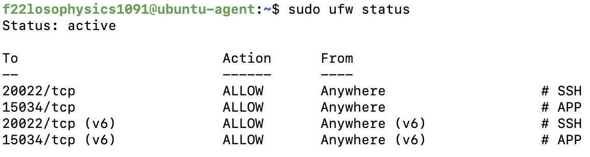
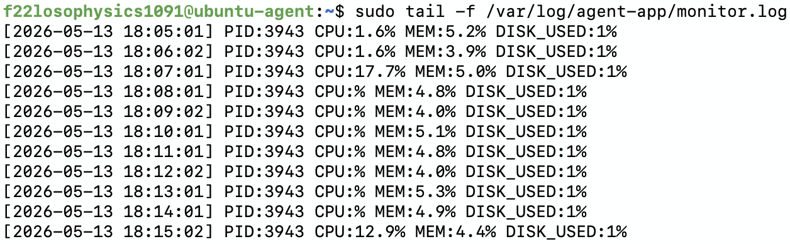

# <시스템 관제 자동화 스크립트 개발> 요구사항 수행 내역서

## 1. 수행 개요

- 미션 목표: 다중 사용자 환경의 권한 관리, 네트워크 보안 설정, 애플리케이션 실행 환경 구성, 시스템 리소스 관제 및 로그 관리 자동화
- 대상 환경: Ubuntu 24.04 LTS 또는 동등 Linux VM
- 선택 방화벽: UFW
- SSH 포트: `20022/tcp`
- 애플리케이션 포트: `15034/tcp`
- 애플리케이션 홈: `/home/agent-admin/agent-app`
- 로그 디렉토리: `/var/log/agent-app`

## 2. 수행 내역

### 2.1 SSH 보안 설정

수행 내용:

- SSH 접속 포트를 기본 `22`에서 `20022`로 변경
- Root 원격 접속 차단

사용 명령:

```bash
sudo sed -i 's/^#\?\s*Port .*/Port 20022/' /etc/ssh/sshd_config
sudo sed -i 's/^#\?\s*PermitRootLogin .*/PermitRootLogin no/' /etc/ssh/sshd_config
grep -E "^Port|^PermitRootLogin" /etc/ssh/sshd_config
sudo systemctl restart ssh 2>/dev/null || sudo systemctl restart sshd
ss -tulnp | grep -E "sshd|ssh"
```

확인 기준:

- `/etc/ssh/sshd_config`에 `Port 20022`가 존재해야 함
- `/etc/ssh/sshd_config`에 `PermitRootLogin no`가 존재해야 함
- `ss -tulnp` 결과에서 SSH 데몬이 `20022` 포트를 LISTEN 해야 함

```bash
$ cat /etc/ssh/sshd_config | grep 20022
Port 20022

$ cat /etc/ssh/sshd_config | grep PermitRoot
PermitRootLogin no

$ ss -tlnp
Netid     State       Recv-Q      Send-Q                 Local Address:Port            Peer Address:Port     Process
tcp       LISTEN      0           4096                         0.0.0.0:20022                0.0.0.0:*         users:(("systemd",pid=1,fd=56))
tcp       LISTEN      0           4096                            [::]:20022                   [::]:*         users:(("systemd",pid=1,fd=58))
```
### 2.2 방화벽 설정

수행 내용:

- UFW 활성화
- 인바운드 기본 차단
- 아웃바운드 기본 허용
- SSH `20022/tcp`, APP `15034/tcp`만 허용

사용 명령:

```bash
sudo ufw --force reset
sudo ufw default deny incoming
sudo ufw default allow outgoing
sudo ufw allow 20022/tcp comment 'SSH'
sudo ufw allow 15034/tcp comment 'APP'
sudo ufw --force enable
sudo ufw status verbose
```

확인 결과:

- 증거 파일: `scrs/ufw_status.png`
- 캡처 내용상 `Status: active`
- 허용 포트:
  - `20022/tcp ALLOW Anywhere # SSH`
  - `15034/tcp ALLOW Anywhere # APP`
  - IPv6 규칙도 동일하게 `20022/tcp (v6)`, `15034/tcp (v6)` 허용



### 2.3 계정/그룹/권한 체계

수행 내용:

- 계정 생성
  - `agent-admin`: 운영/관리, cron 실행자
  - `agent-dev`: 개발/운영, `monitor.sh` 작성자
  - `agent-test`: QA/테스트
- 그룹 생성
  - `agent-common`: `agent-admin`, `agent-dev`, `agent-test`
  - `agent-core`: `agent-admin`, `agent-dev`

사용 명령:

```bash
sudo groupadd -f agent-common
sudo groupadd -f agent-core

sudo useradd -m -s /bin/bash agent-admin
sudo useradd -m -s /bin/bash agent-dev
sudo useradd -m -s /bin/bash agent-test

sudo usermod -aG agent-common agent-admin
sudo usermod -aG agent-common agent-dev
sudo usermod -aG agent-common agent-test

sudo usermod -aG agent-core agent-admin
sudo usermod -aG agent-core agent-dev

id agent-admin
id agent-dev
id agent-test
```

```text
-f: **"이미 그룹이 있으면 에러 내지 말고 그냥 조용히 넘어가 줘"**라는 뜻이 됩니다. 덕분에 setup.sh를 두 번, 세 번 실행해도 스크립트가 멈추지 않고 끝까지 잘 돌아가게 됩니다.
-m: 이 옵션이 없으면 사용자는 만들어지지만, 그 사람이 들어갈 /home/사용자명 폴더가 생기지 않습니다. 그렇게 되면 로그인을 해도 자기 폴더가 없어 설정을 저장할 수 없게 됩니다.
-s: 뒤에 오는 /bin/bash는 우리가 지금 쓰고 있는 가장 표준적이고 편리한 터미널 프로그램입니다. 이걸 지정 안 하면 가끔 기능이 거의 없는 아주 구식 쉘(sh)이 배정되어 사용하기 매우 불편해집니다.
-a (Append): "기존에 이 사용자가 가진 그룹들을 **유지하면서 추가(Append)**해줘!"라는 뜻입니다.
-G (Groups): "이 사용자를 다음 그룹(들)에 소속시켜줘!"라는 뜻입니다.
-aG: "기존 카드 뺏지 말고, 새 출입 카드만 하나 더 줘"
```

확인 기준:

- `agent-admin`은 `agent-common`, `agent-core`에 포함
- `agent-dev`는 `agent-common`, `agent-core`에 포함
- `agent-test`는 `agent-common`에만 포함

```bash
$ id agent-admin
uid=1000(agent-admin) gid=1002(agent-admin) groups=1002(agent-admin),1000(agent-common),1001(agent-core)

$ id agent-dev
uid=1001(agent-dev) gid=1003(agent-dev) groups=1003(agent-dev),1000(agent-common),1001(agent-core)

$ id agent-test
uid=1002(agent-test) gid=1004(agent-test) groups=1004(agent-test),1000(agent-common)
```

### 2.4 디렉토리 구조 및 접근 권한

수행 내용:

- `$AGENT_HOME`
- `$AGENT_HOME/upload_files`
- `$AGENT_HOME/api_keys`
- `$AGENT_HOME/bin`
- `/var/log/agent-app`

사용 명령:

```bash
AGENT_HOME=/home/agent-admin/agent-app

sudo mkdir -p $AGENT_HOME/upload_files
sudo mkdir -p $AGENT_HOME/api_keys
sudo mkdir -p $AGENT_HOME/bin
sudo mkdir -p /var/log/agent-app

sudo chown agent-admin:agent-core $AGENT_HOME
sudo chmod 750 $AGENT_HOME

sudo chown agent-admin:agent-common $AGENT_HOME/upload_files
sudo chmod 2770 $AGENT_HOME/upload_files

sudo chown agent-admin:agent-core $AGENT_HOME/api_keys
sudo chmod 2770 $AGENT_HOME/api_keys

sudo chown agent-admin:agent-core /var/log/agent-app
sudo chmod 2770 /var/log/agent-app

sudo setfacl -m g:agent-common:rwx $AGENT_HOME/upload_files
sudo setfacl -d -m g:agent-common:rwx $AGENT_HOME/upload_files

sudo setfacl -m g:agent-core:rwx $AGENT_HOME/api_keys
sudo setfacl -d -m g:agent-core:rwx $AGENT_HOME/api_keys

sudo setfacl -m g:agent-core:rwx /var/log/agent-app
sudo setfacl -d -m g:agent-core:rwx /var/log/agent-app

ls -la $AGENT_HOME
getfacl $AGENT_HOME/upload_files
getfacl $AGENT_HOME/api_keys
getfacl /var/log/agent-app
```

권한 정책:

| 경로 | 소유자:그룹 | 권한 | 정책 |
| --- | --- | --- | --- |
| `/home/agent-admin/agent-app` | `agent-admin:agent-core` | `750` | 핵심 그룹만 접근 |
| `/home/agent-admin/agent-app/upload_files` | `agent-admin:agent-common` | `2770` + ACL | admin/dev/test 공용 R/W |
| `/home/agent-admin/agent-app/api_keys` | `agent-admin:agent-core` | `2770` + ACL | admin/dev만 R/W, test 차단 |
| `/var/log/agent-app` | `agent-admin:agent-core` | `2770` + ACL | admin/dev만 R/W, test 차단 |

설명:

- `upload_files`는 협업 파일 영역이므로 `agent-common`에 R/W 권한을 부여했다.
- `api_keys`와 `/var/log/agent-app`는 민감 정보와 운영 로그를 포함하므로 `agent-core`로 제한했다.
- `2770`의 `2`는 setgid이며, 하위 파일/디렉토리가 상위 디렉토리의 그룹을 상속하도록 하여 협업 권한이 깨지는 것을 방지한다.
- 기본 ACL을 함께 설정해 이후 생성되는 파일에도 동일한 그룹 접근 정책이 적용되도록 했다.

```bash
# [디렉토리 권한 상세]
$ ls -la /home/agent-admin/agent-app
total 7744
drwxr-x---  1 agent-admin agent-core        64 May 13 17:20 .
drwxr-x---  1 agent-admin agent-admin      134 May 15 04:38 ..
-rwxr-x---  1 agent-admin agent-core   7926296 May 13 17:20 agent-app
drwxrws---+ 1 agent-admin agent-core        24 May 13 17:20 api_keys
drwxr-xr-x  1 root        root              58 May 15 04:28 bin
drwxrws---+ 1 agent-admin agent-common       0 May 13 17:20 upload_files
# drwxrws---+: 여기서 **s**는 setgid가 잘 걸려있다는 증거입니다. (하위 파일이 그룹을 상속함)
# +: 맨 끝의 + 기호는 기본 권한 외에 **ACL(상세 권한)**이 추가로 설정되어 있다는 것을 증명합니다.

# [upload_files ACL 설정]
$ getfacl /home/agent-admin/agent-app/upload_files
getfacl: Removing leading '/' from absolute path names
# file: home/agent-admin/agent-app/upload_files
# owner: agent-admin
# group: agent-common
# flags: -s-
user::rwx
group::rwx
group:agent-common:rwx
mask::rwx
other::---
default:user::rwx
default:group::rwx
default:group:agent-common:rwx
default:mask::rwx
default:other::---

# [비밀 키 폴더 ACL 확인]
$ getfacl /home/agent-admin/agent-app/api_keys
getfacl: Removing leading '/' from absolute path names
# file: home/agent-admin/agent-app/api_keys
# owner: agent-admin
# group: agent-core
# flags: -s-
user::rwx
group::rwx
group:agent-core:rwx
mask::rwx
other::---
default:user::rwx
default:group::rwx
default:group:agent-core:rwx
default:mask::rwx
default:other::---

# [로그 폴더 ACL 확인]
$ getfacl /var/log/agent-app
getfacl: Removing leading '/' from absolute path names
# file: var/log/agent-app
# owner: agent-admin
# group: agent-core
# flags: -s-
user::rwx
group::rwx
group:agent-core:rwx
mask::rwx
other::---
default:user::rwx
default:group::rwx
default:group:agent-core:rwx
default:mask::rwx
default:other::---
```

### 2.5 애플리케이션 실행 환경 구성

수행 내용:

- `agent-admin` 계정 기준 애플리케이션 실행 환경 변수 구성
- 키 파일 생성
- 애플리케이션을 root가 아닌 일반 계정으로 실행

환경 변수:

```bash
export AGENT_HOME=/home/agent-admin/agent-app
export AGENT_PORT=15034
export AGENT_UPLOAD_DIR=$AGENT_HOME/upload_files
export AGENT_KEY_PATH=$AGENT_HOME/api_keys/t_secret.key
export AGENT_LOG_DIR=/var/log/agent-app
```

키 파일 생성:

```bash
echo "agent_api_key_test" | sudo tee /home/agent-admin/agent-app/api_keys/t_secret.key > /dev/null
sudo chown agent-admin:agent-core /home/agent-admin/agent-app/api_keys/t_secret.key
sudo chmod 640 /home/agent-admin/agent-app/api_keys/t_secret.key
```

앱 실행:

```bash
sudo -u agent-admin bash -l -c 'cd $AGENT_HOME && ./agent-app'
>>> Starting Agent Boot Sequence...
[1/5] Checking User Account               [OK]
 ... Running as service user 'agent-admin' (uid=1000)
[2/5] Verifying Environment Variables     [OK]
 ... All required Envs correct
[3/5] Checking Required Files             [OK]
 ... Verified 'secret.key' with correct key string.
[4/5] Checking Port Availability          [OK]
 ... Port 15034 is available.
[5/5] Verifying Log Permission            [OK]
 ... Log directory is writable: /var/log/agent-app
------------------------------------------------------------
All Boot Checks Passed!
Agent READY
2026-05-15 19:29:46,584 [INFO] [SafetyGuard] Process priority lowered (nice=10).
2026-05-15 19:29:46,584 [INFO] Agent listening at port 15034
2026-05-15 19:29:46,584 [INFO] === Agent Started. Beginning resource cycle. ===
2026-05-15 19:29:46,584 [INFO] --- Step Info: Mode=UP, CPU Lv=1, Mem=0MB ---
2026-05-15 19:29:46,621 [INFO] [Memory] Increasing... (+25 MB) Total: 25 MB
2026-05-15 19:29:46,648 [INFO] [CPU] Level 1 workload completed. Duration: 0.03s
2026-05-15 19:29:47,649 [INFO] --- Step Info: Mode=UP, CPU Lv=2, Mem=25MB ---
2026-05-15 19:29:47,686 [INFO] [Memory] Increasing... (+25 MB) Total: 50 MB
2026-05-15 19:29:47,740 [INFO] [CPU] Level 2 workload completed. Duration: 0.05s
2026-05-15 19:29:48,741 [INFO] --- Step Info: Mode=UP, CPU Lv=3, Mem=50MB ---
2026-05-15 19:29:48,778 [INFO] [Memory] Increasing... (+25 MB) Total: 75 MB
...
```

확인 명령:

```bash
ss -tulnp | grep 15034
LISTEN 0      1            0.0.0.0:15034      0.0.0.0:*    users:(("agent-app",pid=4123,fd=4)) 
```

### 2.6 monitor.sh 배치 및 실행

수행 내용:

- `monitor.sh`를 `$AGENT_HOME/bin/monitor.sh`에 배치
- 소유자 `agent-dev`, 그룹 `agent-core`, 권한 `750` 적용
- `agent-admin`이 cron에서 실행할 수 있도록 `agent-core` 소속 유지

사용 명령:

```bash
AGENT_HOME=/home/agent-admin/agent-app

sudo cp /tmp/scripts/monitor.sh $AGENT_HOME/bin/monitor.sh
sudo chown agent-dev:agent-core $AGENT_HOME/bin/monitor.sh
sudo chmod 750 $AGENT_HOME/bin/monitor.sh
sudo ls -la $AGENT_HOME/bin/monitor.sh
```

수동 실행:

```bash
sudo -u agent-admin bash -l -c '$AGENT_HOME/bin/monitor.sh'

====== SYSTEM MONITOR RESULT ======

[HEALTH CHECK]
Checking process 'agent-app'... [OK] (PID: 4223)
Checking port 15034... [OK]

[FIREWALL CHECK]
Firewall (UFW)... [OK] (active)

[RESOURCE MONITORING]
CPU Usage  : 1.6%
MEM Usage  : 4.5%
DISK Used  : 1%


[INFO] Log appended: /var/log/agent-app/monitor.log
```

`monitor.sh` 주요 구현 내용:

- 프로세스 확인: `pgrep -f "$APP_PROCESS"`
- 포트 확인: `ss -tulnp` 결과에서 `15034` LISTEN 여부 확인
- 프로세스 또는 포트 Health Check 실패 시 `exit 1`
- UFW/firewalld 비활성은 `[WARNING]`만 출력하고 스크립트는 계속 진행
- CPU/MEM/DISK 사용률 수집
- CPU `20%`, MEM `10%`, DISK `80%` 초과 시 `[WARNING]`
- `/var/log/agent-app/monitor.log`에 지정 포맷으로 로그 누적
- `monitor.log`가 10MB 이상이면 스크립트 자체 로직으로 최대 10개 파일까지 로테이션

```bash
$ cat /var/log/agent-app/monitor.log
[2026-05-13 17:21:38] PID:3943 CPU:1.6% MEM:4.4% DISK_USED:1%
[2026-05-13 17:22:01] PID:3943 CPU:1.6% MEM:4.1% DISK_USED:1%
[2026-05-13 17:23:01] PID:3943 CPU:% MEM:5.3% DISK_USED:1%
[2026-05-13 17:24:02] PID:3943 CPU:% MEM:5.2% DISK_USED:1%
[2026-05-13 17:25:01] PID:3943 CPU:% MEM:4.4% DISK_USED:1%
[2026-05-13 17:26:01] PID:3943 CPU:10.5% MEM:5.4% DISK_USED:1%
[2026-05-13 17:27:02] PID:3943 CPU:% MEM:4.6% DISK_USED:1%
[2026-05-13 17:28:01] PID:3943 CPU:% MEM:4.2% DISK_USED:1%
[2026-05-13 17:29:01] PID:3943 CPU:1.7% MEM:5.6% DISK_USED:1%
[2026-05-13 17:30:02] PID:3943 CPU:% MEM:4.4% DISK_USED:1%
```

로그 포맷:
```text
[YYYY-MM-DD HH:MM:SS] PID:... CPU:..% MEM:..% DISK_USED:..%
```

주의:

- 현재 `scripts/monitor.sh`의 감시 대상 프로세스명은 `APP_PROCESS="agent-app"`으로 설정되어 있다.
- 과제 문서에는 `agent_app.py(또는 제공 앱 파일명)`이라고 되어 있으며, 이 저장소의 제공 앱은 ELF 실행 파일 `agent-app`이므로 현재 설정이 제공 앱 파일명에 맞는다.

### 2.7 cron 자동 실행

수행 내용:

- `agent-admin` 계정의 crontab에 `monitor.sh` 매분 실행 등록
- cron 실행 시 환경 변수를 읽도록 `/etc/environment` 로드

등록 명령:

```bash
sudo -u agent-admin crontab -e
```

등록 내용:

```cron
* * * * * . /etc/environment; $AGENT_HOME/bin/monitor.sh >> /tmp/cron.log 2>&1
```

확인 명령:

```bash
sudo -u agent-admin crontab -l
* * * * * . /etc/environment; /home/agent-admin/agent-app/bin/monitor.sh >> /tmp/cron.log 2>&1

sudo tail -n 20 /var/log/agent-app/monitor.log
```

확인 기준:

- `crontab -l`에 매분 실행 설정이 존재
- 1분 이상 대기 후 `/var/log/agent-app/monitor.log` 라인 수 또는 최신 타임스탬프가 증가

확인 결과:

- 증거 파일: `scrs/monitor_log.png`
- 캡처 내용상 `2026-05-13 18:05:01`부터 `18:15:02`까지 분 단위 로그가 누적됨
- 동일 PID `3943` 기준 CPU/MEM/DISK 값이 지속 기록됨



## 3. 필수 증거 자료 체크리스트

| 항목 | 상태 | 증거/확인 방법 |
| --- | --- | --- |
| SSH 포트 `20022` 변경 및 Root 원격 접속 차단 | 완료 | `cat /etc/ssh/sshd_config \| grep 20022`, `cat /etc/ssh/sshd_config \| grep PermitRoot` |
| 방화벽 활성화 및 `20022/tcp`, `15034/tcp`만 허용 | 완료 | `scrs/ufw_status.png` |
| 계정/그룹 생성 확인 | 완료 | `id agent-admin`, `id agent-dev`, `id agent-test` |
| 디렉토리 구조 및 권한/ACL 확인 | 완료 | `ls -la $AGENT_HOME`, `getfacl $AGENT_HOME/upload_files`, `getfacl $AGENT_HOME/api_keys`, `getfacl /var/log/agent-app` |
| 앱 Boot Sequence 5단계 `[OK]` 및 `Agent READY` 확인 | 완료 | `sudo -u agent-admin bash -l -c 'cd $AGENT_HOME && ./agent-app'` 실행 화면 |
| `monitor.sh` 실행 결과 확인 | 완료 | 구현 완료. 수동 실행 명령: `sudo -u agent-admin bash -l -c '$AGENT_HOME/bin/monitor.sh'` |
| `/var/log/agent-app/monitor.log` 누적 기록 확인 | 완료 | `scrs/monitor_log.png` |
| crontab 매분 실행 등록 및 자동 실행 확인 | 완료 | 로그 누적 증거는 `scrs/monitor_log.png`, crontab 등록 화면은 사용자 직접 확인 필요 |
| `monitor.log` 용량 관리 10MB/10개 | 완료 | `scripts/monitor.sh`의 `rotate_log()` 구현 |