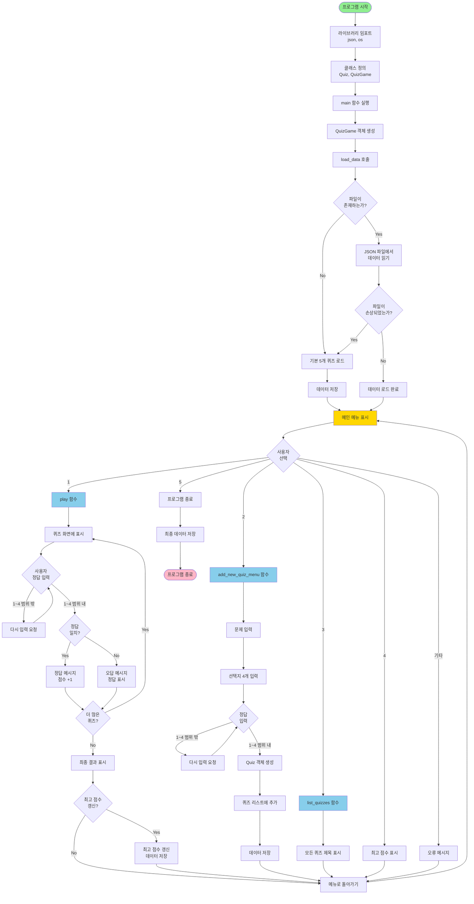

# 🎯 나만의 퀴즈 게임 (Python Quiz Game)

## 📝 프로젝트 개요
Python 기초 문법과 Git을 활용하여 만든 터미널 기반 퀴즈 게임입니다.
- **퀴즈 주제**: 파이썬 기초 및 프로그래밍 상식
- **퀴즈 주제 선정 이유**: 파이썬 학습을 갓 시작한 입장에서 가장 복습이 필요한 내용을 퀴즈로 만들어 학습 효과를 높이고자 했습니다.

## 🚀 실행 방법
```bash
python main.py
```

## 실행 환경
- OS: macOS 15.7.4
- Shell: zsh 5.9 (x86_64-apple-darwin24.0)
- Git: git version 2.53.0
- Python : 3.12.13

# 기능 목록
1. 퀴즈 풀기: 저장된 퀴즈를 풀고 실시간으로 정답을 확인합니다.
2. 퀴즈 추가: 사용자가 직접 새로운 문제를 등록할 수 있습니다.
3. 퀴즈 목록: 현재 등록된 모든 퀴즈의 질문을 확인합니다.
4. 점수 확인: 역대 최고 점수를 확인합니다.
5. 데이터 영속성: 모든 데이터는 state.json에 저장되어 재시작해도 유지됩니다.

# 파일 구조
- main.py : 게임 로직 및 클래스 정의(Quiz, QuizGame)를 포함한 전체 파이썬 코드
- state.json : 퀴즈 데이터 및 최고 점수 저장 파일
- .gitignore : Git 관리 제외 설정
- /docs : 스크린샷(/screenshots)과 메모가 포함된 디렉토리.
- README.md : 프로젝트를 설명하는 마크다운 파일

# 데이터 파일 설명(state.json 등)
- 경로: 프로젝트 루트 디렉토리 (./state.json)
- 역할: 프로그램을 종료해도 퀴즈 목록과 사용자의 최고 점수를 유지하기 위한 데이터 저장소
- 필드 구조 (Schema):
  - best_score: (Number) 사용자가 기록한 최고 정답 수
  - quizzes: (Array) 퀴즈 객체들이 담긴 리스트
    - question: (String) 문제 내용
    - choices: (Array) 4개의 선택지 문구
    - answer: (Number) 정답 번호 (1~4)

# 이 프로젝트는 Git 실습을 위해 작성되었습니다.

----------

# phthon code 로직 흐름


    
# 💡 기술적 의사결정 및 학습 메모

### 1. 클래스 설계와 책임 분리 (객체 지향)
- **클래스를 사용한 이유**: 함수만 사용할 경우 퀴즈 데이터와 상태(점수)를 전역 변수로 관리해야 해서 코드가 꼬이기 쉽습니다. 클래스를 사용하면 `Quiz`라는 '데이터 틀'과 `QuizGame`이라는 '관리자' 역할을 명확히 나눌 수 있어 유지보수가 쉽습니다.
- **책임 분리**: 
  - `Quiz` 클래스: 개별 문제의 데이터(질문, 선택지, 정답) 보관 및 화면 출력 기능 등 담당.
  - `QuizGame` 클래스: 전체 퀴즈 목록 관리, 점수 계산, 메뉴 입력 처리, 파일 입출력 로직 등을 담당.

### 2. 로직 분리 기준
- **입력 처리**: `main()` 함수의 `while True` 루프에서 사용자의 메뉴 번호 입력을 받고 예외 처리(1~5 이외의 값)를 수행.
- **게임 진행**: `QuizGame.play()` 메서드에서 문제를 순회하며 정답/오답을 판정.
- **데이터 저장/불러오기**: 파일 접근을 한 곳에서 관리하기 위해 `save_data()`와 `load_data()` 메서드로 완전히 분리.

### 3. 파일 입출력 흐름과 예외 처리 (try/except)
- **흐름**: 프로그램이 **시작될 때** `load_data()`로 `state.json`을 읽고, 퀴즈를 풀거나 추가하여 데이터가 변할 때마다, 그리고 프로그램이 **종료될 때** `save_data()`로 저장합니다.
- **try/except의 필요성**: 파일 입출력은 '파일이 삭제됨', '권한 없음', '내용 손상' 등 외부 요인으로 인한 에러가 잦습니다. 이를 방어하지 않으면 프로그램이 튕겨버리므로, `try/except`를 통해 오류 발생 시 '기본 퀴즈 제공' 등으로 안전하게 우회해야 합니다.
- **안전 종료 (KeyboardInterrupt/EOFError)**: 사용자가 `Ctrl+C`로 강제 종료를 시도할 때 에러를 뿜지 않고 `except KeyboardInterrupt`로 잡아내어, 종료 직전까지의 데이터를 안전하게 저장(`save_data`)한 후 인사말과 함께 종료하도록 처리했습니다.

### 4. 데이터 저장소로 JSON을 선택한 이유
- JSON은 파이썬의 `Dictionary` 형태와 구조가 거의 같아 상호 변환이 매우 쉽습니다. 또한 사람이 텍스트로 읽고 수정하기 편하며, 다른 프로그래밍 언어와 데이터를 주고받을 때도 표준으로 사용되기 때문에 선택했습니다.

### 5. Git 브랜치 전략과 커밋 규칙
- **커밋 단위**: `Feat(기능 추가)`, `Docs(문서 수정)`, `Refactor(구조 개선)` 등의 접두사를 사용하여 의미 있는 작업 단위로 쪼개어 최소 10회 이상 커밋했습니다.
- **브랜치 분리 이유**: 메인 코드(`main`)가 망가지는 것을 방지하기 위해, 새로운 기능(퀴즈 풀기, 추가 등)을 만들 때는 항상 독립된 `feature` 브랜치에서 실험하고 검증했습니다.
- **병합(Merge)의 의미**: 브랜치에서 기능 검증이 완벽히 끝났을 때, 그 성과를 안전하게 `main` 브랜치로 통합하는 과정입니다.

### 6. 심층 고민 (Advanced)
- **데이터가 1000개 이상으로 늘어난다면?**: 현재는 JSON 파일을 통째로 메모리에 올려서 사용하므로 속도나 메모리 한계가 올 수 있습니다. 이 경우 SQLite 같은 관계형 데이터베이스(DB)로 전환하여 필요한 문제만 가져오도록(Query) 개선해야 합니다.
- **데이터 손상 대응**: `json.JSONDecodeError`를 통해 손상을 감지하고 있으며, 현재는 기본 데이터를 로드하게 되어있습니다. 실무라면 이전 정상 상태의 백업 파일(`state.bak`)을 만들어 복구하는 로직을 추가할 것입니다.
- **요구사항 변경 시 수정 지점**: 만약 GUI 창으로 인터페이스를 바꾼다면, 로직을 담당하는 `QuizGame`의 데이터 처리 부분은 그대로 두고, 화면에 출력하는 `print()`와 `input()` 부분만 분리하여(MVC 패턴) 수정하면 됩니다.

### 7. 퀴즈 풀기 및 추가 시 세부 예외 처리 (오류 케이스 방어)
메뉴 선택뿐만 아니라, **퀴즈 정답 입력 및 추가 과정**에서도 발생할 수 있는 오류 케이스를 다음과 같이 완벽하게 방어했습니다.
- **빈 입력 및 공백 처리**: 사용자가 그냥 Enter를 치거나 스페이스바를 섞어 입력해도 `strip()` 함수를 통해 공백을 제거하여 처리합니다.
- **문자 및 범위 밖 숫자 입력 방어**: 정답 입력 시 문자를 입력(예: 'abc')하거나 1~4 범위를 벗어난 숫자(예: '9')를 입력하면 프로그램이 종료되지 않습니다. `if user_input in['1', '2', '3', '4']:` 조건과 `while True` 무한 루프를 통해 "1~4 사이의 숫자를 입력해 주세요"라는 경고 메시지를 띄우고 올바른 값이 들어올 때까지 재입력을 유도합니다.

### 8. 초기 데이터 구성 (기본 퀴즈 5개 보장)
- 프로그램 최초 실행 시 `state.json` 파일이 존재하지 않거나 손상된 경우, `set_default_quizzes()` 메서드가 호출됩니다.
- 이때 "파이썬 창시자", "리스트 메서드", "기본 자료형", "반복문 키워드", "출력 함수"를 주제로 한 **총 5개의 기본 퀴즈**가 `Quiz` 인스턴스로 자동 생성되며, 즉시 파일에 저장되어 미션 요구사항(5개 이상)을 완벽히 충족합니다.

### 스크린샷은 저장소 내의 docs/screenshots/에 위치합니다.
스크린샷 설명
1. git_clone.png : git clone 사용.
2. git_pull.png : git pull 사용.
3. git_log_branch.png : 10개 이상의 git log와 branch 이력
4. play_add_score.png : 게임 화면, 퀴즈 추가, 점수 확인.
5. version.png : python과 git의 버전.

깃허브 저장소 링크 https://github.com/feelosophysics/E1-2


